# Kom igång med formateringsfönstret

[!INCLUDE[consumer-appliesto-nyyn](../includes/consumer-appliesto-nyyn.md)]    

Om du har redigeringsbehörighet för en rapport finns det ett flertal formateringsalternativ. I Power BI-rapporter kan du ändra färg på dataserier, datapunkter och även visualiseringarnas bakgrund. Du kan ändra presentationen av x-axeln och y-axeln. Du kan även formatera teckensnittsegenskaperna för visualiseringar, former och titlar. Power BI ger fullständig kontroll över hur dina rapporter visas.

Kom igång genom att öppna en rapport i Power BI Desktop eller Power BI-tjänsten. Båda alternativen ger nästan identiska formateringsalternativ. När du öppnar en rapport i Power BI-tjänsten ska du välja **Redigera** på menyraden. 

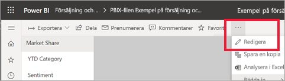

När du redigerar en rapport och du har en vald visualisering visas fönstret **Visualiseringar**. Använd det här fönstret för att ändra visualiseringar. Direkt under fönstret **Visualiseringar** finns tre ikoner: **Fält** (en stack med staplar), **Format** (en roller) och **Analys** (ett förstoringsglas). På bilden nedan har ikonen **Fält** valts, vilket indikeras med ett gult fält under ikonen.

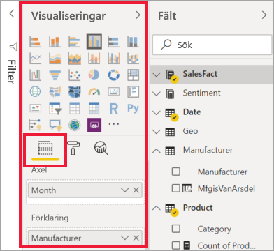

När du väljer **Format** visar området under ikonen de anpassningar som är tillgängliga för den för tillfället valda visualiseringen.  

Du kan anpassa många element i respektive visualisering. Vilka alternativ som är tillgängliga beror på vilket visuellt objekt som har valts. Några av dessa alternativ är:

* Förklaring
* X-axeln
* X-axeln
* Datafärger
* Dataetiketter
* Former
* Rityta
* Rubrik
* Bakgrund
* Låsning av höjd/bredd
* Kantlinje
* Knappbeskrivningar
* Visuella rubriker
* Former
* Position    
och mer.

> [!NOTE]
>  
> Alla dessa element visas inte med varje visualisering. Den visualisering du väljer påverkar vilka anpassningar som är tillgängliga. Någon x-axel visas t.ex. inte om du har markerat ett cirkeldiagram, eftersom cirkeldiagram inte har någon x-axel.

Observera också att om du inte har markerat någon visualisering så visas **filter** istället för ikoner, vilket gör att du kan använda filter för alla visualiseringar på sidan.

Det bästa sättet att lära dig hur du använder formateringsalternativen är att testa dem. Du kan alltid ångra ändringarna eller återgå till standard. Det finns en otrolig mängd alternativ som är tillgängliga och nya läggs till hela tiden. Det är helt enkelt inte möjligt att beskriva alla formateringsalternativ i en artikel. Men för att komma igång ska vi gå igenom några saker tillsammans. 

1. Ändra färger som används i det visuella objektet   
2. Använda en stil    
3. Ändra axelegenskaper    
4. Lägga till dataetiketter    

## Arbeta med färger

Låt oss gå igenom de olika stegen för hur man anpassar färger i en visualisering.

1. Välj en visualisering för att aktivera den.

2. Välj rollerikonen för att öppna formateringsfönstret. Fliken formatering visar alla formateringselement som är tillgängliga för den valda visualiseringen.

    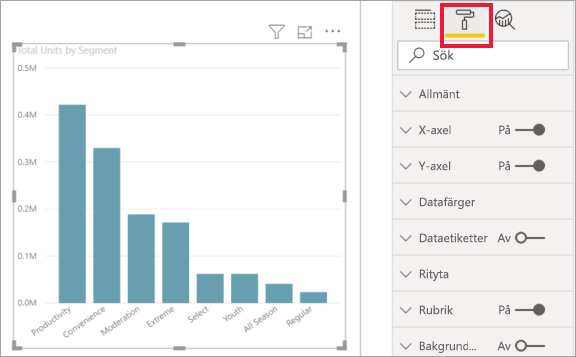

3. Välj **Datafärger** för att utöka de tillgängliga anpassningarna.  

    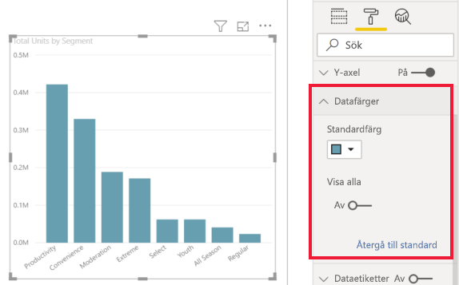

4. Ändra **Visa alla** till På och välj olika färger för kolumner.

    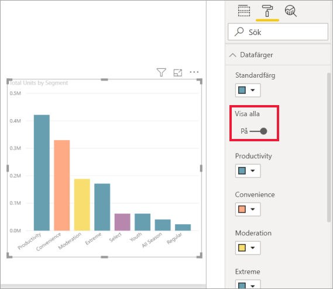

Här följer några användbara tips om hur du arbetar med färger. Siffrorna i följande lista visas även på följande skärmbild, där de indikerar var du kan hitta och ändra dessa användbara element.

1. Gillar du inte färgerna? Inga problem. Det är bara att välja **Återgå till standard**, så återgår valet till standardinställningarna. 

2. Gillar du inte någon av färgändringarna? Välj **Återgå till standard** längst ned i avsnittet **Datafärg**, så återgår färgerna till standardinställningarna. 

3. Vill du ha en färg som inte visas på paletten? Då är det bara att välja **Egen färg**, och välja färg i spektrumet.  

   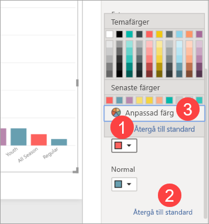

Är du inte överförtjust i den ändring du just har gjort? Ångra med **CTRL + Z**, precis som du är van att göra i andra sammanhang.

## Tillämpa en stil på en tabell
Vissa Power BI-visualiseringar har ett **Stil**-alternativ. Med ett klick används en fullständig uppsättning av formateringsalternativ i visualiseringen, samtidigt. 

1. Välj en tabell eller matris för att göra den aktiv.   
1. Öppna fliken formatering och välj **Stil**.

   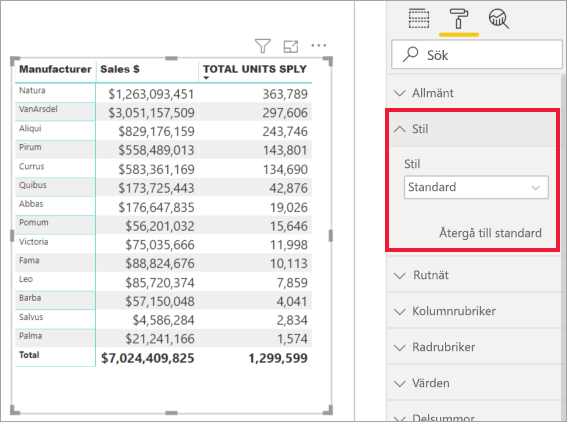

1. Välj en stil i listrutan. 

   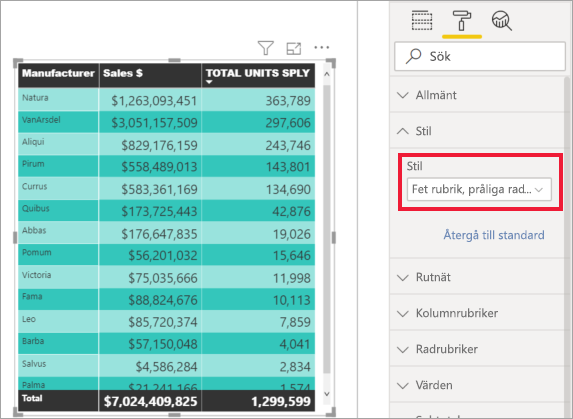

Även om du har tillämpat en stil kan du fortsätta att formatera egenskaper, inklusive färg, för visualiseringen.

## Ändra axelegenskaper

Det kan ofta vara användbart att ändra x-axeln eller y-axeln. På liknande sätt som du arbetar med färger kan du ändra en axel genom att välja nedåtpilen till vänster om den axel som du vill ändra, så som visas på följande bild.  
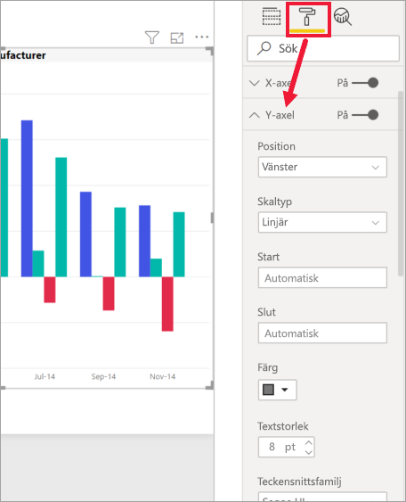

I exemplet nedan har vi formaterat Y-axeln genom att:
- flytta etiketterna till höger sida av visualiseringen

- ändra startvärdet till noll.

- ändra etikettens teckensnittsfärg till svart

- öka etikettens teckensnittsstorlek till 12

- lägga till en rubrik i Y-axeln

    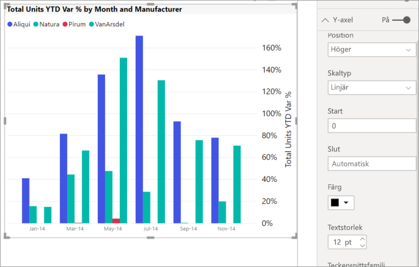

Du kan ta bort x-axelns etiketter helt och hållet genom att klicka på alternativknappen bredvid **x-axeln** eller **y-axeln**. Du kan också ange om du vill aktivera eller inaktivera axelrubriker genom att välja alternativknappen bredvid **rubriken**.  

## Lägga till dataetiketter    

Ett sista formateringsexempel innan du börjar utforska på egen hand.  Vi ska lägga till dataetiketter i ett ytdiagram. 

Här är *förebilden*. 

Och här är *efterbilden*.

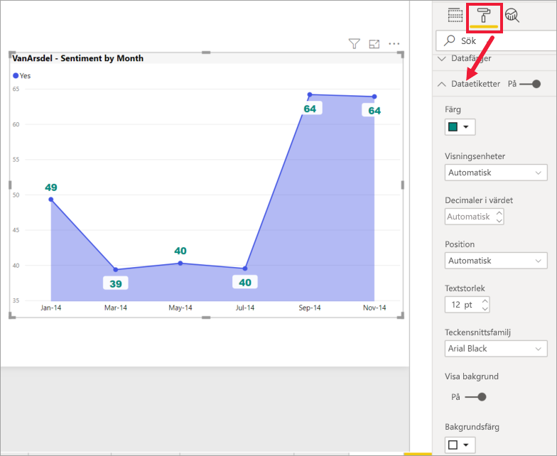

Vi valde visualiseringen för att göra den aktiv och öppnade fliken Formatering.  Vi valde **Dataetiketter** och aktiverade dem. Sedan ökade vi teckensnittet till 12, ändrade teckensnittet till Arial Black, aktiverade **Visa bakgrund** till På och bakgrundsfärg till vit med transparensen 5 %.

Detta är bara några av de formateringsåtgärder som är möjliga. Öppna en rapport i redigeringsläge och roa dig med att utforska formateringsfönstret för att skapa snygga och informativa visualiseringar.

## Nästa steg
Mer information finns i följande artikel: 

* [Dela rapporter](../collaborate-share/service-share-reports.md)

* [Tips för färgformatering i Power BI](service-tips-and-tricks-for-color-formatting.md)  
* [Villkorsstyrd formatering i tabeller](../create-reports/desktop-conditional-table-formatting.md)

