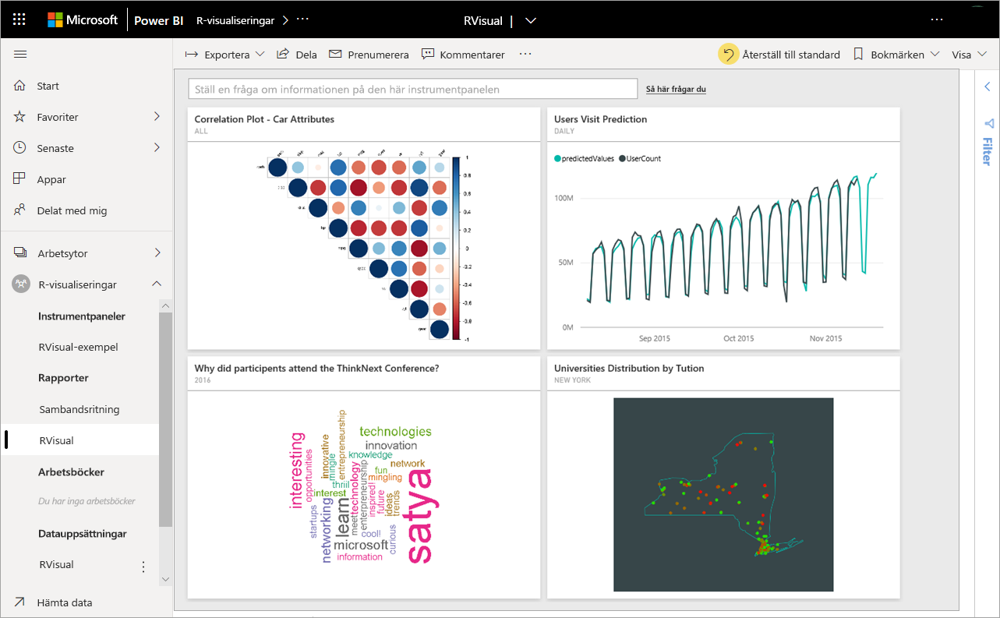
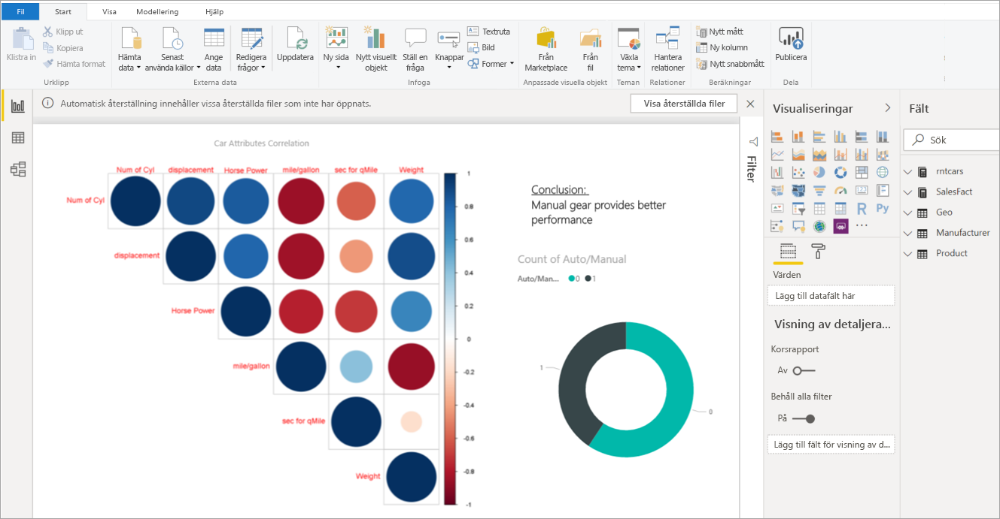
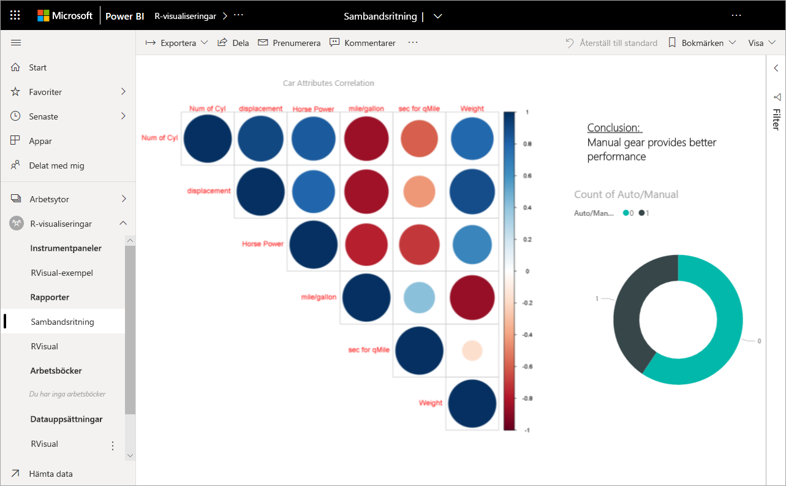
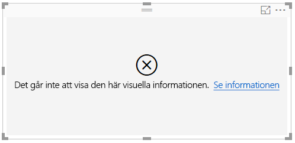
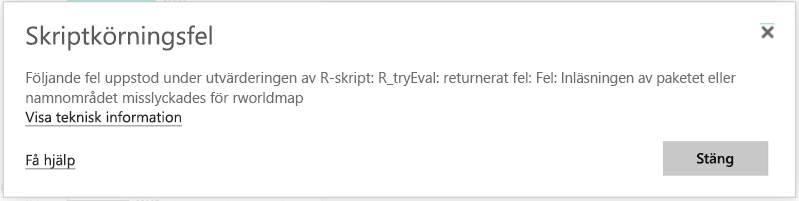

# Skapa och använd R-visualiseringar i Power BI

[!INCLUDE[consumer-appliesto-nnyn](../includes/consumer-appliesto-nnyn.md)]

Visuella R-objekt kan för närvarande kan bara skapas i **Power BI Desktop**, och sedan publiceras i Power BI-tjänsten. Läs mer om hur du skapar visuella R-objekt i [Skapa visuella Power BI-objekt med R](../create-reports/desktop-r-visuals.md).

## Visa visuella R-objekt i Power BI-tjänsten
Power BI-tjänsten stöder visning av och interaktion med visuella objekt som skapats med R-skript. Visualiseringar som har skapats med R-skript, vanligtvis kallade *visuella R-objekt*, kan användas för avancerad datautformning och analyser som t.ex. prognoser som bygger på den omfattande analys- och visualiseringskraften i R.

> [!NOTE]
> [R-programmeringsspråket](https://www.r-project.org/) är ett av de mest använda programmeringsspråken bland statistiker, dataanalytiker och affärsanalytiker. R-språket har ett community för öppen källkod som erbjuder över 7 000 tilläggspaket och populära R-användargrupper. Den version av R som distribueras i Power BI-tjänsten är *Microsoft R 3.4.4.*
> 
> 

Följande bild visar en Power BI-instrumentpanel med en samling visuella R-objekt som används för avancerade analyser.

Visuella R-objekt skapas i en [Power BI Desktop-rapport](../fundamentals/desktop-get-the-desktop.md), som den rapport som visas i följande bild.

När rapporten har skapats i **Power BI Desktop** kan du publicera rapporten med en eller flera visuella R-objekt i Power BI-tjänsten. 

 Det är inte alla R-paket som stöds i tjänsten. I slutet av den här artikeln återfinner du en lista över vilka paket som för närvarande stöds i Power BI-tjänsten.

Du kan hämta den här [Power BI Desktop-exempelfilen](https://download.microsoft.com/download/D/9/A/D9A65269-D1FC-49F8-8EC3-1217E3A4390F/RVisual_correlation_plot_sample%20SL.pbix) (.pbix-fil) som innehåller ett antal visuella R-objekt, så att du kan experimentera och se hur de fungerar.

Visuella R-objekt som skapas i **Power BI Desktop**, och sedan publiceras i Power BI-tjänsten, funerar oftast som andra visuella objekt i Power BI-tjänsten. Du kan interagera, filtrera, dela, och fästa dem på en instrumentpanel, eller dela dem med andra. Läs mer om man delar instrumentpaneler och visuella objekt i [Dela en instrumentpanel med kollegor och andra](../collaborate-share/service-share-dashboards.md). En skillnad från andra visuella objekt är att visuella R-objekt inte kan visa verktygstips och kan inte användas för att filtrera övrig visuella objekt.

Som du ser i följande bild, så visar och beter sig visuella R-objekt i Power BI-tjänsten, i såväl instrumentpaneler som rapporter, i stort som andra visuella objekt, och användarna behöver inte känna till det underliggande R-skriptet som ligger till grund för det visuella objektet.

## R-skriptssäkerhet
Visuella R-objekt har skapats från R-skript, vilka som potentiellt kan innehålla kod som medför säkerhets- eller integritetsrisker.

Dessa risker finns främst i skrivfasen när skriptförfattaren kör skriptet på sin egen dator.

Power BI-tjänsten använder sig av en *sandbox*-teknik för att skydda både användarna och tjänsten mot säkerhetsrisker.

Denna *sandbox*-metoden medför vissa begränsningar för R-skript som körs i Power BI-tjänsten. Det kan t.ex. gälla åtkomst till Internet eller åtkomst till andra resurser som inte krävs för att skapa visuella R-objekt.

## R-skriptsfel
När ett R-skript påträffar ett fel, ritas inte det visuella R-objektet och ett felmeddelande visas. Om du vill ha mer information om felet väljer du **Mer information** om det visuella R-objektsfelet på arbetsytan, så som visas i följande bild.

Följande bild innehåller ett annat exempel med det felmeddelande som visas när ett R-skript inte kan köras korrekt på grund av att ett R-paket saknas i Azure.

## Licensiering
Visuella R-objekt måste ha en [Power BI Pro](../fundamentals/service-self-service-signup-for-power-bi.md)-licens för att kunna återges i rapporter, uppdateras, filtreras och korsfiltreras. Mer information om Power BI Pro-licenser och hur de skiljer sig från kostnadsfria licenser finns i [Power BI Pro-innehåll – vad är det?](../admin/service-admin-purchasing-power-bi-pro.md)

Användare av den kostnadsfria Power BI-versionen kan bara använda paneler som delats med dem i Premium-arbetsytor. Mer information finns i [Köpa Power BI Pro](../admin/service-admin-purchasing-power-bi-pro.md).

I följande tabell beskrivs funktionerna för visuella R-objekt baserat på licensiering.

|  |Skapa R-visualiseringar i Power BI Desktop  | Skapa PBI-tjänstrapporter med R-visualiseringar |Visa R-visualiseringar i rapporter  | Visa R-paneler på instrumentpaneler |
|---------|---------|---------|---------|--------|
|**Gäst** (Power BI Embedded)     |  Stöds|  Stöds ej      | Stöds endast i Premium/Azure-kapacitet  | Stöds endast i Premium/Azure-kapacitet |
|**Ohanterad klientorganisation** (domänen är inte verifierad) | Stöds | Stöds ej |  Stöds ej |Stöds (B2B-scenario) |
|**Hanterad klientorganisation** med kostnadsfri licens    |  Stöds       |  Stöds ej       |    Stöds endast i Premium-kapacitet    | Stöds |
**Hanterad klientorganisation** med Pro-licens     |   Stöds      | Stöds      | Stöds    |Stöds|

## Kända begränsningar
Visuella R-objekt i Power BI-tjänsten har några begränsningar:

* Stödet för visuella R-objekt är begränsat till de paket som identifieras [i Läs mer om vilka R-paket som stöds](../connect-data/service-r-packages-support.md). Det finns för närvarande inget stöd för anpassade paket.
* Storleksbegränsningar för data – data som används för ritning av visuella R-objekt är begränsat till 150 000 rader. Om du väljer mer än 150 000 rader, är det enbart de översta 150 000 raderna som används och ett meddelande visas på bilden. Indata har dessutom en gräns på 250 MB.
* Upplösning – alla R-visualiseringar visas med 72 DPI.
* Ritenhet – det finns endast stöd för att rita till standardenheten. 
* Begränsning av beräkningstid – om en beräkning för visuella R-objekt överstiger 60 så passerar skriptet sin tidsgräns, vilket resulterar i ett fel.
* Visuella R-objekt uppdateras när data uppdateras, filtreras eller markeras. Bilden i sig är dock inte interaktiv och stöder inte verktygstips.
* Visuella R-objekt svarar på markering av andra visuella objekt, men du kan inte korsfiltrera andra element genom att klicka på element i det visuella R-objektet.
* Visuella R-objekt stöds för närvarande inte för datatypen *Time*. Använd Date/Time istället.
* Visuella R-objekt visas inte när du använder **Publicera på webben**.
* Visuella R-objekt stöder inte byte av namn på indatakolumner. Kolumner refereras till med sitt ursprungliga namn under skriptkörningen.
* Visuella R-objekt skrivs för närvarande inte ut med utskrift av instrumentpanel och rapporter
* Visuella R-objekt stöds för närvarande inte i Analysis Services i DirectQuery-läge
* Visuella R-objekt kan konvertera textetiketter till grafiska element. Om du gör det i Power BI-tjänsten måste du utföra följande ytterligare steg:
  
  * Lägg sedan till följande rad i början av R-skriptet:
    
        powerbi_rEnableShowText =  1
* Kinesiska, japanska och koreanska teckensnitt kräver alla följande extra steg för att fungera i Power BI-tjänsten:
  
  * Installera först R-paketet *showtext* och alla dess beroenden. Du kan göra detta genom att köra följande skript:
    
        *install.packages("showtext")*
  * Lägg sedan till följande rad i början av R-skriptet:
    
        powerbi_rEnableShowTextForCJKLanguages =  1

## Översikt över R-paket
R-paket är samlingar med R-funktioner, data och kompilerad kod som kombineras i ett väldefinierat format. När R har installerats innehåller det en standarduppsättning av paket, och ytterligare paket kan hämtas och installeras. När R-paketen har installerats måste de läsas in i sessionen för att kunna användas. Den primära källan för kostnadsfria R-paket är [Comprehensive R Archive Network](https://cran.r-project.org/web/packages/available_packages_by_name.html) (CRAN).

**Power BI Desktop** kan använda vilken typ av R-paket som helst utan några begränsningar. Du kan installera R-paket för användning i **Power BI Desktop** på egen hand, t.ex. med hjälp av [RStudio IDE](https://www.rstudio.com/).

Visuella R-objekt i **Power BI-tjänsten** stöds av de paket som anges i avsnittet **Paket som stöds** i [den här artikeln](../connect-data/service-r-packages-support.md). Om du inte hittar det paket som du är intresserad av i listan över paket som stöds, kan du begära stöd för paketet. Mer information om hur du begär stöd finns i [R-paket i Power BI-tjänsten](../connect-data/service-r-packages-support.md).

### Krav och begränsningar avseende R-paket
Det finns några krav och begränsningar när det gäller R-paket:

* Power BI-tjänsten stöder, för det mesta, R-paket med kostnadsfria programlicenser med öppen källkod, som GPL-2, 3 GPL, MIT + med flera.
* Power BI-tjänsten stöder paket som publicerats i CRAN. Tjänsten stöder inte privata eller anpassade R-paket. Vi uppmanar användarna att göra sina privata paket tillgängliga på CRAN innan de begär att paketen ska vara tillgängliga i Power BI-tjänsten.
* **Power BI Desktop** har två varianter av R-paket:
  
  * När det gäller R-visualiseringar kan du installera vilket paket du vill, inklusive anpassade R-paket
  * När det gäller anpassade R-visualiseringar stöds automatisk paketinstallation endast för offentliga CRAN-paket
* Av säkerhets- och sekretesskäl stöder vi för tillfället inte R-paket som tillhandahåller klient/server-frågor via webben (t.ex. RgoogleMaps) i tjänsten. Nätverket blockeras för sådana försök. En lista över vilka paket som stöds respektive inte stöds finns i [R-paket i Power BI-tjänsten](../connect-data/service-r-packages-support.md).
* Godkännandeprocessen för att inkludera ett nytt R-paket har ett beroendeträd. Vissa av de beroenden som måste installeras i tjänsten stöds inte.

### Paket som stöds:
En lång lista över R-paket som stöds (och en kort lista över paket som inte stöds) finns i följande artikel:

* [R-paket i Power BI-tjänsten](../connect-data/service-r-packages-support.md)
