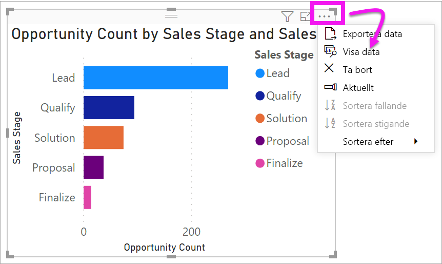
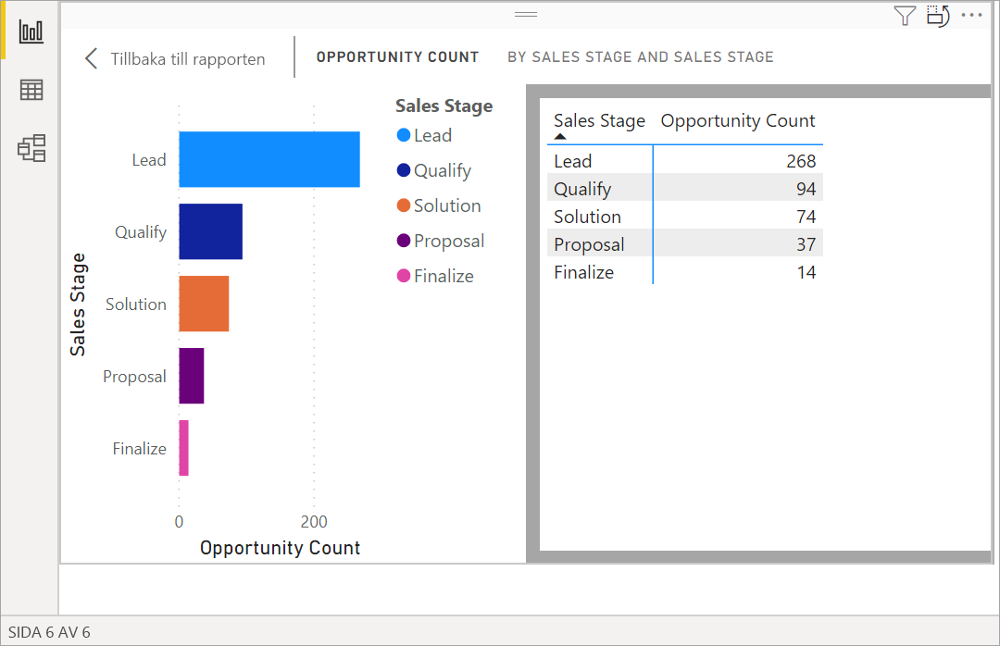
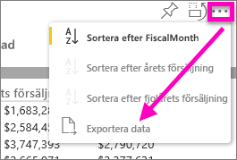
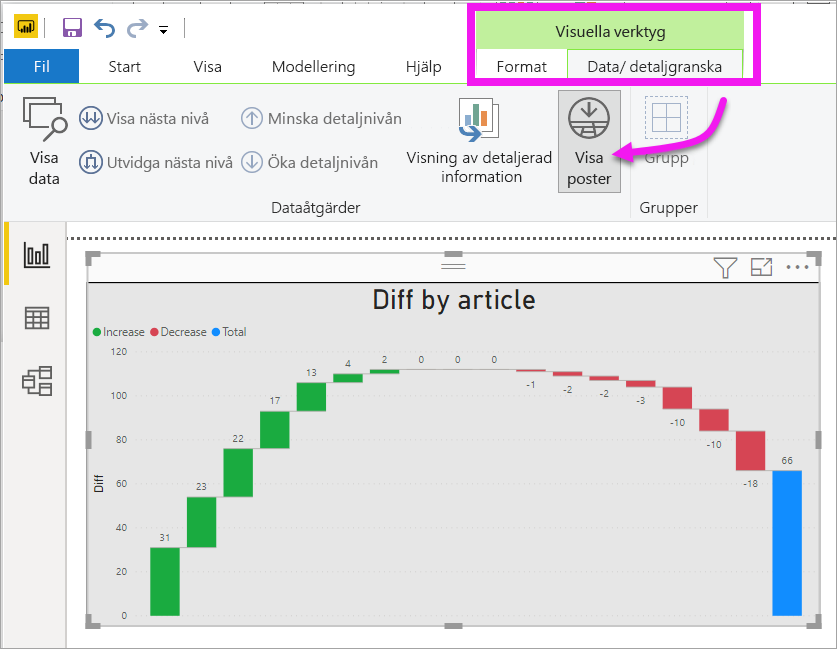
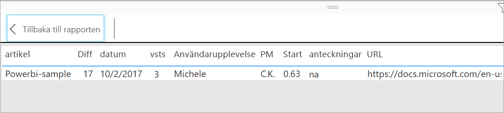

# Visa data som används för att skapa visualiseringen
## Visa data
En Power BI-visualisering konstrueras med data från dina datauppsättningar. Om du är intresserad av att se vad som pågår i bakgrunden, Power BI kan *visa* de data som används för att skapa visualiseringen. När du väljer **Visa data** visar Power BI dessa data under (eller bredvid) visualiseringen.

Du kan också exportera de data som används för att skapa visualiseringen som en .xlsx- eller .csv-fil och visa dem i Excel. Mer information finns i [Exportera data från visualiseringar i Power BI](power-bi-visualization-export-data.md).

> [!NOTE]
> *Visa Data* och *Exportera data* finns både i Power BI-tjänsten och Power BI Desktop. Dock ger Power BI Desktop ett ytterligare lager med information: [*Visa poster* visar de faktiska raderna i datauppsättningen](../desktop-see-data-see-records.md).
> 
> 

## Använda *Visa data* 
1. I Power BI Desktop väljer du en visualisering för att aktivera den.

2. Välj **Fler åtgärder** (...) och **Visa data**. 
    

3. Som standard visas data under visualiseringen.
   
   

4. För att välja orientering väljer du lodrät layout  uppe i det högra hörnet på visualiseringen.
   
   
5. Om du vill exportera data till en .csv-fil väljer du ellipserna och sedan **Exportera data**.
   
    
   
    Mer information om att exportera data till Excel finns i [Exportera data från visualiseringar i Power BI](power-bi-visualization-export-data.md).
6. Om du vill dölja data avmarkerar du **Utforska** > **Visa data**.

## Använda Visa poster
Du kan också fokusera på en datapost i en visualisering och gå in på detaljnivå på bakomliggande data. 

1. Välj en visualisering för att aktivera den och använda **Visa poster**. 

2. I menyfliksområdet Desktop väljer du fliken för **Visuella verktyg** > **Data/detaljgranska** > **Visa poster**. 

    

3. Välj en datapunkt eller en rad i visualiseringen. I det här exemplet har vi valt den fjärde kolumnen från vänster. Power BI visar datamängdsposten för datapunkten.

    

4. Välj **Tillbaka till rapporten** för att återgå till Desktop-rapportens arbetsyta. 

## Överväganden och felsökning

- Om knappen **Visa poster** i menyfliksområdet är inaktiverad och nedtonad, betyder det att den valda visualiseringen inte stöder Visa poster.
- Du kan inte ändra data i vyn Visa poster och sedan spara dem i rapporten igen.
- Du kan inte använda Visa poster när ditt visuella objekt använder ett beräknat mått.
- Du kan inte använda Visa poster när du är ansluten till en flerdimensionell livemodell.  

## Nästa steg
[Exportera data från Power BI-visualiseringar](power-bi-visualization-export-data.md)    

Har du fler frågor? [Prova Power BI Community](https://community.powerbi.com/)

