# Distribuera Power BI-innehåll till externa gästanvändare med Azure Active Directory B2B

**Sammanfattning:** Det här är ett tekniskt White Paper som beskriver hur du distribuerar innehåll till användare utanför organisationen med hjälp av integrering av Azure Active Directory Business-to-business (Azure AD B2B).

**Skrivare:** Lukasz Pawlowski, Kasper de Jonge

**Tekniska granskare:** ADAM Wilson, Sheng Liu, Qian Liang, Sergei Gundorov, Jacob Grimm, Adam Saxton, Maya Shenhav, Nimrod Shalit, Elisabeth Olson

> [!NOTE]
> Du kan spara eller skriva ut detta white paper genom att välja **Skriv ut** i webbläsaren och sedan välja **Spara som PDF**.

## Introduktion

Powerbi ger organisationer en 360-graders vy över verksamheten och gör det möjligt för alla i dessa organisationer att fatta intelligenta beslut med hjälp av data. Många av dessa organisationer har starka och betrodda relationer med externa partners, kunder och leverantörer. Dessa företag måste du ange säker åtkomst till Power BI-instrumentpaneler och rapporter till användare i dessa externa partners.

Powerbi integrerar med [Azure Active Directory Business-to-business (Azure AD B2B)](https://docs.microsoft.com/azure/active-directory/b2b/what-is-b2b) att tillåta säker distribution av Power BI innehåll till gästanvändare utanför organisationen – medan du fortfarande att behålla kontrollen och reglerar åtkomsten till interna data.

Detta faktablad innehåller all de information du behöver för att förstå Power BI-integrering med Azure Active Directory B2B. Vi beskriver den vanligaste användningsfall, konfiguration, licensiering och säkerhet på radnivå.

> [!NOTE]
> I detta white paper refererar vi till Azure Active Directory som Azure AD och Azure Active Directory företag som Azure AD B2B.

## Scenarier

Contoso är ett fordon tillverkare och fungerar med många olika leverantörer som tillhandahåller den med alla komponenter, material och tjänster som krävs för att köra driften tillverkning. Contoso vill förenkla sin strömförsörjning kedja logistik och planer på att använda Power BI för att övervaka viktiga prestandamått av sin leveranskedja. Contoso vill dela med extern strömförsörjning kedja partner analytics på en säker och hanterbar sätt.

Contoso kan aktivera följande upplevelser för externa användare med hjälp av Power BI och Azure AD B2B.

### Ad hoc per objekt delning

Contoso fungerar med en leverantör som bygger radiatorer för Contosos bilar. De behöver ofta, optimera tillförlitligheten för radiatorer med hjälp av data från alla Contosos bilar. En analytiker på Contoso använder Power BI för att dela en element tillförlitlighet rapport med en tekniker på leverantören. Teknikern tar emot ett e-postmeddelande med en länk till rapporten.

Enligt beskrivningen ovan, utförs denna ad hoc-delning av användare i verksamheten på grundval av efter behov. Länken som skickats av Power BI till den externa användaren är en länk för Azure AD B2B-inbjudan. När den externa användaren öppnar länken, ombeds de att ansluta till Contosos Azure AD-organisation som gästanvändare. När inbjudan har accepterats öppnas länken den specifika rapporten eller instrumentpanelen. Azure Active Directory-administratören delegerar behörighet att bjuda in extern användare i organisationen och väljer vad användarna kan göra när de har accepterat inbjudan, enligt beskrivningen i avsnittet styrning i det här dokumentet. Contoso-analytiker kan bjuda in gästanvändare endast eftersom Azure AD-administratör tillåtna åtgärden och Power BI administratör tillåts användare att bjuda in gäster för att visa innehåll i Power BI-klientinställningar.

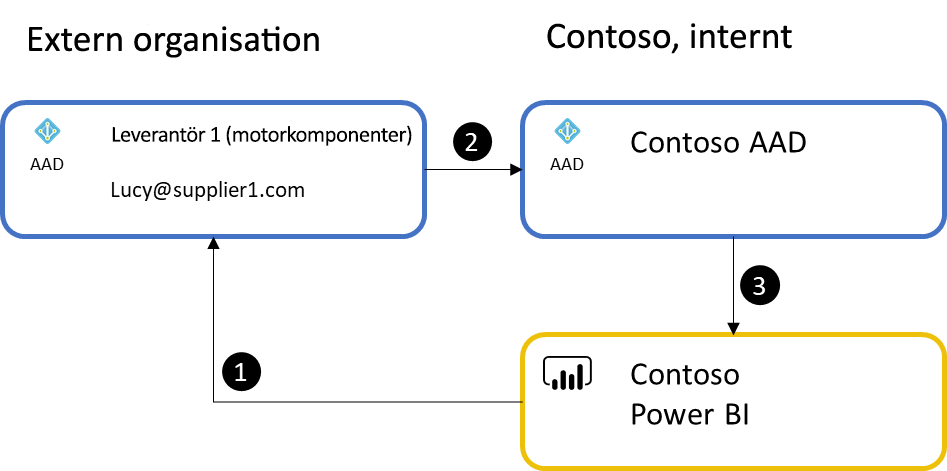

1. Processen börjar med en intern Contoso-användare som delar en instrumentpanel eller en rapport med en extern användare. Om den externa användaren inte är gäst i Contosos Azure AD, de har bjudits in. Ett e-postmeddelande skickas till sin e-postadress som innehåller en inbjudan till Contosos Azure AD
2. Mottagaren accepterar inbjudan till Contoso Azure AD och läggs till som en gästanvändare i Contosos Azure AD.
3. Mottagaren omdirigeras sedan till Power BI-instrumentpanel, rapport eller app, som är skrivskyddade för användaren.

Processen betraktas ad hoc eftersom användare i verksamheten i Contoso åtgärden inbjudan som behövs för deras företagsändamål. Varje delade objektet är en enda länk har åtkomst till den externa användaren vill visa innehållet.

När den externa användaren har bjudits in till Contoso-resurser, ett shadow-konto skapas för dem i Contoso Azure AD och de behöver inte bjudas in igen.  Första gången de försöker komma åt en Contoso-resurs som en Power BI-instrumentpanel som de går igenom en process för godkännande som redeems inbjudan.  Om de inte Slutför medgivande, de kan inte komma åt någon av Contosos innehåll.  Om de har problem som löser in sin inbjudan via ursprungliga länken kan kan en Azure AD-administratör görs en specifik inbjudan länk att lösa in.

### Planerat per objekt delning

Contoso fungerar med en underleverantörernas att analysera tillförlitlighet radiatorer. Underleverantörernas har ett team med 10 personer som behöver åtkomst till data i Contosos Power BI-miljö. Contoso Azure AD-administratör är komplicerat att bjuda in alla användare och för att hantera tillägg/ändringar som personal på underleverantörernas ändringen. Azure AD-administratör skapar en säkerhetsgrupp för alla medarbetare på underleverantörernas. Med hjälp av gruppen, kan Contosos anställda enkelt hantera åtkomst till rapporter och se till att alla nödvändiga underleverantörernas personal har åtkomst till alla nödvändiga rapporter, instrumentpaneler och Power BI-appar. Azure AD-administratör kan också undvika att vara inblandad i inbjudningsprocessen helt och hållet genom att välja att delegera inbjudan rättigheter till en betrodd anställd på Contoso eller på underleverantörernas så snabbt personal management.

Vissa organisationer kräver mer kontroll över när externa användare har lagts till, bjuder in många användare i en extern organisation eller många externa organisationer. I dessa fall är kan planerad delning används för att hantera skalan för delning, kan tillämpa organisationens principer och även för att delegera behörighet till betrodda personer som vill bjuda in och hantera externa användare. Azure AD B2B stöder planerad inbjudan skickas direkt [från Azure-portalen av en IT-administratör](https://docs.microsoft.com/azure/active-directory/b2b/add-users-administrator), eller via [PowerShell med hjälp av inbjudan manager API](https://docs.microsoft.com/azure/active-directory/b2b/customize-invitation-api) där en uppsättning användare kan bjudas in i ett åtgärd. Med hjälp av den planerade bjuder in metod, organisationen kan styra vem som kan bjuda in användare och implementera godkännandeprocesser. Avancerade Azure AD-funktioner som dynamiska grupper kan göra det enkelt att upprätthålla säkerhetsgrupp automatiskt.

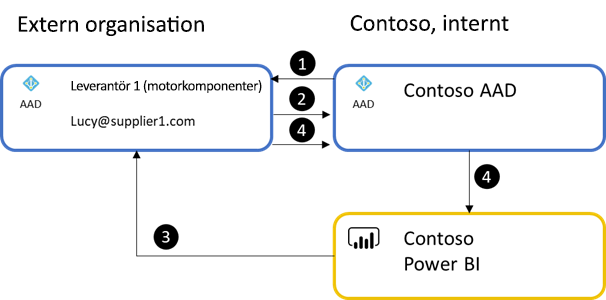

1. Processen stjärnor med en IT-administratör bjuda in gästanvändare manuellt eller via API tillhandahålls av Azure Active Directory
2. Användaren accepterar inbjudan för organisationen.
3. När användaren har accepterat inbjudan, kan en användare i Power BI dela en rapport eller instrumentpanel med den externa användaren eller en säkerhetsgrupp som de finns i. Precis som med vanlig delning i Power BI får den externa användaren ett e-postmeddelande med en länk till objektet.
4. När de externa användare använder länken som sin autentisering i sin katalog skickas till Contoso Azure AD och används för att få åtkomst till Power BI-innehåll.

### Ad hoc- eller planerade delning av Power BI-appar

Contoso har en uppsättning rapporter och instrumentpaneler som de behöver för att dela med en eller flera leverantörer. För att säkerställa att alla nödvändiga externa användare har åtkomst till det här innehållet, kommer den som en Power BI-appen. Externa användare läggs antingen direkt till listan över åtkomst eller via säkerhetsgrupper. Någon på Contoso skickar sedan app-URL för alla externa användare, till exempel i ett e-postmeddelande. När de externa användarna öppna länken, visas allt innehåll i en enda lättnavigerad upplevelse.

Med hjälp av en Power BI-appen gör det enkelt för Contoso att bygga en BI-portalen för dess leverantörer. En enda åtkomstlista styr åtkomst till alla nödvändiga innehåll som minskar oanvänt tid kontroll och ange behörigheter för objekt på kolumnnivå. Azure AD B2B underhåller åtkomst med hjälp av leverantörens interna identitet så att användarna inte behöver ytterligare inloggningsuppgifter. Om bjuder in med hjälp av planerat med säkerhetsgrupper, förenklas åtkomsthantering av till appen som personal rotera till eller från projektet. Medlemskap i security grupper manuellt eller genom att använda [dynamiska grupper](https://docs.microsoft.com/azure/active-directory/b2b/use-dynamic-groups), så att alla externa användare från någon annan leverantör läggs automatiskt till i lämpliga säkerhetsgruppen.

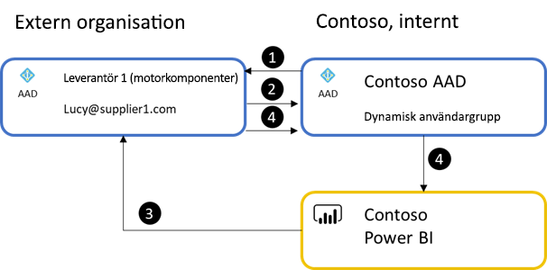

1. Processen startas av användaren som bjuds in att Contosos Azure AD-organisation via Azure portal eller PowerShell
2. Användaren kan läggas till en användargrupp i Azure AD. En statisk eller dynamisk användargrupp kan användas, men dynamiska grupper minska manuellt arbete.
3. De externa användarna får åtkomst till Power BI-appen via användargruppen. Appen URL: en ska skickas direkt till den externa användaren eller placeras på en plats där de har åtkomst till. Powerbi gör bästa förmåga att skicka ett e-postmeddelande med applänk till externa användare men när du använder användargrupper vars medlemmar kan ändra Power BI inte kan skicka till alla externa användare hanteras via användargrupper.
4. När den externa användaren ansluter till Power BI-app-URL, de autentiseras med Contosos Azure AD, appen är installerad för användaren och användaren kan se alla befintliga rapporter och instrumentpaneler i appen.

Appar kan också ha en unik funktion som gör att apputvecklare att installera programmet automatiskt för användaren, så att den är tillgänglig när användaren loggar in. Den här funktionen är endast installerar automatiskt för externa användare som redan är en del av Contoso-organisationen när programmet publicerades eller uppdaterades. Därför det är bäst lämpad för planerad inbjudan-metoden och beror på appen som publicerades eller uppdaterades när användarna har lagts till Contosos Azure AD. Externa användare kan alltid installera appen med hjälp av app-länken.

### Kommentarer och prenumerera på innehåll mellan olika organisationer

När Contoso fortsätter att arbeta med dess underleverantörer eller leverantörer, måste de externa teknikerna att samarbeta med Contosos analytiker. Powerbi har flera samarbetsfunktioner som hjälper användarna att kommunicera om innehåll som de använder. Instrumentpanelen kommentarer (och snart rapportera kommentarer) tillåter användare att diskutera datapunkter de se och kommunicera med rapportförfattare att ställa frågor.

För närvarande kan externa gästanvändare delta i kommentarer genom att lämna kommentarer och läsa svaren. Men till skillnad från interna användare gästanvändare får inte vara @mentioned och tar inte emot meddelanden att de har fått en kommentar. Gästanvändare kan inte använda funktionen prenumerationer i Power BI vid tidpunkten för skrivning. I en kommande version dessa begränsningar dras tillbaka och gästanvändaren får ett e-postmeddelande när en kommentar @mentions dem, eller när en prenumeration levereras till sin e-post som innehåller en länk till innehåll i Power BI.

### Åtkomst till innehåll i Power BI-mobilapparna

I en kommande version när Contosos användarna dela rapporter eller instrumentpaneler med motsvarigheterna externa gäst skickar Power BI ett e-postmeddelande gästen. När gästanvändaren öppnas en länk till rapporten eller instrumentpanelen på sina mobila enheter öppnas innehållet i de inbyggda Power BI-mobilapparna på en enhet om de installeras. Gästanvändaren kommer sedan att kunna navigera mellan innehåll som delats med dem i externa klienten och tillbaka till sitt eget innehåll från sina startklientorganisation.

> [!NOTE]
> Gästanvändaren kan inte öppna Power BI-mobilappen och gå direkt till externa klient, de måste börja med en länk till ett objekt i den externa klienten. Vanliga lösningar beskrivs i den [distribuera länkar till innehåll i den överordnade organisationen Power BI](#distributing-links-to-content-in-the-parent-organizations-power-bi) senare i det här dokumentet.

### Mellan olika organisationer redigera och hantera Power BI-innehåll

Contoso och dess leverantörer och underleverantörer fungerar allt bra tillsammans. En analytiker på underleverantörernas behöver ofta fler visualiseringar som ska läggas till i en rapport som Contoso har delat med dem som mått eller data. Data ska placeras i Contosos Power BI-klient, men externa användare ska kunna redigera den, skapa nytt innehåll och även distribuera den till rätt personer.

Powerbi innehåller ett alternativ som gör att **externa gästanvändare kan redigera och hantera innehåll** i organisationen. Externa användare har som standard en skrivskyddad förbrukning inriktad upplevelse. Den här nya inställningen kan dock Power BI-administratören kan välja vilka externa användare kan redigera och hantera innehåll inifrån den egna organisationen. När tillåts, kan den externa användaren redigera rapporter, instrumentpaneler, publicera eller uppdatera appar, fungerar i arbetsytor och ansluta till data som de har behörighet att använda.

Det här scenariot beskrivs i detalj i avsnittet Aktivera externa användare att redigera och hantera innehåll i Power BI senare i det här dokumentet.

## Organisationens relationer med hjälp av Power BI och Azure AD B2B

När alla användare av Power BI är interna för organisationen, är det inte nödvändigt att använda Azure AD B2B. Men när två eller fler organisationer vill samarbeta med data och insikter, gör Power BI-supporten för Azure AD B2B det enkelt och kostnadseffektivt sätt att göra detta.

Nedan visas vanligtvis påträffades organisationsstrukturer som lämpar sig för Azure AD B2B style mellan olika organisationer samarbete i Power BI. Azure AD B2B fungerar bra i de flesta fall, men i vissa fall gemensamt alternativa metoder som beskrivs i slutet av det här dokumentet är värda att hänsyn tagits till.

### Fall 1: Direkt samarbete mellan organisationer

Contosos relation med dess element-leverantören är ett exempel på direkt samarbete mellan organisationer. Eftersom det är relativt få användare på Contoso och dess leverantör som behöver åtkomst till element tillförlitlighetsinformation med hjälp av Azure AD B2B-baserade extern delning är idealiskt. Det är lätt att använda och enkla att administrera. Det är också ett vanligt mönster i konsulttjänster där en konsult kan behöva skapa innehåll för en organisation.

Delning av det här inträffar vanligtvis börjar använda Ad hoc-per objekt delning. Team växa eller relationer fördjupa planerad per objekt delning blir metoden den bästa metoden för att minska hanteringskostnader. Dessutom Ad hoc- eller planerade delning av Power BI-appar, kommentarer och prenumerera på innehåll mellan olika organisationer, åtkomst till innehåll i mobila appar kan komma i play, och mellan olika organisationer redigera och hantera Power BI-innehåll. Om båda organisationerna användarna har Power BI Pro-licenser i sina respektive organisationer, använda de är dock dessa Pro-licenser i varandras Power BI-miljöer. Detta ger stora fördelar licensiering eftersom organisationen som bjuder in inte kan behöva betala för en Power BI Pro-licens för externa användare. Detta beskrivs i detalj i avsnittet Licensing senare i det här dokumentet.

### Fall 2: Överordnade och dess dotterbolag eller samarbetspartners

Vissa organisationsstrukturer är mer komplexa, inklusive helt eller delvis ägda dotterbolag, dotterbolag eller hanterad tjänst providern relationer. Dessa organisationer har en överordnad-organisation till exempel ett holdingbolag, men de underliggande organisationerna arbeta självständigt semikolonavgränsade, ibland under olika regionala krav. Detta leder till varje organisation att ha en egen Azure AD-miljö och en separat Power BI-klienter.

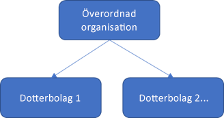

I den här strukturen måste den överordnade organisationen vanligtvis att distribuera standardiserad insikter till dess dotterbolag. Denna delning inträffar normalt med hjälp av Ad hoc- eller planerade delning av Power BI-appar metod såsom illustreras på följande bild, eftersom det tillåter att distributionen av standardiserad auktoritativa innehåll till bred publik. I praktiken används en kombination av de scenarier som nämnts tidigare i det här dokumentet.

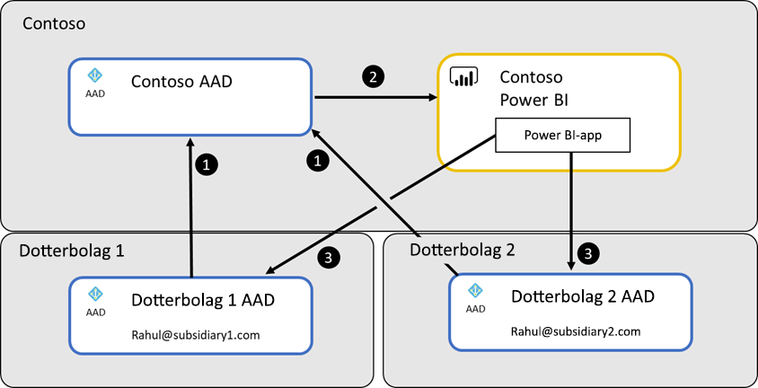

Det följer på följande sätt:

1. Användare från varje dotterbolag är välkomna till Contosos Azure AD
2. Sedan har Power BI-appen publicerats för att ge användarna åtkomst till nödvändiga data
3. Slutligen kan öppna användarna appen via en länk som de har fått Se rapporterna

Flera viktiga utmaningar upplevdes av organisationer i den här strukturen:

- Hur du distribuerar länkar till innehåll i den överordnade organisationen Power BI
- Så här tillåter användare att komma åt datakällan som värd för den överordnade organisationen på dotterbolag

#### Distribuera länkar till innehåll i den överordnade organisationen Power BI

Tre metoder används ofta för att distribuera länkar till innehållet. Först och de flesta basic är att skicka en länk till appen till nödvändiga användarna eller att placera den i en SharePoint Online-webbplats där den kan öppnas. Användare kan sedan bokmärka länken i webbläsaren för snabbare åtkomst till de data de behöver.

Den andra metoden är beroende av organisationer redigering och hantering av kapaciteten för Power BI-innehåll. Den överordnade organisationen kan användare från alla dotterbolag till dess Power BI och styr vad de kan komma åt via behörighet. Detta ger åtkomst till Power BI Start där användaren från dotterbolaget ser en omfattande lista över innehåll som delats till dem i överordnade organisationens klient. Sedan ges Webbadressen till den överordnade organisationer Power BI-miljö till användare i dotterbolag.

Den sista metoden använder en Power BI-app som skapats i Power BI-klient för varje dotterbolag. Power BI-appen innehåller en instrumentpanel med [paneler som konfigurerats med alternativet extern länk](https://docs.microsoft.com/power-bi/service-dashboard-edit-tile#hyperlink). När användaren trycker på panelen, tas de till lämplig rapporten, instrumentpanel eller app i den överordnade organisationen Power BI. Den här metoden har vidare fördelen att appen kan installeras automatiskt för alla användare i dotterbolaget och är tillgängliga för dem när de loggar in på sina egna Power BI-miljö. En annan fördel med den här metoden är att det fungerar bra med Power BI-appar som kan öppna länken internt. Du kan också kombinera detta med den andra metoden att aktivera enklare växla mellan Power BI-miljöer.

#### Tillåter användare att få åtkomst till datakällor som är värd för den överordnade organisationen på dotterbolag

Ofta analytiker på ett dotterbolag måste du skapa egna analytics med hjälp av data från den överordnade organisationen. I det här fallet används ofta molndatakällor för att möter utmaningen.

Det första tillvägagångssättet utnyttjar [Azure Analysis Services](https://docs.microsoft.com/azure/analysis-services/analysis-services-overview) att skapa ett företagsinformationslager för i företagsklass som tjänar analytiker i överordnat och dess dotterbolag enligt följande bild. Contoso kan vara värd för data och använda funktioner som säkerhet på radnivå så att användarna i varje dotterbolag kan komma åt endast sina data. Analytiker på varje organisation kan få åtkomst till datalagret via Power BI Desktop och publicera resulterande analytics sina respektive Power BI-klienter.

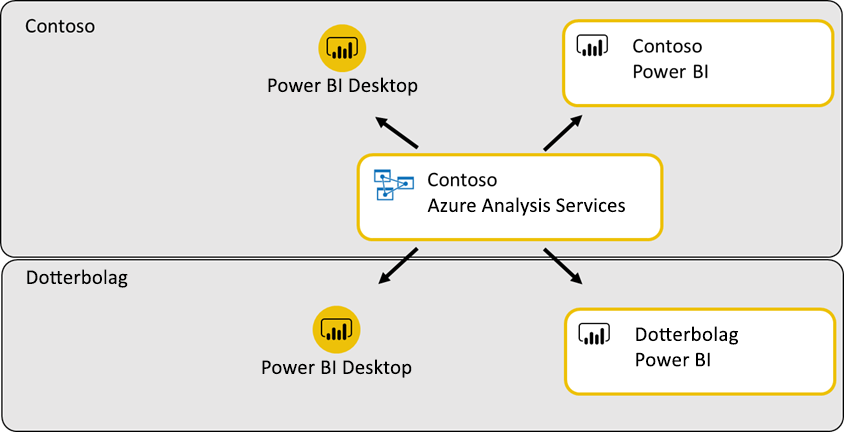

Den andra metoden utnyttjar [Azure SQL Database](https://azure.microsoft.com/services/sql-database/) att skapa ett relationella datalager för att ge åtkomst till data. Detta fungerar på samma sätt till Azure Analysis Services-metoden, men vissa funktioner som säkerhet på radnivå kan vara svårare att distribuera och underhålla över dotterbolag.

Mer avancerade metoderna är också möjligt, men ovanstående är allra mest vanliga.

### Fall 3: Delad miljö för partner

Contoso kan ingå ett partnerskap med en konkurrent gemensamt bygga en bil på en delad sammanställningsrad, men att distribuera vehicle under olika varumärken eller i olika regioner. Detta kräver omfattande samarbete och Samägd mark av data, intelligens och analys mellan olika organisationer. Den här strukturen är också vanligt i tjänstbranschen konsult där ett team med konsulter kan göra projektbaserade analyser för en klient.

Dessa strukturer i praktiken är komplexa, enligt följande bild och personalen att underhålla måste. För att gälla beroende den här strukturen mellan olika organisationer redigering och hantering av kapaciteten för Power BI-innehåll eftersom det gör att organisationer kan återanvända Power BI Pro licenser för sina respektive Power BI-klienter.

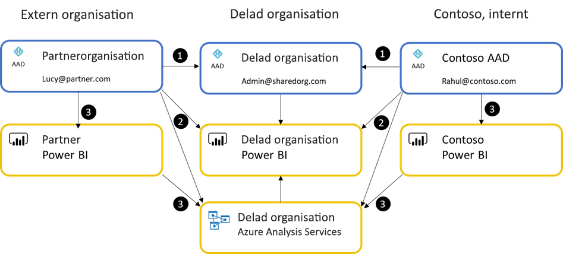

För att upprätta en delad Power BI-klient, en Azure Active Directory måste skapas och minst en Power BI Pro användarkonto måste köpas för en användare i den active directory. Den här användaren bjuder in nödvändiga användarna i organisationen som delad. Det viktiga är i det här scenariot behandlas Contosos användare som externa användare när de är verksamma inom organisationens delat Power BI.

Processen är följande:

1. Delade organisationen som en ny Azure Active Directory och minst ett användarkonto har skapats i den nya ordningen. Användaren bör ha tilldelats en Power BI Pro-licens.
2. Den här användaren sedan upprättar en Power BI-klient och bjuder in nödvändiga användarna från Contoso och partnerorganisationen. Användaren upprättar också alla delade datatillgångar som Azure Analysis Services. Contoso och partnerns användare kan komma åt delade organisationens Power BI som gästanvändare. Om tillåtelse att redigera och hantera innehåll i Power BI kan externa användare använda Power BI hem, använda arbetsytor, uppladdning eller redigering innehåll och dela rapporter. Vanligtvis alla delade resurser lagras och öppnas från delade organisationen.
3. Beroende på hur parterna är överens om att samarbeta, är det möjligt för varje organisation att utveckla sina egna sekretesskyddade data och analytics med hjälp av delade data warehouse tillgångar. De kan distribuera dem till sina respektive interna användare med sina interna Power BI-klienter.

### Fall 4: Distribution till hundratals eller tusentals externa partners

När Contoso skapade en element tillförlitlighet rapport för en leverantör, vill Contoso nu att skapa en uppsättning standardiserad rapporter för hundratals olika leverantörer. På så sätt kan Contoso att kontrollera att alla leverantörer har de analyser som de behöver för att göra förbättringar och åtgärda tillverkning defekter.

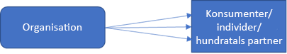

När en organisation behöver distribuera standardiserad data och insikter så många externa användare/organisationer, kan de använda Ad hoc- eller planerade delning av Power BI-appar scenariot för att skapa en BI-portalen snabbt och utan omfattande utvecklingskostnader. Processen att skapa en sådan portal med hjälp av en Power BI-appen behandlas i fallstudien: Skapar en BI-portalen med hjälp av Power BI + Azure AD B2B – stegvisa anvisningarna senare i det här dokumentet.

En vanlig variant av det här fallet är när en organisation görs ett försök att dela information med konsumenter, särskilt när du vill använda Azure B2C med Power BI. Powerbi stöder inte Azure B2C internt. Om du utvärderar alternativen för det här fallet kan du använda alternativa alternativ 2 i de alternativa metoderna för vanliga avsnittet senare i det här dokumentet.

## Fallstudie: Att skapa en BI-portalen med hjälp av Power BI + Azure AD B2B – stegvisa instruktioner

Powerbi-integrering med Azure AD B2B ger Contoso en sömlös, smidig sätt att förse gästanvändare med säker åtkomst till dess BI-portalen. Contoso kan konfigurera detta med tre steg:

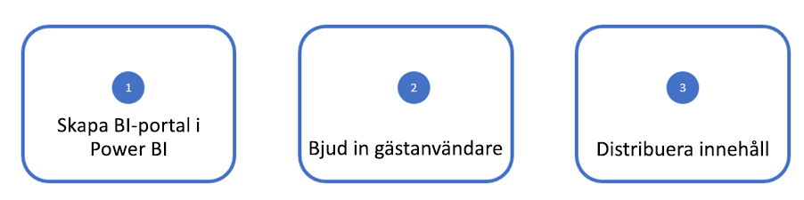

1. Skapa BI-portal i Power BI

    Den första aktiviteten för Contoso är att skapa sina BI-portalen i Power BI. Contosos BI-portalen består av en samling av specialbyggda instrumentpaneler och rapporter som ska göras tillgängliga för många användare för interna och gästanvändare. Det rekommenderade sättet för att göra detta i Power BI är att skapa en Power BI-appen. Läs mer om [appar i Power BI](https://powerbi.microsoft.com/blog/distribute-to-large-audiences-with-power-bi-apps/).

- Contosos BI-teamet skapar en apparbetsyta i Power BI

    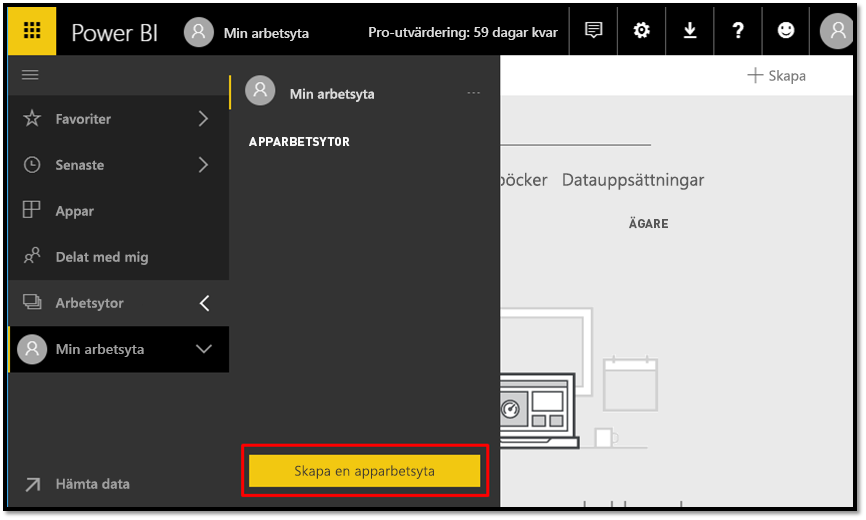
    

- Andra författare har lagts till i arbetsytan

    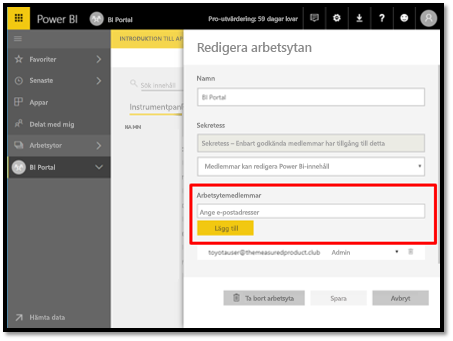

- Innehåll skapas i arbetsytan

    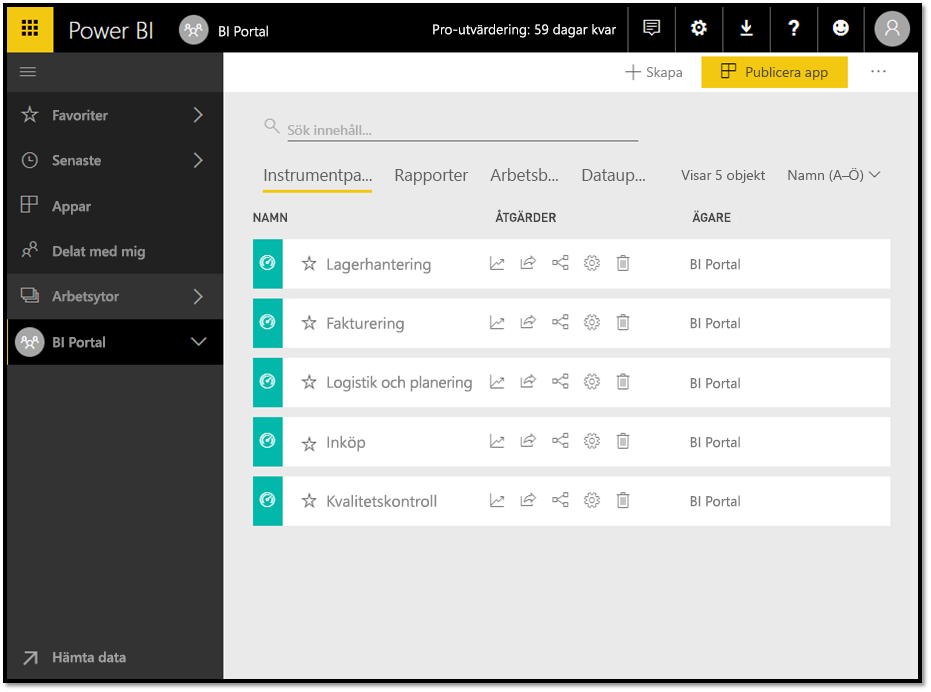

    Nu när innehållet har skapats i en apparbetsyta, är Contoso redo att bjuda in gästanvändare i resurspartner-organisationer att använda det här innehållet.

2. Bjud in gästanvändare

    Det finns två sätt för Contoso att bjuda in gästanvändare till dess BI-portalen i Power BI:

    * Planerad inbjudan
    * Ad hoc-inbjudningar

    **Planerad inbjudan**

    Den här metoden kan Contoso bjuder in gästanvändare till dess Azure AD i tid och distribuerar sedan Power BI-innehåll till dem. Contoso kan bjuda in gästanvändare från Azure portal eller med hjälp av PowerShell. Här följer stegen för att bjuda in gästanvändare från Azure portal:

    - Contosos Azure AD-administratör navigerar till **Azure-portalen > Azure Active Directory > användare och grupper > alla användare > Ny gästanvändare**

    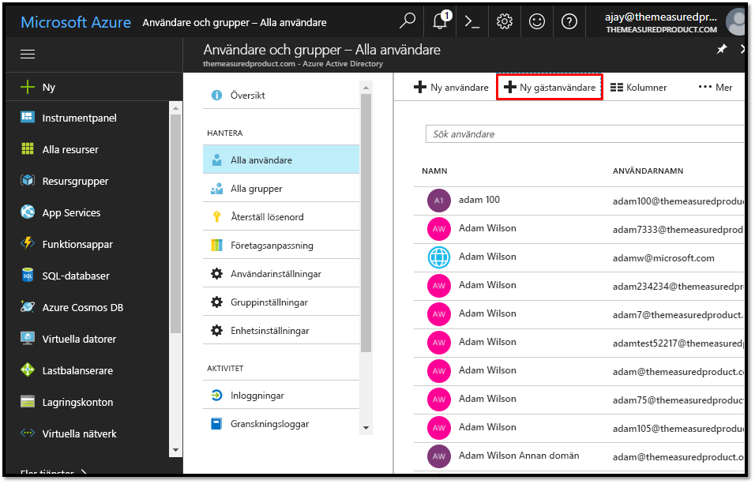

    - Lägg till ett meddelande med inbjudan för gästanvändare och klicka på inbjudan

    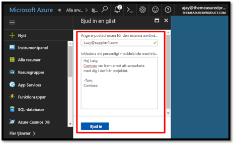

    > [!NOTE]
    > Om du vill bjuda in gästanvändare från Azure-portalen, måste du administratör för Azure Active Directory för din klient.

    Om Contoso vill bjuda in gästanvändare många, kan de göra det med hjälp av PowerShell. Contosos Azure AD-administratör lagrar e-postadresserna för alla gästanvändare i en CSV-fil. Här följer [Azure Active Directory B2B-samarbetskod och PowerShell-exempel](https://docs.microsoft.com/azure/active-directory/b2b/code-samples) och instruktioner.

    När inbjudan får gästanvändare ett e-postmeddelande med länken inbjudan.

    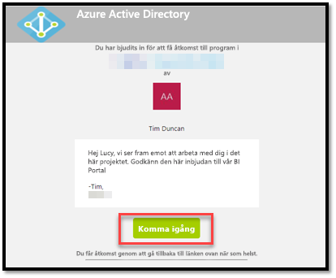

    När gästanvändare klickar du på länken, kan de komma åt innehåll i Contoso Azure AD-klienten.

    > [!NOTE]
    > Det går att ändra layouten för e-postinbjudan med funktionen Azure AD företagsanpassning enligt beskrivningen [här](https://docs.microsoft.com/azure/active-directory/active-directory-b2b-invitation-email).

    **Ad hoc-inbjudningar**

    Vad händer om Contoso inte vet alla gästanvändare som företaget vill bjuda in förväg? Eller vad händer om du Analytikerns Contoso som skapade BI-portalen som vill distribuera innehåll till gästanvändare sig själv? Vi stöder även det här scenariot i Power BI med ad hoc-inbjudan.

    Analytiker kan bara lägga till externa användare till åtkomstlistan för appen när de publicerar den. Gästanvändare får en inbjudan och när de har accepterat de omdirigeras automatiskt till Power BI-innehåll.

    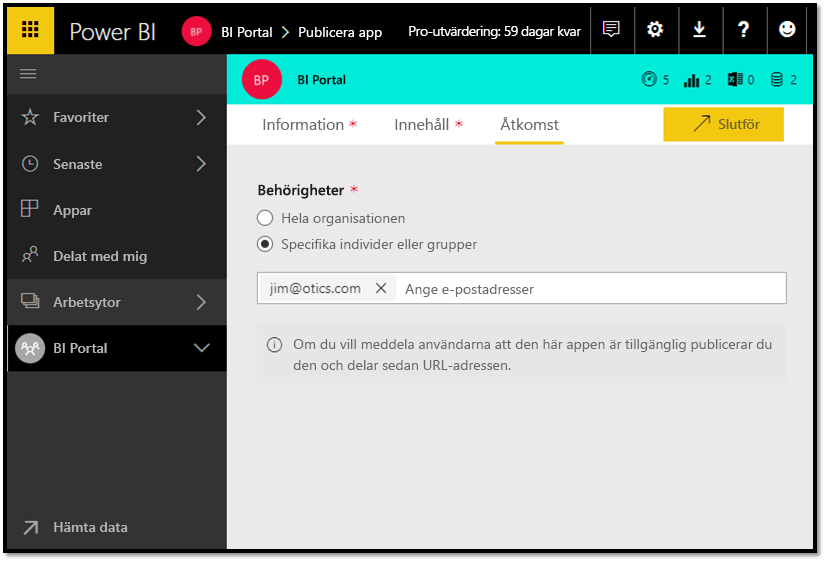

    > [!NOTE]
    > Inbjudningar krävs endast första gången en extern användare bjuds in till din organisation.

3. Distribuera innehåll

    Nu när Contosos BI-teamet har skapat BI-portalen och bjudit in gästanvändare, kan de distribuera sina portalen för att slutanvändarna genom att ge gästanvändare åtkomst till appen och publicera den. Powerbi kompletterar-namnen på gästanvändare som tidigare har lagts till Contoso-klienten. Ad hoc-inbjudningar till andra gästanvändare kan också läggas till i det här läget.

    > [!NOTE]
    > Om du använder säkerhetsgrupper för att hantera åtkomst till appen för externa användare kan använda metoden planerat inbjudningar och dela länken app direkt med alla externa användare som måste komma åt den. I annat fall den externa användaren kanske inte att installera eller visa innehåll inifrån appen. _

    Gästanvändare får ett e-postmeddelande med en länk till appen.

    

    När du klickar på den här länken, uppmanas gästanvändare att autentisera med sin egen identitet.

    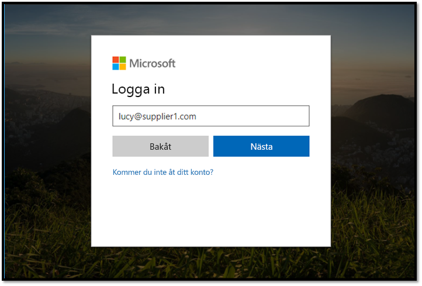

    När de har autentiserats omdirigeras de till Contosos BI-appen.

    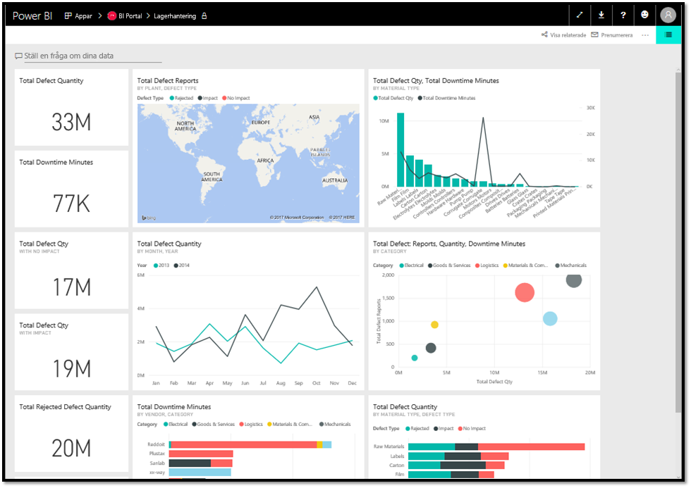

    Gästanvändare får därefter till Contosos app genom att klicka på länken i e-postmeddelandet eller bokmärka länken. Contoso kan också göra det enklare för gästanvändare genom att lägga till den här länken till alla befintliga extranät-portalen som gästanvändare redan använder.

4. Nästa steg

    Med hjälp av en Power BI-appen och Azure AD B2B, kunde Contoso snabbt skapa en BI-portalen för dess leverantörer på ett sätt utan kod. Detta förenklas distribuerar standardiserad analyser för att alla leverantörer som behövs för den.

    Även om exemplet visade hur en enda vanliga rapport kan fördelas mellan leverantörer, kan Power BI gå mycket längre. För att säkerställa att varje partner ser endast data som är relevanta för själva, läggas säkerhet på radnivå enkelt till modellen för rapporten och data. Datasäkerhet för externa partners senare i det här dokumentet beskriver den här processen i information.

    Ofta enskilda rapporter och instrumentpaneler måste bäddas in i en befintlig portal. Detta kan också inträffa att många av de metoder som visas i exemplet. I dessa fall kan det dock vara lättare att bädda in rapporter eller instrumentpaneler direkt från en arbetsyta. Processen för att bjuda in och tilldela behörighet att de kräver att användarna är desamma.

## Under huven: Vad är Lucy från Supplier1 tillgång till Power BI-innehåll från Contosos klient?

Nu när vi har sett hur Contoso kan smidigt distribuera Power BI-innehåll till gästanvändare i resurspartner-organisationer, nu ska vi titta på hur det fungerar i lösningen.

När Contoso inbjuden [ lucy@supplier1.com ](mailto:lucy@supplier1.com) till dess katalog, Azure AD skapar en länk mellan [ Lucy@supplier1.com ](mailto:Lucy@supplier1.com) och Contoso Azure AD-klienten. Den här länken kan Azure AD som vet att Lucy@supplier1.com kan komma åt innehåll i Contoso-klienten.

När Lucy försöker få åtkomst till Contosos Power BI-appen, verifierar Azure AD att Lucy har åtkomst till Contoso-klienten och som sedan visar Power BI en token som anger att Lucy autentiseras för att få åtkomst till innehåll i Contoso-klienten. Powerbi använder denna token för att auktorisera och kontrollera att Lucy har åtkomst till Contosos Power BI-appen.

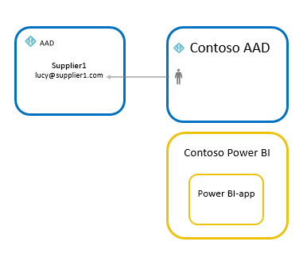

Powerbi-integrering med Azure AD B2B fungerar med alla företag e-postadresser. Om användaren inte har en Azure AD-identitet, kan de uppmanas att skapa en. Följande bild visar detaljerad flödet:

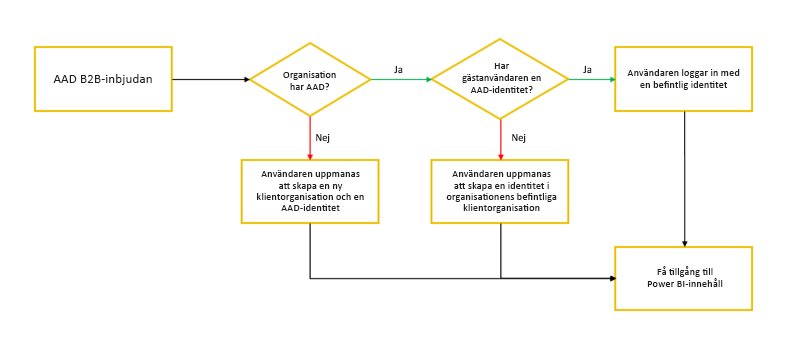

Det är viktigt att känna igen att Azure AD-kontot ska användas eller skapas i den externa parten är Azure AD, det här gör det möjligt att Lucy kan använda sina egna användarnamn och lösenord och sina autentiseringsuppgifter automatiskt slutar fungera i andra klienter när hon lämnar företaget när sin organisation också använder Azure AD.

## Licensiering

Contoso kan välja en av tre metoder att licens gästanvändare från dess leverantörer och partnerorganisationer ska ha åtkomst till Power BI-innehåll.

> [!NOTE]
> _Azure AD B2B kostnadsfria nivån är tillräckligt för att använda Power BI med Azure AD B2B. Vissa avancerade Azure AD B2B-funktioner som dynamiska grupper kräver ytterligare licenser. Finns i Azure AD B2B-dokumentationen för ytterligare information:_ [_https://docs.microsoft.com/azure/active-directory/b2b/licensing-guidance_](https://docs.microsoft.com/azure/active-directory/b2b/licensing-guidance)

### Metod 1: Contoso använder Power BI Premium

Med den här metoden Contoso köper Power BI Premium-kapacitet och tilldelar innehållet BI portalen till den här kapaciteten. På så sätt kan gästanvändare från partnerorganisationer till Contosos Power BI-appen utan en licens för Power BI.

Externa användare omfattas också förbrukningen endast upplevelser erbjuds till ”kostnadsfria” användare i Power BI när innehållet i Power BI Premium.

Contoso kan också dra nytta av andra Power BI premium-funktioner för dess appar som ökade uppdateringsintervall, dedikerad kapacitet och stora modellstorlekar.

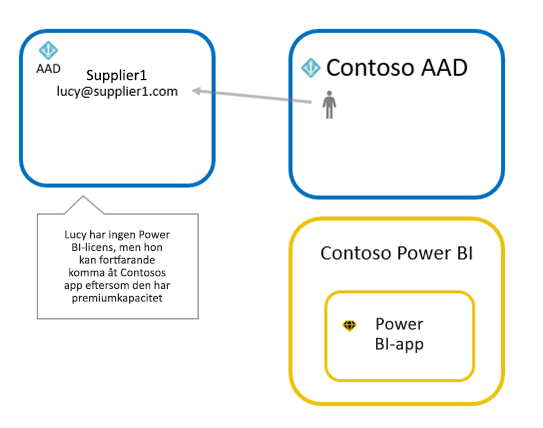

### Metod 2: Contoso tilldelar Power BI Pro-licenser till gästanvändare

Med den här metoden Contoso tilldelar pro-licenser till gästanvändare från partner organisationer – detta kan göras från Administrationscenter för Contosos Microsoft 365. På så sätt kan gästanvändare från partnerorganisationer till Contosos Power BI-appen utan att köpa en licens för sig själva. Detta kan vara lämplig för att dela med externa användare vars organisation inte har valt Power BI ännu.

> [!NOTE]
> _Contosos pro-licens gäller för gästanvändare endast när de har åtkomst till innehåll i Contoso-klienten. Pro-licenser ger åtkomst till innehåll som inte är i en Power BI Premium-kapacitet. Externa användare med en Pro-licens är begränsade som standard till en enda consumption-upplevelse. Detta kan vara ändringen genom att använda den metod som beskrivs i den_ _aktiverar externa användare att redigera och hantera innehåll i Power BI_ _senare i det här dokumentet._

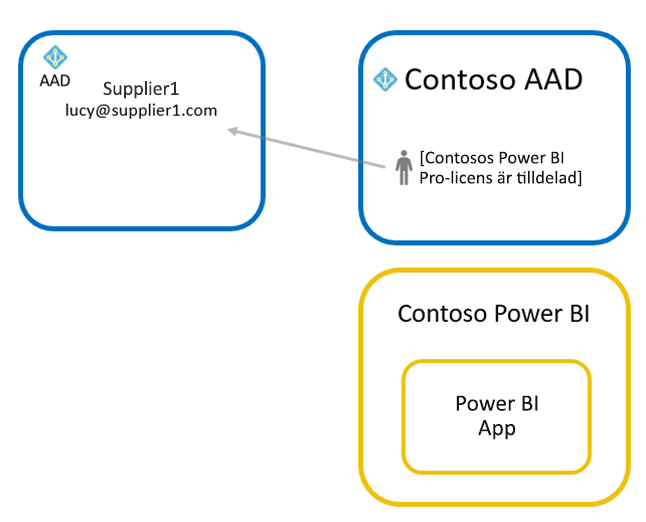

### Metod 3: Gästanvändare tar med egna Power BI Pro licenser

Med den här metoden tilldelar leverantör 1 Lucy en Power BI Pro-licens. Hon kan sedan komma åt Contosos Power BI-appen med denna licens. Eftersom Lucy kan använda sin Pro-licens från sin egen organisation vid åtkomst till en extern Power BI-miljö, den här metoden är kallas ibland _använda din egen licens_ (BYOL). Om båda organisationerna använder Power BI kan detta erbjuder fördelaktiga licensiering för den övergripande analytics-lösningen och minimerar arbetet med att tilldela licenser till externa användare.

> [!NOTE]
> _Pro-licens tilldelas Lucy som leverantören 1 gäller för alla Power BI-klient där Lucy är en gästanvändare. Pro-licenser ger åtkomst till innehåll som inte är i en Power BI Premium-kapacitet. Externa användare med en Pro-licens är begränsade som standard till en enda consumption-upplevelse. Detta kan vara ändringen genom att använda den metod som beskrivs i den_ _aktiverar externa användare att redigera och hantera innehåll i Power BI_ _senare i det här dokumentet._

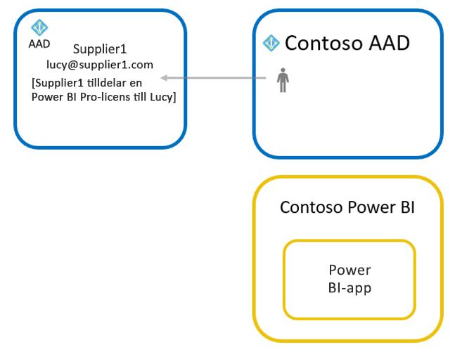

## Datasäkerhet för externa partners

Ofta när du arbetar med flera externa leverantörer, måste Contoso se till att varje leverantör ser data endast om dess egna produkter. Användarbaserad säkerhets- och dynamisk säkerhet på radnivå är det enkelt att göra med Power BI.

### Användarbaserad säkerhet

En av de mest kraftfulla funktionerna i Power BI är säkerhet på radnivå. Den här funktionen kan Contoso att skapa en enda rapport och datauppsättning men fortfarande använda olika säkerhetsregler för varje användare. En detaljerad förklaring finns i [säkerhet på radnivå (RLS)](https://powerbi.microsoft.com/documentation/powerbi-admin-rls/).

Powerbi-integrering med Azure AD B2B kan Contoso att tilldela säkerhet på radnivå regler till gästanvändare när de är välkomna att Contoso-klienten. Eftersom vi har sett innan Contoso kan lägga till gästanvändare via antingen planerat eller ad hoc-inbjudningar. Vi rekommenderar starkt att använda planerad inbjudan för att lägga till gästanvändare förväg och tilldela dem säkerhetsroller innan du delar innehållet om Contoso vill framtvinga säkerhet på radnivå. Om Contoso i stället använder ad hoc-inbjudningar kan det uppstå en kort tidsperiod där gästanvändare inte kan se några data.

> [!NOTE]
> Den här fördröjningen i åtkomst till data som skyddas av RLS när du använder ad hoc-inbjudningar kan leda till supportförfrågningar IT-teamet eftersom användarna ser antingen tomt eller brutna leta rapporter/instrumentpaneler när du öppnar en dela länken i e-postmeddelandet. Därför rekommenderas att använda planerad inbjudan i det här scenario.* *

Låt oss gå igenom det här med ett exempel.

Som tidigare nämnts, Contoso har leverantörer runt om i världen och de vill se till att användare från organisationen leverantör få insikter från data från just deras territorium.  Men användare från Contoso kan komma åt alla data. Contoso skapar en enda rapport och filtrerar data baserat på användaren som visar den istället för att skapa flera olika rapporter.

För att säkerställa Contoso kan filtrera data baserat på vem som ansluter, skapas två roller i Power BI desktop. En för att filtrera alla data från SalesTerritory ”Europa” och en annan för ”Nordamerika”.

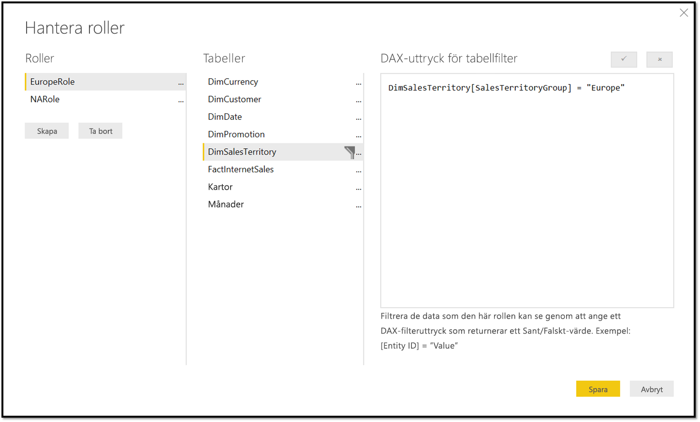

När roller har definierats i rapporten kan måste en användare tilldelas en specifik roll att få åtkomst till alla data. Tilldelning av roller som händer i Power BI-tjänsten ( **datauppsättningar > säkerhet** )

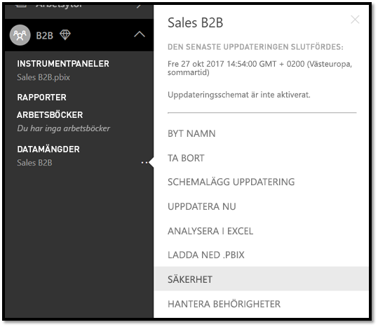

Då öppnas en sida där Contosos BI-teamet kan se två roller som de skapas.  Contosos BI-teamet kan nu tilldela användare till databasrollerna.

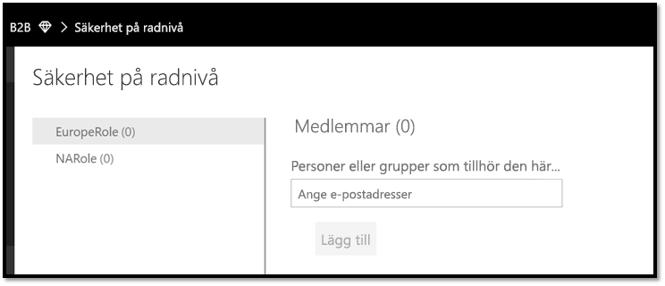

I det här exemplet är Contoso att lägga till en användare i en partnerorganisation med e-postadress ”[adam@themeasuredproduct.com](mailto:adam@themeasuredproduct.com)” till rollen Europa:

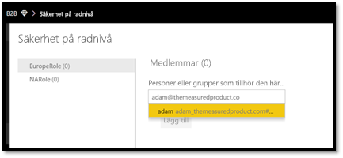

När detta hämtar lösas av Azure AD, ser namnet visas i fönstret klar att läggas i Contoso:

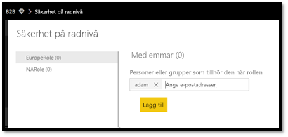

Nu när den här användaren öppnas den app som har delats med honom ser han bara en rapport med data från Europa:

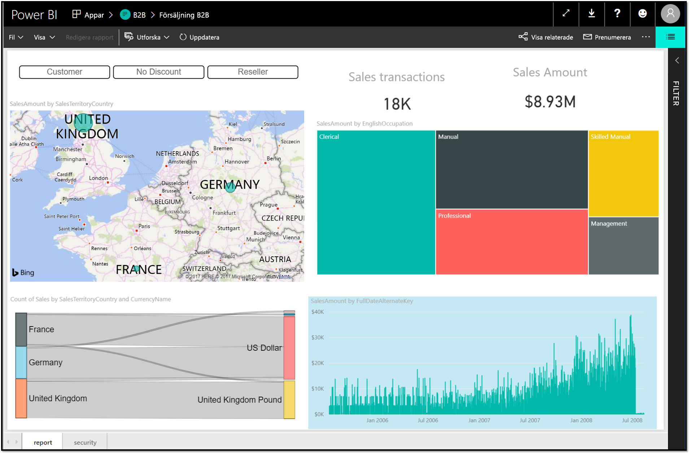

### Dynamisk säkerhet på radnivå

En annan intressant avsnittet är att se hur dynamisk säkerhet på radnivå (RLS) fungerar med Azure AD B2B.

Kort sagt: dynamisk säkerhet på radnivå fungerar genom att filtrera data i modellen baserat på användarnamnet för den person som ansluter till Power BI. I stället för att lägga till fler roller för grupper av användare, anger du användarna i modellen. Vi kommer inte beskriver mönstret i detalj här. Kasper de Jong ger en detaljerad Skriv upp på alla stilar av säkerhet på radnivå i [facit för Power BI Desktop dynamisk säkerhet](https://www.kasperonbi.com/power-bi-desktop-dynamic-security-cheat-sheet/), och i [detta White Paper](https://msdn.microsoft.com/library/jj127437.aspx) .

Nu ska vi titta på ett litet exempel – Contoso har en enkel rapport på försäljning per grupper:

Nu den här rapporten måste delas med två gästanvändare och en intern användare – intern användare kan se allt, men gästanvändare kan bara se grupperna som har de åtkomst till. Det innebär att vi måste filtrera data endast för gästanvändare. Contoso använder dynamisk RLS-mönster som beskrivs i inlägget dokumentation och bloggen för att filtrera data på rätt sätt. Det innebär att Contoso lägger till användarnamnen i aktuella data:

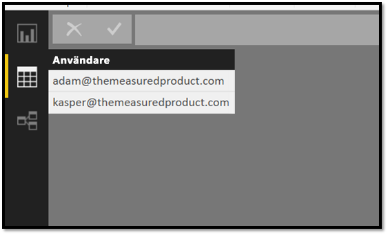

Sedan skapar Contoso rätt datamodellen som filtrerar data på rätt sätt med rätt plats:

Om du vill filtrera dina data automatiskt baserat på vem som är inloggad måste Contoso skapa en roll som skickar in användaren som ansluter. I det här fallet Contoso skapas två roller – först är det ”securityrole” som filtrerar tabellen användare med det aktuella användarnamnet för den användare som loggat in till Power BI (detta fungerar även för Azure AD B2B-gästanvändare).

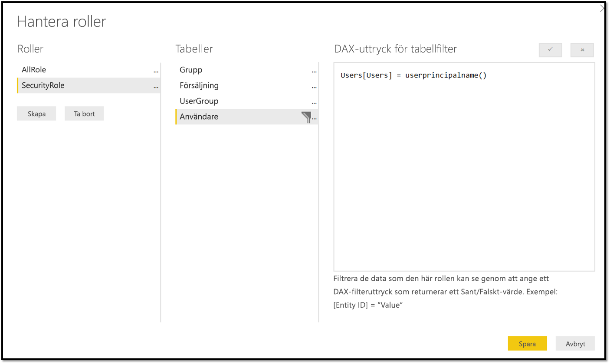

Contoso skapar även en annan ”AllRole” för de interna användare som kan se allt – den här rollen har inte någon säkerhetspredikat.

När du har överfört Power BI desktop-filen till tjänsten, kan Contoso tilldela gästanvändare till ”SecurityRole” och ”AllRole” intern användare

Nu när gästanvändare öppnar rapporten, de endast kan se försäljningen från grupp A:

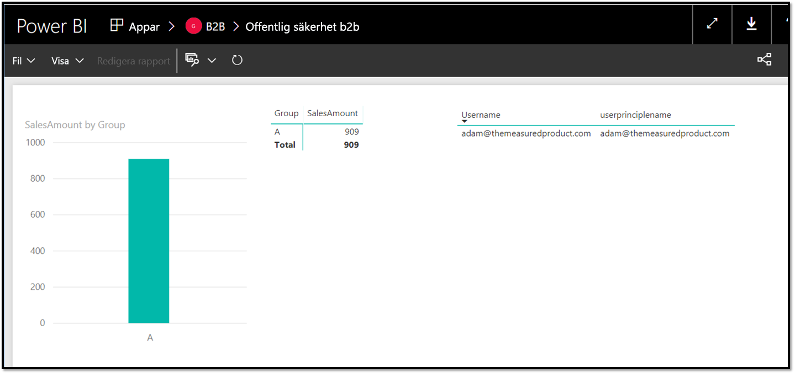

Du kan se resultatet av funktionen USERNAME() och USERPRINCIPALNAME() båda att returnera gästanvändare e-postadress i matrisen till höger.

Intern användare hämtar nu att se alla data:

Som du ser fungerar dynamisk RLS med både interna eller gäst-användare.

> [!NOTE]
> Det här scenariot fungerar även när du använder en modell i Azure Analysis Services. Vanligtvis Azure Analysis Service är ansluten till samma Azure AD som dina Power BI – i så fall kan Azure Analysis Services vet gästanvändare som bjuds in via Azure AD B2B också.

## Ansluta till på lokala datakällor

Powerbi erbjuder möjligheten för Contoso att utnyttja på lokala datakällor som [SQL Server Analysis Services](https://powerbi.microsoft.com/documentation/powerbi-gateway-enterprise-manage-ssas/) eller [SQL Server](https://powerbi.microsoft.com/documentation/powerbi-gateway-kerberos-for-sso-pbi-to-on-premises-data/) direkt tack vare den [lokal datagateway](https://powerbi.microsoft.com/documentation/powerbi-gateway-onprem/). Det går även att logga in på dessa datakällor med samma autentiseringsuppgifter som används med Power BI.

> [!NOTE]
> När du installerar en gateway för att ansluta till din Power BI-klient, måste du använda en användare har skapat i din klient. Externa användare kan inte installera en gateway och ansluter den till din klient. _

För externa användare, och det kan vara mer komplicerat för de externa användarna vanligtvis inte känner till lokalt AD. Powerbi erbjuder en lösning för detta genom att låta Contoso-administratörer att mappa den externa användarnamnen till interna användarnamn enligt beskrivningen i [hantera din datakälla – Analysis Services](https://powerbi.microsoft.com/documentation/powerbi-gateway-enterprise-manage-ssas/). Till exempel [ lucy@supplier1.com ](mailto:lucy@supplier1.com) kan mappas till [lucy\_supplier1\_com #EXT@contoso.com](mailto:lucy_supplier1_com).

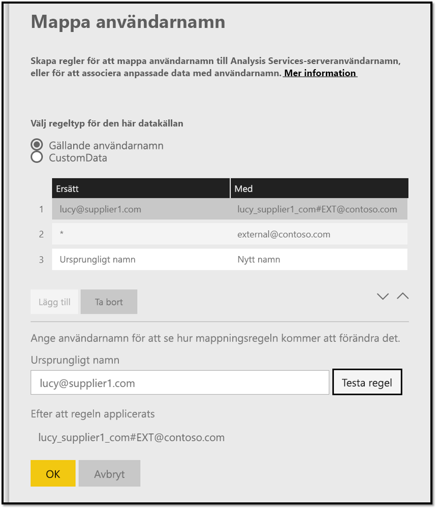

Den här metoden är bra om Contoso har bara ett fåtal användare eller Contoso kan mappa alla externa användare till ett internt konto. För mer komplicerade scenarier där varje användare ha sina egna autentiseringsuppgifter, det finns en mer avancerad strategi som använder [anpassade AD-attribut](https://technet.microsoft.com/library/cc961737.aspx) göra mappningen enligt beskrivningen i [hantera din datakälla – Analysis Services](https://powerbi.microsoft.com/documentation/powerbi-gateway-enterprise-manage-ssas/). Det innebär att Contoso-administratör att definiera en mappning för varje användare i din Azure AD (även externa B2B användare).  Dessa attribut kan anges via AD-objektmodellen med skript eller kod så Contoso kan automatisera mappningen på inbjudan eller på en schemalagd takt.

## Aktivera externa användare att redigera och hantera innehåll i Power BI

Contoso kan externa användare bidra med innehåll i organisationen som beskrivits tidigare i den mellan olika organisationer redigera och hantera Power BI innehållsavsnittet.

> [!NOTE]
> Om du vill redigera och hantera innehåll i din organisations Power BI, måste användaren ha en Power BI Pro-licens i en annan arbetsyta än Min arbetsyta. Användare kan erhålla Pro-licenser som inkluderas i the_ _Licensing__section i det här dokumentet._

Power BI-Administratörsportalen ger den **att externa gästanvändare redigera och hantera innehåll i organisationen** i klientinställningar. Som standard är inställningen inaktiverad, vilket innebär att externa användare får en begränsad upplevelse för skrivskyddade som standard. Inställningen gäller för användare med UserType angett gäst i Azure AD. Tabellen nedan beskrivs vad användare få beroende på deras UserType och hur inställningarna har konfigurerats.

| **Typ av användare i Azure AD** | **Tillåt externa gästanvändare rätt att redigera och hantera innehåll inställning** | **Behavior** |
| --- | --- | --- |
| Gäst | Inaktiverad för användaren (standard) | Per objekt förbrukning enda vy. Tillåter läsåtkomst till rapporter, instrumentpaneler och appar när de visas via en URL som skickas till gästanvändare. Power BI-mobilappar ger en skrivskyddad vy till gästanvändaren. |
| Gäst | Har aktiverats för användaren | Den externa användaren får tillgång till den fullständiga upplevelsen för Power BI, även om vissa funktioner inte är tillgängliga på dem. Den externa användaren måste logga in på Power BI med Power BI-tjänstens URL med klientinformation som ingår. Användare-hämtar Home-upplevelse, Min arbetsyta och baserat på behörigheter kan bläddra, visa och skapa innehåll.    Power BI-mobilappar ger en skrivskyddad vy till gästanvändaren. |

> [!NOTE]
> Externa användare i Azure AD kan också anges till UserType medlem. Detta stöds inte för närvarande i Power BI.

I Power BI-administratörsportalen visas inställningen i följande bild.

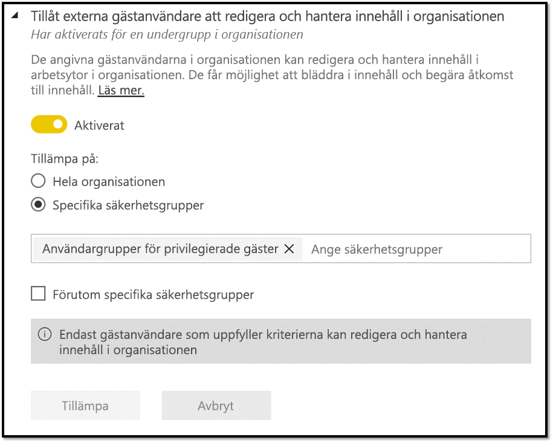

Gästanvändare får skrivskyddad standard och som kan redigera och hantera innehåll. Standardvärdet är inaktiverad, vilket innebär att alla gästanvändare har skrivskyddad upplevelse. I Power BI-Administratörsportalen kan antingen aktivera inställningen för alla gästanvändare i organisationen eller för specifika säkerhetsgrupper som definierats i Azure AD. I följande bild har skapat Power BI-administratören för Contoso en säkerhetsgrupp i Azure AD för att hantera vilka externa användare kan redigera och hantera innehåll i Contoso-klienten.

För att hjälpa användarna att logga in på Power BI, ger du dem med klient-URL. Följ dessa steg för att hitta klientorganisations-URL:en.

1. I Power BI-tjänsten på den översta menyn väljer du hjälp ( **?** ) sedan **om Powerbi**.
2. Leta efter värdet bredvid **klient-URL**. Detta är klient-URL som du kan dela med dina gästanvändare.

    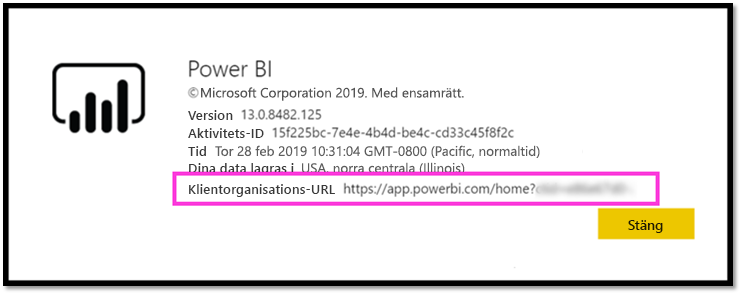

När du använder Tillåt externa gästanvändare rätt att redigera och hantera innehåll i organisationen, de angivna gästanvändare få åtkomst till din organisations Power BI och se allt innehåll som de har behörighet. De kan komma åt Start, bläddra och bidra med innehåll till arbetsytor, installera appar där de finns med i åtkomstlistan och har en Min arbetsyta. De kan skapa eller vara administratör för arbetsytor som använder den nya användningen av arbetsytan.

> [!NOTE]
> När du använder det här alternativet måste du gå igenom avsnittet styrning i det här dokumentet eftersom standardinställningarna för Azure AD förhindra gästanvändare för att använda vissa funktioner som personer datumväljare, vilket kan leda till minskad experience.* *

Vissa funktioner är inte tillgängliga för dem för gästanvändare som aktiveras via Tillåt externa gästanvändare rätt att redigera och hantera innehåll i organisationen klientinställningen. Om du vill uppdatera eller publicera rapporter, måste gästanvändare du använda Power BI-tjänsten webbgränssnittet, inklusive hämta Data om du vill överföra Power BI Desktop-filer. Följande användningar stöds inte:

- Direktpublicering från Power BI Desktop till Power BI-tjänsten
- Gästanvändare kan inte använda Power BI Desktop för att ansluta till tjänstdatauppsättningar i Power BI-tjänsten
- Klassiska arbetsytor som är kopplade till Office 365-grupper: Gästanvändare kan inte skapa eller vara administratörer för dessa arbetsytor. De kan vara medlemmar.
- Det går inte att skicka ad hoc-inbjudan för arbetsyteåtkomstlistor
- Power BI Publisher för Excel stöds inte för gästanvändare
- Gästanvändare kan inte installera en Power BI Gateway och ansluta den till din organisation
- Gästanvändare kan inte installera appar och publicera i hela organisationen
- Gästanvändare kan inte använda, skapa, uppdatera eller installera innehållspaket för organisationen
- Gästanvändare kan inte använda Analysera i Excel
- Gästanvändare kan inte vara @mentioned i kommentarer (den här funktionen kommer läggas till i en kommande version)
- Gästanvändare kan inte använda prenumerationer (den här funktionen kommer läggas till i en kommande version)
- Gästanvändare som använder den här funktionen ska ha ett arbets- eller skolkonto. Gästanvändare med personliga konton Upplev mer begränsningar på grund av begränsningar för inloggning.

## Styrning

### Ytterligare Azure AD-inställningar som påverkar upplevelser i Power BI som är relaterade till Azure AD B2B

När du använder Azure AD B2B-delning, styr Azure Active Directory-administratör aspekter av den externa användaren upplevelse. Dessa styrs på inställningssidan för externt samarbete i Azure Active Directory-inställningar för din klient.

Information om inställningarna finns här:

[https://docs.microsoft.com/azure/active-directory/b2b/delegate-invitations](https://docs.microsoft.com/azure/active-directory/b2b/delegate-invitations)

> [!NOTE]
> Som standard i behörigheterna för gästanvändare är begränsade alternativet är inställt på Ja, så gästanvändare i Power BI har begränsad upplevelser särskilt omger delning där Personväljaren användargränssnitt inte arbetar för dessa användare. Det är viktigt att arbeta med Azure AD-administratören att inställt på Nej, som visas nedan för att säkerställa ett bra experience.* *

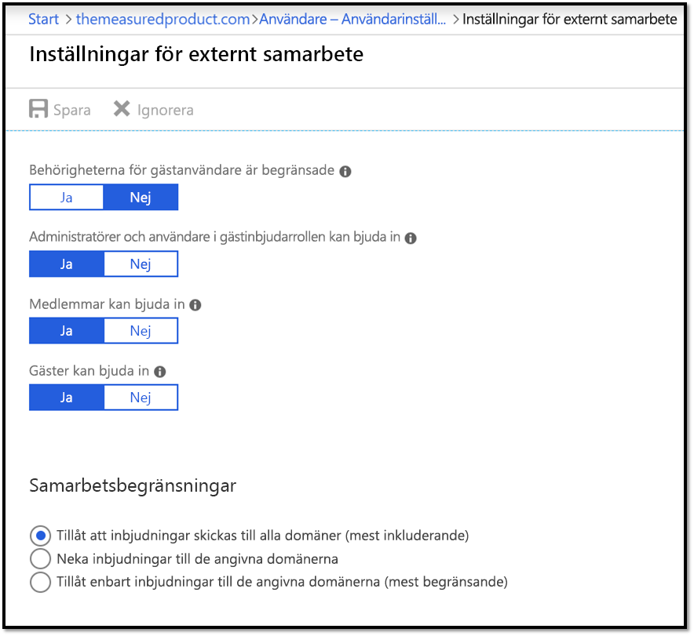

### Kontrollen gäst inbjudningar

Power BI-administratörer kan styra extern delning för Power BI genom att gå till Power BI-administratörsportalen. Men innehavaradministratörer kan också styra extern delning med olika Azure AD-principer.  Dessa principer kan klienten administratörer

- Inaktivera inbjudningar av slutanvändare
- Bara administratörer och användare i rollen Gästinbjudare kan bjuda in
- Administratörer, Gäst bjuder in roll och medlemmar kan bjuda in
- Alla användare, inklusive gäster, kan bjuda in

Du kan läsa mer om dessa principer i [delegera inbjudningar för Azure Active Directory B2B-samarbete](https://docs.microsoft.com/azure/active-directory/active-directory-b2b-delegate-invitations).

Alla Power BI-åtgärder av externa användare är också [granskas i vår granskning portal](https://powerbi.microsoft.com/documentation/powerbi-admin-auditing/).

### Villkorliga åtkomstprinciper för gästanvändare

Contoso kan tillämpa principer för villkorlig åtkomst för gästanvändare som åtkomst till innehåll från Contoso-klienten. Du kan hitta detaljerade anvisningar i [villkorlig åtkomst för användare i B2B-samarbetet](https://docs.microsoft.com/azure/active-directory/active-directory-b2b-mfa-instructions).

## Vanliga alternativa metoder

Azure AD B2B gör det enkelt att dela data och rapporter mellan olika organisationer, finns men det flera metoder som används ofta och överlägsen i vissa fall.

### Alternativ 1: Skapa dubbla identiteter för användare

Med det här alternativet Contoso var tvungen att manuellt skapa dubbla identiteter för varje partner-användare i Contoso-klienten som du ser i följande bild. Sedan i Power BI, kan Contoso dela på de tilldelade identiteterna lämpliga rapporter, instrumentpaneler och appar.

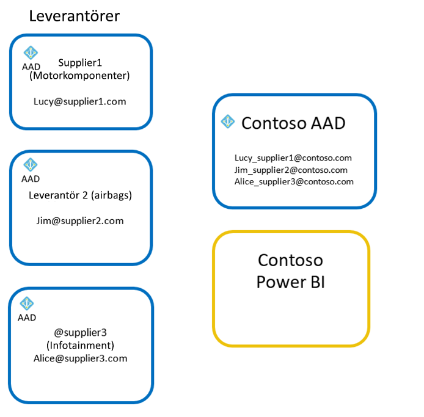

Anledningar till att du väljer detta alternativ:

- Eftersom användarens identitet styrs av din organisation, relaterade tjänst, till exempel e-post, SharePoint, osv finns också i kontrollen av din organisation. Din IT-administratörer kan återställa lösenord, inaktivera åtkomst till konton eller granska aktiviteter i dessa tjänster.
- Användare som använder personliga konton för sin verksamhet ofta är begränsade från att komma åt vissa tjänster kanske så måste ett organisationskonto.
- Vissa tjänster fungerar bara över organisationens användare. Till exempel kanske använder Intune för att hantera innehåll på personliga/mobile-enheter för externa användare som använder Azure B2B inte möjligt.

Skäl inte kan välja detta alternativ:

- Användare från partnerorganisationer måste komma ihåg två uppsättningar autentiseringsuppgifter – en för att komma åt innehåll från den egna organisationen och den andra att komma åt innehåll från Contoso. Detta är en besvär för dessa gästanvändare och många gästanvändare är förvirrad av den här upplevelsen.
- Contoso måste köpa och tilldela användarna licenser per användare. Om en användare måste ta emot e-post eller använder office-program, måste de lämpliga licenser, inklusive Power BI Pro för att redigera och dela innehåll i Power BI.
- Contoso vill kanske tillämpa strängare auktorisering och styrningsprinciper för externa användare jämfört med interna användare. För att uppnå detta Contoso måste skapa en intern terminologi för externa användare och alla Contoso-användare måste utbildas om den här terminologi.
- När användaren lämnar organisationen, fortsätter de att ha åtkomst till resurser i Contosos tills administratören för Contoso manuellt tar bort sitt konto
- Contoso-administratörer måste hantera identiteten för gäst, inklusive skapandet, lösenordsåterställning osv.

### Alternativ 2: Skapa ett anpassat Power BI Embedded-program med hjälp av anpassad autentisering

Ett annat alternativ för Contoso är att skapa en egen anpassad inbäddad Power BI-program med anpassad autentisering (['Appen äger data'](https://docs.microsoft.com/power-bi/developer/embed-sample-for-customers)). Även om många organisationer inte har tid eller resurser för att skapa en anpassad App för att distribuera Power BI innehåll till sina externa partners, för vissa organisationer detta är den bästa metoden och ska ha allvarlig.

Ofta kan organisationer har befintliga partnerportaler som centralisera åtkomsten till alla företagsresurser för partner ger isolering från interna företagsresurser och tillhandahåller effektiv upplevelser för partner att stödja många partner och deras enskilda användare.

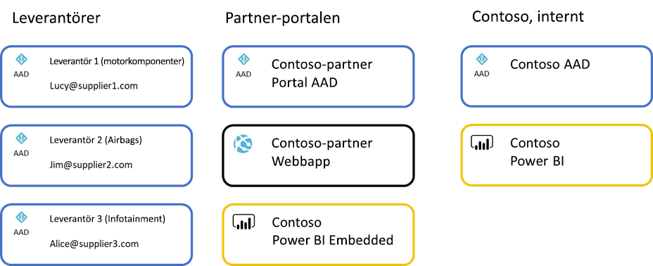

I exemplet ovan användare från varje leverantör inloggningen till Contosos partnerportalen använder som AAD som identitetsprovider. Det kan använda AAD B2B, Azure B2C, interna identiteter eller federera med valfritt antal andra identitetsleverantörer. Användaren kan logga in och komma åt en partner portal version med hjälp av Azure Web App eller en liknande infrastruktur.

I webbapp bäddas Power BI-rapporter från en Power BI Embedded distribution. Webbappen skulle strömlinjeforma åtkomst till rapporterna och relaterade tjänster i en sammanhängande upplevelse som syftar till att göra det enkelt för leverantörer att interagera med Contoso. Den här portalen miljön är isolerat från Contoso interna AAD och Contosos interna Power BI-miljö så leverantörer kunde inte komma åt resurserna. Normalt lagras data i ett separat datalager för Partner att säkra isolering av data. Denna isolering har fördelar eftersom det begränsar antalet externa användare direkt åtkomst till din organisations data, begränsa vilka data som kan vara tillgängliga för den externa användaren och begränsa delas av misstag med externa användare.

Med Power BI Embedded kan portalen kan dra nytta av stora fördelar licensiering, med hjälp av apptoken eller överordnad användare plus premium-kapacitet köps i Azure-modellen, vilket förenklar frågor om hur du tilldelar licenser till slutanvändare och kan skala upp/ned baserat på förväntat användning. Portalen kan erbjuda en övergripande högre kvalitet och enhetlig upplevelse eftersom partner åtkomst till en enda portal som utformats med alla behov av en Partner i åtanke. Till sist, eftersom Power BI Embedded baserade lösningar är vanligtvis avsedda att vara flera innehavare, det gör det enklare att säkra isolering mellan partnerorganisationer.

Anledningar till att du väljer detta alternativ:

- Enklare att hantera som antalet partnerorganisationer växer. Eftersom partner läggs till i en separat katalog isolerade från Contosos interna AAD-katalogen, förenklar dess styrning uppgifter och hjälper till att förhindra oavsiktlig delning av interna data för externa användare.
- Vanliga Partnerportaler är mycket märkesprodukter upplevelser med konsekvent upplevelse över partner och effektiviseras för att uppfylla behoven hos vanliga partner. Contoso kan därför att erbjuda en bättre helhetsupplevelse för partner genom att integrera alla nödvändiga tjänster i en enda portal.
- Licenskostnaden för avancerade scenarier som redigering innehåll i Power BI Embedded täcks av Azure har köpt Power BI Premium och kräver inte tilldelningen av Power BI Pro-licenser till användarna.
- Ger bättre isolering mellan partner om skapats som en lösning för flera innehavare.
- Partnerportalen innehåller ofta andra verktyg för partner utöver Power BI-rapporter, instrumentpaneler och appar.

Skäl inte kan välja detta alternativ:

- Betydande arbete krävs för att skapa, hantera och underhålla sådana hanteringsportalen att en betydande investering i resurser och tid.
- Tid till lösning är mycket längre tid än att använda B2B dela sedan noggrann planering och körning över flera workstreams krävs.
- Det arbete som krävs för detta alternativ är förmodligen för högt att motivera där det finns ett mindre antal partners.
- Med hjälp av ad hoc-delning är det primära scenariot som din organisation.
- Rapporter och instrumentpaneler är olika för varje partner. Detta alternativ introducerar hanteringen overhead bortom bara dela direkt med partner.

## Vanliga frågor och svar

**Contoso skicka en inbjudan som automatiskt in, så att användaren är bara ”klart”? Eller användaren har alltid att klicka dig igenom till URL: en för inlösen?**

Slutanvändaren måste alltid klicka dig igenom samtycke upplevelsen innan de kan komma åt innehållet.

Om du kommer bjuda in gästanvändare för många, rekommenderar vi att du delegerar detta från dina core Azure AD-administratörer av [att lägga till en användare i rollen som gästinbjudare i resursorganisationen](https://docs.microsoft.com/azure/active-directory/active-directory-b2b-add-guest-to-role). Den här användaren kan bjuda in andra användare i partnerorganisationen med hjälp av inloggning Användargränssnittet, PowerShell-skript eller API: er. Detta minskar den administrativa belastningen för din Azure AD-administratörer kan bjuda in eller skickas igen inbjudningar till användare i partnerorganisationen.

**Kan Contoso tvinga Multi-Factor authentication för gästanvändare om dess partner inte har multifaktorautentisering?**

Ja. Mer information finns i [villkorlig åtkomst för användare i B2B-samarbetet](https://docs.microsoft.com/azure/active-directory/active-directory-b2b-mfa-instructions).

**Hur fungerar B2B-samarbete när den inbjudna partnern använder federation att lägga till egna lokal autentisering?**

Om partnern har en Azure AD-klient som är federerat till lokal autentisering infrastruktur, uppnås lokala enkel inloggning (SSO) automatiskt. Om partnern inte har en Azure AD-klient, kan en Azure AD-konto skapas för nya användare.

**Kan jag bjuda in gästanvändare med konsumenten e-postkonton?**

Bjuder in gästanvändare med konsumenten e-postkonton stöds i Power BI. Detta inkluderar domäner, till exempel hotmail.com, outlook.com och gmail.com. Men dessa användare kan uppleva begränsningar utöver vad användare med fungerar eller skolkonton stöta på.
