# Distribuera och hantera Power BI Premium-kapaciteter

**Sammanfattning:** Power BI Premium ger mer konsekvent prestanda, support för stora datavolymer och flexibiliteten hos en enhetlig självbetjänings- och BI-företagsplattform för alla i din organisation. Detta tekniska nivå 300-white paper har skrivits specifikt för Power BI-administratörer och innehållsförfattare och utgivare. Syftet är att hjälpa dem att förstå potentialen i Power BI Premium och förklara hur man utformar, distribuera, övervakar och felsöker skalbara lösningar.

**Författare:** [Peter Myers](https://www.linkedin.com/in/peterjsmyers) (Data Platform MVP och oberoende BI-expert med binära lösningar)

**Tekniska granskare:** Adam Saxton, Akshai Mirchandani, Bhavik Merchant, David Magar, Josh Caplan, Michael Blythe, Nimrod Shalit, Olivier Matrat, Swati Gupta

**Gäller för:** Power BI-tjänst, Power BI Premium och Azure Power BI Embedded-kapaciteter

> [!NOTE]
> Du kan spara eller skriva ut detta white paper genom att välja **Skriv ut** i webbläsaren och sedan välja **Spara som PDF**.

## Introduktion till BI

Power BI är en tjänst för företagsanalyser, som har utformats för att du ska få insikter som gör att du snabbt kan fatta välgrundade beslut. Sedan tjänsten publicerades år 2015 har den snabbt blivit en populär tjänst som används för att leverera lösningar för de minsta organisationerna till de största företagen.

Den görs tillgängligt på två sätt: Som en molntjänst och som en lokal rapporteringslösning med namnet **Power BI-rapportserver**. \[[1](#endnote-01)\]

Power BI som en molntjänst är en programvara som en tjänst (SaaS) \[ [2](#endnote-02)\]. Den representerar en uppsättning tjänster och program som gör att organisationerna kan utveckla, distribuera, hantera och dela lösningar för att övervaka sin verksamhet.

Detta white papers avsikt är inte att tillhandahålla en omfattande beskrivning av Power BI-tjänsten. I stället fokuserar det på ämnen som är relevanta för Power BI Premium. Allmän information om Power BI finns i den omfattande [Power BI-dokumentationen](service-admin-premium-multi-geo.md). En mer detaljerad förklaring av Power BI-tjänsten med fokus på att uppnå väl utförda företagsdistributioner finns i det omfattande white paper [Planera en företagsdistribution för Power BI](https://aka.ms/pbienterprisedeploy).

Inom ramen för detta white papers ämne introducerar och beskriver det här avsnittet kapaciteter, Power BI-innehållstyper, modellagringslägen och licensiering. En förståelse för de här avsnitten är viktigt för att distribuera och hantera Power BI Premium framgångsrikt.

### Kapacitet

**Kapaciteter** är ett kärnbegrepp för Power BI som representerar en uppsättning resurser (lagring, processor och minne) som används för att vara värd för och leverera Power BI-innehåll. Kapaciteter är antingen delade eller dedikerade. En **delad kapacitet** är delad med andra Microsoft-kunder, medan en **dedikerade kapaciteten** är helt tillägnad en enda kund. Dedikerade kapaciteter introduceras i avsnittet [Premium-kapaciteter](#premium-capacities).

I delad kapacitet körs arbetsbelastningar på dataresurser som delas med andra kunder. När kapaciteten måste dela resurser, införs begränsningar för att säkerställa ”sjyst spel”, till exempel maximal modellstorlek (1 GB) och maximal daglig uppdateringsfrekvens (åtta gånger per dag).

### Arbetsytor

Power BI-arbetsytor finns i kapaciteter och de representerar säkerhet, samarbete och distribueringsbehållare. Varje Power BI-användare har en personlig arbetsyta som kallas **Min arbetsyta**. Fler arbetsytor kan skapas för att möjliggöra samarbete och distribution och dessa kallas **Apparbetsytor**. Som standard skapas arbetsytor, inklusive personliga arbetsytor, i den delade kapaciteten.

### Power BI-innehållstyper

För att introducera Power BI Premium-ämnen, är det viktigt att börja med en ingående diskussion av Power BI-arkitekturen, inklusive grundläggande innehållstyper.

Allt Power BI-innehåll lagras och hanteras i arbetsytor som är behållare för Power BI-innehåll. Varje Power BI-användare har sin egen personliga arbetsyta, men generellt är den bästa metoden är att skapa app-arbetsytor. App-arbetsytor aktiverar samägande av innehåll och möjlighet att samarbeta med innehåll. De ger också möjlighet att mellanlagra och distribuera innehåll till en bred publik som appar.

Följande Power BI-innehåll lagras i arbetsytor:

- Dataflöden
- Datauppsättningar
- Arbetsböcker
- Rapporter
- Instrumentpaneler

#### Dataflöden

Power BI-dataflöden hjälper organisationer att förena data från olika källor. De kan ses som data som är förberedda och mellanlagrade för användning i modeller, men de kan inte användas direkt som en källa för rapportering. De utnyttjar den omfattande uppsättningen av Microsoft-datakopplingar och aktiverar inmatning av data från lokala och molnbaserade datakällor.

Dataflöden kan bara skapas och hanteras i app-arbetsytor och de lagras som entiteter i Common Data Model (CDM) i Azure Data Lake Storage Gen2. Normalt kommer de att uppdateras regelbundet för att lagra aktuella data.

Mer information finns i dokumentet [Dataförberedelser med självbetjäning i Power BI (förhandsversion)](service-dataflows-overview.md).

#### Datauppsättningar

Power BI-datauppsättningar representerar en källa av data som är redo för rapportering och visualisering. Det finns många typer av datauppsättningar som skapats genom att:

- Ansluta till en befintlig datamodell som inte finns i en Power BI-kapacitet
- Ladda upp en Power BI Desktop-fil som innehåller en modell
- Ladda upp en Excel-arbetsbok (som innehåller en eller flera tabeller i Excel och/eller en arbetsboksdatamodell) eller ladda upp en CVS-fil (kommateckenavgränsad fil)
- Använda Power BI-tjänsten för att skapa en distribution, direktuppspelande eller hybriduppspelande datauppsättning

Förutom direktuppspelande datauppsättningar \[[3](#endnote-03)\], representerar datauppsättningen en datamodell som använder modelleringstekniker av Analysis Services.

Observera att i dokumentation är ibland datauppsättningarna med termer och modeller utbytbara. I allmänhet från ett Power BI-tjänsteperspektiv refereras det till som en **datauppsättning**, och från ett utvecklingsperspektiv refereras det till som en **modell**. I detta white paper betyder de i stort sett samma sak.

##### Externt värdbaserade modeller

Att ansluta till en externt värdbaserad modell innebär att installera den [lokala datagatewayen](service-gateway-onprem.md) till att ansluta till SQL Server Analysis Services, oavsett om det är infrastruktur som en tjänst (IaaS) lokalt eller om den virtuella datorn är värd. Azure Analysis Services kräver inte en gateway. Det här scenariot fungerar ofta när det finns befintliga modellinvesteringar, vilka normalt utgör en del av Enterprise Data Warehouse (EDW). Det gör att Power BI kan utföra en **Live-anslutning** till Analysis Services och gör det genom att tillämpa databehörigheter med hjälp av Power BI-rapportanvändarens identitet. SQL Server Analysis Services stöder både flerdimensionella modeller (kuber) och tabellmodeller. I följande bild visas en live-ansluten (LC) datauppsättning som skickar frågor till externt värdbaserade modeller.

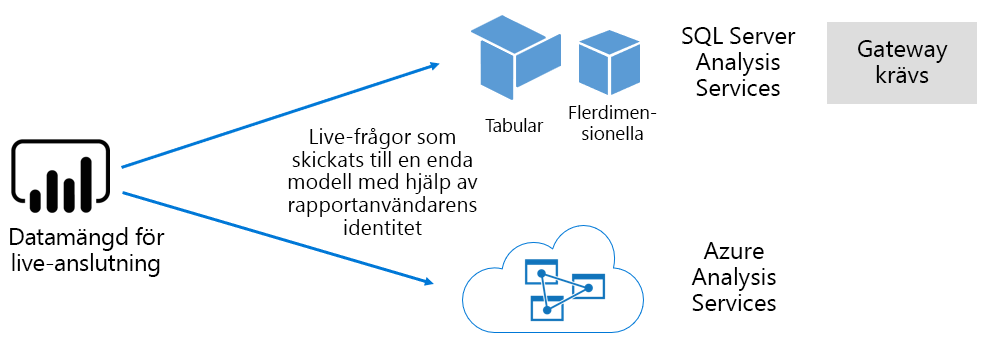

##### Power BI Desktop-utvecklade modeller

Power BI Desktop – ett klientprogram avsett för utveckling av Power BI – kan användas för att utveckla en modell som är en Analysis Services-tabellmodell. Modeller kan utvecklas genom att importera data från dataflöden, som sedan kan integreras med andra datakällor. Även om information om hur modellering kan ske ligger utom omfånget för detta white paper, är det viktigt att förstå att det finns tre olika typer, eller lägen, av modeller som kan utvecklas med hjälp av Power BI Desktop. Dessa lägen avgör om data har importerats till modellen, eller om de finns kvar i datakällan. Det finns tre lägen: Import, DirectQuery och Sammansatt. En fullständig beskrivning av varje steg beskrivs i ämnet [modellagringslägen](#model-storage-modes).

Externt värdbaserade modeller och modeller som utvecklats i Power BI desktop kan tillämpa säkerhet på radnivå (RLS) för att begränsa de data som kan hämtas för en viss användare. Användare som tillhör säkerhetsgruppen säljare kan till exempel bara visa rapportdata för de försäljningsregioner som de har tilldelats. RLS-roller kan vara dynamiska eller statiska. **Dynamiska roller** filtrerar efter rapportanvändare, medan för **statiska roller** gäller samma filter för alla användare som tilldelats rollen.

##### Excel-arbetsbokmodeller

Skapa datauppsättningar baserade på Excel-arbetsböcker eller CSV-filer leder till automatiskt skapande av en modell. Excel-tabeller och CSV-data kommer att importeras för att skapa modelltabeller, medan en datamodell för en Excel-arbetsbok kommer att införlivas för att skapa en Power BI-modell. I samtliga fall importeras fildata till en modell.

Åtskillnader kan sedan göras om Power BI-datauppsättningar som representerar modeller:

- De finns antingen i Power BI-tjänsten, eller externt hos Analysis Services
- De kan lagra importerade data eller de kan utfärda frågebegäranden till underliggande datakällor eller en blandning av båda

Här är en sammanfattning av viktiga fakta om Power BI-datauppsättningar som representerar modeller:

- Modeller i SQL Server Analysis Services kräver en gateway för att utföra LC-frågor
- Power BI-värdbaserade modeller som importerar data
  - Måste vara helt inlästa i minnet så att de kan efterfrågas
  - Kräver uppdatering för att hålla data aktuella och måste innefatta gatewayer när datakällan inte är tillgänglig direkt via Internet
- Power BI-värdbaserade modeller som använder DirectQuery (DQ) lagringsläge kräver anslutning till datakällan. När modellen får en fråga, utfärdar Power BI frågor till källdata för att hämta aktuella data. Detta läge måste innefatta gatewayer när datakällan inte är tillgänglig direkt via Internet.
- Modeller kan införa RLS-regler, vilka tillämpar filter för att begränsa åtkomst för vissa användare

Om du vill distribuera och hantera Power BI Premium, är det viktigt att förstå var modeller finns, deras lagringsläge, eventuella beroenden för gatewayer, storleken på importerade data och uppdateringstypen och -intervallet. Dessa kan alla ha en betydande inverkan på Power BI Premium-resurser. Dessutom kan själva modelldesignen inklusive frågorna för förberedelse av data och beräkningar räknas med i blandningen överväganden.

Det är också viktigt att förstå att Power BI-värdbaserade importmodeller kan uppdateras enligt schema eller utlösas på begäran av en användare i Power BI-tjänsten.

Design av optimerade modeller beskrivs senare i det här tekniska dokumentet i avsnittet [Optimera modeller](#optimizing-models).

#### Arbetsböcker

Power BI-arbetsböcker är en Power BI-innehållstyp \[[4](#endnote-04)\]. De är Excel-arbetsböcker som har överförts till Power BI-tjänsten och ska inte förväxlas med överförda Excel-arbetsböcker som skapar datauppsättningar (modeller). Arbetsbokens innehållstyp representerar en anslutning till en arbetsbok som antingen ska överföras till Power BI-tjänsten eller finnas kvar i molnlagring i OneDrive eller SharePoint Online.

Det är viktigt att förstå att den här innehållstypen inte är tillgänglig som en datakälla för Power BI-datavisualiseringar. Den kan i stället öppnas som en arbetsbok i Power BI-tjänsten genom att använda Excel Online. Den huvudsakliga avsikten för den här innehållstypen är att äldre Excel-arbetsboksrapporter ska vara tillgängliga i Power BI-tjänsten, så att dess datavisualiseringar kan fästas på Power BI-instrumentpaneler.

Mer information finns i dokumentet [Hämta data från Excel-arbetsboksfiler](service-excel-workbook-files.md).

#### Rapporter

Det finns två typer av rapporter: Power BI-rapporter och sidnumrerade rapporter.

**Power BI-rapporter** ger en interaktiv datavisualiseringsupplevelse som ansluter till endast en enskild datauppsättning. Rapporter är ofta utformade att främja användardeltagande så att de kan interagera med en extraordinära uppsättning funktioner, inklusive filtrering, uppdelning, korsfiltrering och markering, detaljgranska uppåt, detaljgranska neråt, gå igenom, frågor och svar med naturligt språk, fokusering, sidnavigering, spotlighting, visa bokmärken och mer.

I samband med detta white paper, är det viktigt att förstå hur Power BI-arkitekturen, Power BI-rapportdesignen och användarinteraktioner kan påverka resurserna i Power BI-tjänsten:

- Om du vill läsa in och interagera med rapporter som baseras på importmodeller, måste modellen vara helt inläst i minnet (vare sig om de finns i Power BI-tjänsten eller externt)
- Varje visuellt rapportobjekt skickar en fråga för att hämta data genom att fråga modellen
- I allmänhet bör filter- och utsnittsinteraktioner omfatta att fråga modellen. Till exempel kommer ändring av ett utsnittsval, som standard, att kräva att varje visuellt objekt läses in igen på sidan \[[5](#endnote-05)\]
- Power BI-rapporter garanterar inte att aktuella data visas och kan kräva att användaren uppdaterar rapporten för att läsa in rapportsidan och dess visuella objekt på nytt
- Användare kan interagera med funktionen för frågor och svar med naturligt språk för att ställa frågor, förutsatt att Power BI-rapportdesignen tillåter det och datauppsättningen representerar en Power BI-värdbaserade dataimportmodell eller en LC-datauppsättning som konfigurerats för att aktivera frågor och svar

**Sidnumrerade rapporter** tillåter publikationen och återgivningen av SQL Server Reporting Services (SSRS)-rapporter (\*RDL-format). Som namnet antyder används sidnumrerade rapporter ofta vid ett behov av utskrift till en fast sidstorlek eller om det förekommer variabellistor med data som måste expanderas helt. Till exempel en faktura som utformats för flersidig rendering (i stället för att bläddra i ett visuellt objekt) och utskrift.

De två rapporttyper som stöds anger alternativ för rapportförfattare, så att de kan välja typ efter behov och avsedd användning. I allmänhet är Power BI-rapporter idealiska för interaktiva upplevelser som tillåter användare att utforska och upptäcka insikter från data, medan sidnumrerade rapporter är bättre lämpade för parameterdrivna sidlayouter.

Oavsett rapporttyp är det viktigt att uppnå responsiv rapportbelastning och datauppdateringar (när filter eller parametrar har ändrats) för att tillhandahålla en tillförlitlig och väl utförd användarupplevelse.

#### Instrumentpaneler

Power BI-instrumentpaneler är avsedda att leverera övervakningsupplevelser och skiljer sig begreppsmässigt mycket åt från Power BI-rapporter. Instrumentpaneler är utformade för visning på en enda ruta för att uttrycka värden och datavisualiseringar i paneler. Instrumentpaneler ger ofta färre interaktionsupplevelser än Power BI-rapporter och i vissa instrumentpanelsutformningar förväntas ingen interaktion. Till exempel en obevakad instrumentpanel på en icke-pekskärm i ett serverrum. En annan betydande skillnad är att instrumentpaneler kan uppvisa paneler som källdata från flera datamängder, samtidigt som en Power BI-rapport bara kan baseras på en enda datauppsättning.

Det är viktigt att förstå att en instrumentpanel är utformad för att alltid läsa in snabbt och uttrycka de senaste data (kända för Power BI-tjänsten). Den uppnår detta genom att cachelagra panelfrågeresultat och detta sker för varje instrumentpanel. Den måste i själva verket göra detta för varje användare som har åtkomst till en instrumentpanel som baseras på modeller som tillämpar dynamisk RLS.

Power BI-tjänsten uppdaterar automatiskt instrumentpanelens frågecacheminnen omedelbart efter det att Power BI-värdbaserade importmodeller har uppdaterats. När det gäller LC- och DQ-modeller har datauppsättningens ägare stor kontroll över hur ofta Power BI-tjänsten uppdaterar cacheminnet, vilket kan konfigureras till så ofta som var 15:e minut eller så sällan som en gång i veckan. Observera att uppdateringar av LC-frågecacheminnen först frågar om modellmetadata för att avgöra om en modelluppdatering har ägt rum sedan den senaste uppdateringen av cachen och fortsätter inte att uppdatera cachen om en uppdatering har ägt rum. Den här kontrollen är inte möjligt för DQ-modeller och cacheuppdateringar kommer att ske oavsett om datakällan har ändrats eller inte.

Instrumentpanelens uppdateringar av frågecache baserade på DQ- och LC-modeller kan påverka både Power BI-tjänstresurser och externa datakällor. Tänk dig en instrumentpanel med 20 paneler, alla baserade på en Azure Analysis Services-modell som tillämpar dynamisk RLS som uppdateras varje timme och att den här instrumentpanelen delas med 100 användare. Om datauppsättningen har konfigurerats för att uppdateras varje timme, skulle detta resultera i minst 2000 (20 x 100) LC-frågor. Detta kan placera en enorm belastning på Power BI-tjänsten och externa datakällor och det kan även överskrida begränsningar som har införts på tillgängliga resurser. Kapacitetsresurser och begränsningar beskrivs i avsnittet [Kapacitetsnoder](#capacity-nodes).

Användare kan interagera med en instrumentpanel på olika sätt, vilket kräver resurser från Power BI-tjänsten. Mer specifikt kan de:

- Utlösa en uppdatering av paneler på instrumentpanelen, vilket kan resultera i en uppdatering på begäran av alla relaterade Power BI-värdbaserade dataimportmodeller
- Interagera med funktionen för frågor och svar med naturligt språk för att ställa frågor (förutsatt att instrumentpanelsutformningen tillåter det och datauppsättningen är en Power BI-värdbaserade dataimportmodell eller en LC-datauppsättning som konfigurerats för att aktivera frågor och svar)
- Använda funktionen Snabbinsikter för att Power BI ska upptäcka insikter från en underliggande datauppsättning och svara med visuella objekt som visar och beskriver dem (förutsatt att panelen baseras på en datamängd som är värd för en Power BI-importdatamodell)
- Konfigurera aviseringar på instrumentpaneler, vilket kräver att Power BI-tjänsten jämför tröskelvärden med panelvärden – eventuellt så ofta som varje timme – och att användare meddelas om tröskelvärden överskrids (förutsatt att panelen visar ett numeriskt värde och baseras på en datauppsättning som är värd för en Power BI-importdatamodell)

### Modellagringslägen

Kom ihåg att Power BI Desktop tillåter utveckling av en modell i ett av tre lägen. Det är viktigt att förstå anledningen till varje lagringsläge för datamodellen och möjlig påverkan på Power BI-tjänstens resurser. Det här avsnittet introducerar alla tre lägen. De kommer att diskuteras mer i detalj senare i detta white paper i avsnittet Optimera modeller.

#### Importläge

Importläget är det vanligaste läget som används för att utveckla modeller på grund av den mycket snabba prestanda som är associerad med minnesinterna frågor, tillgänglig designflexibilitet för modellerare och stöd för specifika funktioner för Power BI-tjänsten (frågor och svar, Snabbinsikter o.s.v.). Det är standardläget när du skapar en ny Power BI Desktop-lösning.

Det är viktigt att förstå att importerade data alltid lagras till disken och måste vara helt inlästa i minnet för att efterfrågas eller uppdateras. Väl i minnet uppnår importmodeller blixtsnabba frågeresultat. Det är också viktigt att förstå att det inte finns något begrepp för att en importmodell delvis läses in i minnet.

När de uppdateras, komprimeras data och optimeras och sparas sedan till disk av VertiPaq-lagringsmotorn. När de lästs in från en disk till minnet, är det möjligt att se 10 x komprimering och därför är det rimligt att förvänta sig att 10 GB av källdata kan komprimeras till cirka 1 GB i storlek. Lagringsutrymmets storlek på disken kan åstadkomma en 20 % reducering utöver detta. \[[6](#endnote-06)\]

Designflexibilitet kan ske på tre sätt. Datamodellerare kan:

- Integrera data genom att cachelagra data från flera datakällor – oavsett typ av datakälla och format
- Utnyttja hela uppsättningen funktioner för Power Query-formelspråket (kallas informellt M) när frågor för förberedelse av data skapas
- Använda hela uppsättningen av funktioner för dataanalysuttryck (DAX) när modellen med affärslogik förbättras, vilket uppnås med beräknade kolumner, beräknade tabeller och mått

Såsom visas på följande bild kan en importmodell integrera data från en rad olika typer av datakällor som stöds.

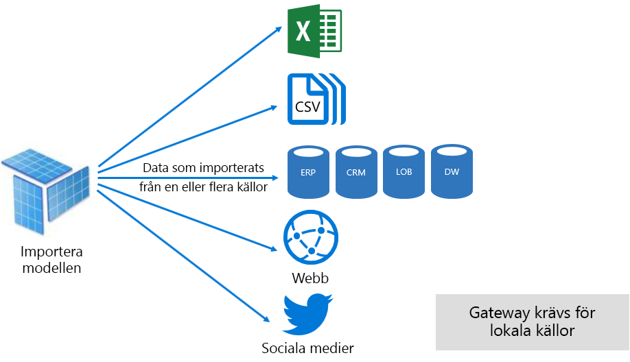

Även om det finns övertygande fördelar som är associerade med importmodeller, finns det också nackdelar:

- Hela modellen måste läsas in i minnet innan Power BI kan fråga modellen, vilket kan lägga press på tillgängliga resurser eftersom antalet och storleken på modeller växer
- Modelldata är endast så aktuella som den senaste uppdateringen och importmodeller måste därför helst uppdateras enligt ett schema
- En fullständig uppdatering tar bort alla data från alla tabeller och läser in dem igen från datakällan. Detta kan vara väldigt dyrt med tanke på tid och resurser för Power BI-tjänsten och datakällan/datakällorna. Power BI har stöd för inkrementell uppdatering som kan undvika att trunkera och läsa in hela tabeller på nytt och detta beskrivs i avsnittet [Optimera Power BI-värdbaserade modeller](#optimizing-power-bi-hosted-models).

Från ett resursperspektiv för Power BI-tjänsten, kräver importmodeller:

- Tillräckligt med minne för att läsa in modellen när den efterfrågas eller uppdateras
- Bearbetning av resurser och ytterligare minnesresurser för att uppdatera data

#### DirectQuery-läge

Modeller som utvecklats i DirectQuery-läge (DQ) importerar inte data. I stället består de endast av metadata som när de efterfrågas ställer interna frågor till den underliggande datakällan.

Det finns två huvudsakliga skäl till att utveckla en DQ-modell. Det första skälet är när datavolymerna är för stora – även när dataförminskningsmetoder tillämpas – för att läsa in i en modell eller uppdatera praktiskt. Det andra är när rapporter och instrumentpaneler behöver leverera data ”nära realtid”, utöver vad som kan uppnås inom gränserna för schemalagd uppdatering (48 gånger per dag för en dedikerad kapacitet).

Det finns flera fördelar som är associerade med DQ-modeller:

- Storleksgränser för importmodeller gäller inte
- Modeller kräver inte uppdatering
- Rapportanvändarna ser senaste data när du interagerar med rapportfilter och utsnitt, och kan uppdatera hela rapporten för att hämta aktuella data
- Paneler på instrumentpanelen, då de är baserade på DQ-modeller, kan uppdateras automatiskt så ofta som var 15:e minut

Det finns dock flera nackdelar och begränsningar som är associerade med DQ-modeller:

- Modellen måste baseras på en enskild datakälla som stöds och eventuell dataintegrering måste därför uppnås redan i datakällan. Datakällor som stöds är relationella och analytiska system med stöd för många populära datakällor \[[7](#endnote-07)\].
- Prestanda kan vara långsam, med potentiellt negativ påverkan på Power BI-tjänsten (frågor kan vara mycket CPU-intensiva) och på datakällan (som kanske inte är optimerad för analytiska frågor)
- Power Query-frågor får inte vara komplicerade och är begränsade till M-uttryck och funktioner som kan införlivas till interna frågor som tolkas av datakällan
- DAX-funktioner är begränsade till de som kan införlivas till interna frågor som tolkas av datakällan och det finns inget stöd för beräknade tabeller eller inbyggda funktioner för tidsinformation
- Som standard ställer modellen frågor som kräver hämtning av över en miljon rader
- Rapporter och instrumentpaneler med flera visuella objekt kan visa inkonsekventa resultat, särskilt när datakällan är temporär
- Frågor och svar och snabbinsikter stöds inte

Från ett resursperspektiv för Power BI-tjänsten, kräver DQ-modeller:

- Minimalt minne för att läsa in modellen (metadata) när den efterfrågas
- Ibland betydande processorresurser för att generera och bearbeta frågor som skickats till datakällan

Mer information finns i dokumentet [Använd Direct Query i Power BI Desktop](desktop-use-directquery.md).

#### Sammansatt läge

Modeller som utvecklats i sammansatt läge kan konfigurera lagringsläget för enskilda datamodellstabeller. Därför stöder de en blandning av import- och DQ-tabeller. De stöder även beräknade tabeller (definieras med DAX) och flera DQ-datakällor.

Tabellagringsläge kan konfigureras som Import, DirectQuery eller Dubbla. En tabell som har konfigurerats som Dubbla lagringslägen är både Import och DirectQuery, på så sätt kan Power BI-tjänsten fastställa det effektivaste läget som ska användas på basis av fråga efter fråga.

Sammansatta modeller strävar efter att leverera det bästa från Import- och DirectQuery-lägena. När de konfigurerats korrekt kombinerar de hög frågeprestanda av minnesinterna modeller med möjligheten att hämta nära realtidsdata från datakällor.

Datamodellerare som utvecklar sammansatta modeller kommer troligen att konfigurera tabeller av dimensionstyp i lagringslägena Import eller Dubbla och tabeller av faktatyp i DirectQuery-läget. Anta exempelvis en modell med produktdimension i läget Dubbla och en tabell av typen försäljningsfakta i DirectQuery-läget. Produkttabellen kan snabbare och effektivare efterfrågas från internminnet för att återge ett rapportutsnitt. Försäljningstabellen kan sedan efterfrågas i DirectQuery-läget som är anslutet till den relaterade produkttabellen. Den senare frågan kunde generera en enda effektiv intern fråga för att slå samman produkt-och försäljningstabellerna och filtrera med utsnittsvärdena.

I allmänhet kan fördelarna och nackdelarna, som är associerade med varje modelläge, betraktas att gälla för tabellagringsläge i sammansatta modeller.

Mer information finns i dokumentet [Använda sammansatta modeller i Power BI Desktop](desktop-composite-models.md).

### Licensiering

Power BI har tre licenser:

- Power BI (kostnadsfri)
- Power BI Pro
- Power BI Premium

Licensen **Power BI Free** tillåter en person att logga in till Power BI-tjänsten och arbeta i sin personliga arbetsyta genom att publicera modeller och rapporter. Det är viktigt att förstå att det inte går att dela Power BI-innehåll med hjälp av denna licens. Denna licens, är som namnet antyder kostnadsfri.

Licensen **Power BI Pro** tillåter en person att skapa och samarbeta i app-arbetsytor och dela och distribuera Power BI-innehåll. De kan också konfigurera uppdatering för deras datauppsättningar för att automatiskt behålla data aktuella, inklusive lokala datakällor. Vidare kan de granska och övervaka hur data nås och används. Denna licens krävs för att få delat innehåll från andra, om inte användaren är associerad med en dedikerad kapacitet i Power BI Premium.

Licensen **Power BI Premium** är en licens på klientnivå och den beskrivs i avsnittet [Introduktion till Power BI Premium](#introducing-power-bi-premium).

Ytterligare information om Power BI-licensiering finns på sidan [Power BI-prissättning](https://powerbi.microsoft.com/pricing/).

## Introduktion till Power BI Premium

Power BI Premium ger en enhetlig självbetjänings- och enterprise BI-plattform med skalbar, pålitlig prestanda och förutsägbara kostnader. Främst uppnås detta genom att tillhandahålla dedikerade resurser för att köra Power BI-tjänsten för din organisation.

Power BI Premium ger dessutom många företagsfunktioner:

- Kostnadseffektiv innehållsdistribution, vilket möjliggör delning av Power BI-innehåll till ett obegränsat antal kostnadsfria Power BI-användare, inklusive externa användare
- Stöd för större datauppsättningsstorlekar \[[8](#endnote-08)\]
- Högre uppdateringsintervall för dataflöden och datauppsättningar (upp till 48 gånger per dag)
- Inkrementell uppdatering av dataflöden och datauppsättningar
- Dataflödeslänkade entiteter och parallell körning av transformeringar
- Sidnumrerade rapporter
- Power BI-rapportservern, för lokal rapportering
- Möjligheten att bädda in innehåll i appar för appanvändare (PaaS)

Många av dessa funktioner kan användas för att leverera effektiva och skalbara företagslösningar och de beskrivs i avsnittet [Optimera Premium-kapaciteter](#optimizing-premium-capacities).

### Prenumerationer och licensiering

Power BI Premium är en prenumeration på klientnivå för Office 365, tillgänglig för två SKU-serier (lagerhållningsenhet):

- **EM** SKU:er (EM1-EM3) för inbäddning, kräver ett årligt åtagande som faktureras månadsvis
- **P** SKU:er (P1-P3) för inbäddning och företagsfunktioner, kräver ett åtagande per månad eller år, faktureras månadsvis och inkluderar en licens för att installera Power BI-rapportserver lokalt

En annan metod är att köpa en Azure Power BI Embedded-prenumeration som har en enda SKU-serie: **A** SKU:er (A1-A6) är endast för inbäddning och kapacitetstestning.

Alla SKU:er levererar virtuella kärnor för att skapa kapacitet \[[9](#endnote-09)\], men EM SKU:er är begränsade till inbäddning i mindre skala. Även om detta White Papers fokus är på P SKU:er, är mycket av vad som diskuteras också relevant för A SKU:er.

Till skillnad från SKU:er för Premium-prenumeration, kräver Azure SKU:er ingen tid för åtagande och de faktureras per timme. De levererar fullständig flexibilitet att aktivera uppskalning, nedskalning, pausa, återuppta och ta bort.

Azure Power BI Embedded är i stort sett utanför detta White Papers omfång, men beskrivs i avsnittet om testningsmetoder som ett praktiskt och ekonomiskt alternativ för att testa och mäta arbetsbelastningar.

Ytterligare information om Azure SKU:er finns i [Azure Power BI Embedded-dokumentationen](/azure/power-bi-embedded/).

Power BI Premium-prenumerationer köps av administratörer i Microsoft 365 Administrationscenter. Mer specifikt kan endast globala administratörer för Office 365 eller faktureringsadministratörer köpa SKU:er.

Då de köpts tar klienten emot ett motsvarande antal v-kärnor för att tilldela kapaciteter – detta kallas **gruppering av v-kärnor**. Köp av en P3 SKU ger till exempel klienten 32 v-kärnor.

Mer information finns i dokumentet [Så här köper du Power BI Premium](service-admin-premium-purchase.md).

### Premium-kapaciteter

Till skillnad från en delad kapacitet där arbetsbelastningar körs på dataresurser som delas med andra kunder, är en **dedikerad kapacitet** för exklusiv användning av en organisation. Den är isolerad med dedikerade resurser som ger pålitlig och konsekvent prestanda för värdbaserat innehåll.

Fokus i detta White Paper är **Premiumkapacitet** , vilket innebär att den är associerad med antingen EM eller P SKU:er.

#### Kapacitetsnoder

Som beskrivs i ämnet Prenumerationer och licensiering, finns det två Power BI Premium SKU-serier: EM och P. Alla Power BI Premium SKU:er är tillgängliga som kapacitetsnoder, där var och en representerar en viss mängd resurser som består av processor, minne och lagring. Förutom resurser, har varje SKU gränser för antalet anslutningar med DirectQuery (DQ) och Live-anslutning (LC) per sekund och antalet uppdateringar av parallella modeller.

Bearbetning uppnås med ett visst antal v-kärnor, jämnt fördelat mellan serverdelen och klientdelen.

**Serverdelens v-kärnor** ansvarar för huvudfunktioner för Power BI, inklusive frågebearbetning, hantering av cache, köra R-tjänster, modelluppdatering, bearbetning av naturligt språk (frågor och svar) och återgivning av rapporter och bilder från serversidan. Serverdelens v-kärnor tilldelas en fast mängd minne som i första hand används för att vara värd för modeller som även kallas aktiva datauppsättningar.

**Klientdelens v-kärnor** ansvarar för webbtjänsten, instrumentpanel och hantering av rapportdokument, hantering av åtkomsträttigheter och schemaläggning av API:er, ladda upp och hämta filer, och vanligen för allt som rör användarupplevelser.

Lagring är inställd på 100 TB per kapacitetsnod.

Resurser och begränsningarna för varje Premium-SKU (och motsvarande storlek på A SKU) beskrivs i följande tabell.

| Kapacitetsnoder | Totalt antal virtuella kärnor | Virtuella kärnor för serverdel | RAM (GB) | Virtuella kärnor för klientdel | DQ/LC (per sekund) | Modellens uppdateringsparallellitet |
| --- | --- | --- | --- | --- | --- | --- |
| EM1/A1 | 1 | 0.5 | 2.5 | 0.5 | 3.75 | 1 |
| EM2/A2 | 2 | 1 | 5 | 1 | 7.5 | 2 |
| EM3/A3 | 4 | 2 | 10 | 2 | 15 | 3 |
| P1/A4 | 8 | 4 | 25 | 4 | 30 | 6 |
| P2/A5 | 16 | 8 | 50 | 8 | 60 | 12 |
| P3/A6 | 32 | 16 | 100 | 16 | 120 | 24 |
| | | | | | | |

#### Kapacitetsarbetsbelastningar

Kapacitetsarbetsbelastningar är tjänster som är tillgängliga för användarna. Som standard har Premium- och Azure-kapaciteterna endast stöd för en arbetsbelastning för datauppsättning som är associerad med Power BI-frågor som inte kan inaktiveras.

Ytterligare arbetsbelastningar kan aktiveras för sidnumrerade rapporter, dataflöden och AI. Varje ytterligare arbetsbelastning kräver att du konfigurerar den högsta mängd minne (som en procentandel av den totala mängden tillgängligt minne) som kan användas av arbetsbelastningen.

#### Så här fungerar kapaciteter

Power BI-tjänsten strävar alltid efter att använda kapacitetsresurser på bästa sätt utan att överskrida gränserna som införts på kapaciteten.

Kapacitetsåtgärder klassificeras som antingen interaktiva eller bakgrund. Interaktiva åtgärder omfattar renderingsbegäranden och svarar på användarinteraktioner (filtrering, frågor och svar frågor, o.s.v.). I allmänhet är frågor från importmodellen minnesresurskrävande, medan frågor från LC/DQ-modeller är processorintensiva. Bakgrundsåtgärder omfattar uppdateringar av dataflöde och importmodeller, och frågecache för instrumentpanelen.

Det är viktigt att förstå att interaktiva åtgärder alltid är prioriterade över bakgrundsåtgärder för att försäkra bästa möjliga användarupplevelse. Om det inte finns tillräckligt med resurser, läggs bakgrundsåtgärder till i en kö för bearbetning när resurser frigörs. Bakgrundsåtgärder, som uppdateringar av datauppsättningen och AI-funktioner, kan stoppas mitt i process av Power BI-tjänsten och läggs till i en kö.

Importmodeller måste vara helt inlästa i minnet så att de kan efterfrågas eller uppdateras. Power BI-tjänsten hanterar minnesanvändning med hjälp av avancerade algoritmer för att garantera maximal användning av det tillgängliga minnet, och kan leda till överansträngning av kapaciteten: Det är möjligt för en kapacitet att lagra många importmodeller (upp till 100 TB per Premium-kapacitet), när deras sammanlagda disklagring överskrider det minne som stöds (och ytterligare minne krävs för att fråga och uppdatera), kan inte alla läsas in i minnet samtidigt.

Importmodeller läses därför in, och tas bort från, minnet beroende på användningen. En importmodell läses in när den efterfrågas (interaktiv åtgärd) och ännu inte är i minnet, eller när den uppdateras (bakgrundsåtgärden).

Borttagning av en modell från minnet kallas **avlägsning**, och det är en åtgärd som Power BI snabbt kan utföra beroende på storleken på modellerna. Om kapaciteten inte har någon minnesbelastning, läses modeller bara in i minnet och finns kvar där. \[[10](#endnote-10) \] Men om det inte finns tillräckligt med minne för att läsa in en modell måste Power BI-tjänsten först frigöra minne. Den frigör minne genom att identifiera modeller som har inaktiverats av sökmodeller som inte har använts under de senaste tre minuterna \[[11](#endnote-11)\], och tar sedan bort dem. Om det inte finns några inaktiva modeller att ta bort, strävar Power BI-tjänsten efter att avlägsna modeller som lästs in för bakgrundsåtgärder. Detta kan omfatta borttagning av bakgrundsarbetsbelastningar som AI-arbetsbelastningar. En sista utväg, efter 30 sekunder av misslyckade försök \[[11](#endnote-11)\], är att den interaktiva åtgärden misslyckas. I det här fallet meddelas rapportanvändaren på ett smidigt sätt om felet med ett förslag om att försöka igen om en stund.

Det är viktigt att påpeka att datamängdsavlägsning är ett normalt och förväntat beteende. Det strävar efter att maximera minnesanvändningen efter inläsning och inaktivera modeller vars kombinerade storlekar kan överstiga tillgängligt minne. Detta är avsiktligt, och helt transparent för rapportanvändarna. Höga avlägsningsfrekvenser innebär inte nödvändigtvis att kapaciteten är otillräckligt resurstilldelad. Detta kan dock bli ett problem om frågans eller uppdaterings svarstid har drabbats på grund av höga avlägsningsfrekvenser.

Uppdateringar av importmodeller är alltid minnesintensiva eftersom modeller måste läsas in i minnet och det krävs ytterligare minne för bearbetningen. En fullständig uppdatering kan ungefär dubbla den mängd minne som krävs av modellen. Detta säkerställer att modellen kan efterfrågas även när den bearbetas (frågor skickas till den befintliga modellen tills uppdateringen har slutförts och den nya modellinformationen är tillgänglig). Observera att inkrementell uppdatering kräver mindre minne och kan slutföras snabbare och således avsevärt kan minska trycket på kapacitetsresurser. Uppdateringar kan även vara processorintensiva för modeller, särskilt de med komplexa Power Query-omvandlingar eller beräknade tabeller/kolumner som är komplexa eller baseras på stora tabeller.

Uppdateringar – t.ex. frågor – kräver att modellen läses in i minnet. Om det inte finns tillräckligt med minne kommer Power BI-tjänsten att försöka ta bort inaktiva modeller, och om det inte är möjligt (alla modeller är aktiva) placeras uppdateringsjobbet i kö. Uppdateringar är vanligtvis mycket CPU-intensiva, till och med mer än frågor. Därför finns kapacitetsbegränsningar på antal samtidiga uppdateringar, inställt på 1,5 gånger antalet serverdelens v-kärnor, avrundat uppåt. Om det finns för många samtidiga uppdateringar, placeras en schemalagd uppdatering i kö. När sådana situationer inträffar, tar det längre tid för uppdateringen att färdigställas. Observera att på begäran-uppdateringar (utlöses av en användarbegäran eller ett API-anrop) kommer att försöka igen tre gånger \[[11](#endnote-11)\], och sedan misslyckas om det fortfarande inte finns tillräckligt med resurser.

## Hantera Power BI Premium

Hantera Power BI Premium innebär att köpa prenumerationer och skapa, hantera och övervaka Premium-kapaciteter.

### Skapa och hantera kapaciteter

Sidan **Kapacitetsinställningar** för **Power BI-administratörsportalen** visar antalet v-kärnor som har köpts och är tillgängliga (d.v.s. som ska tilldelas till en kapacitet) och en lista över Premium-kapaciteter. Sidan tillåter globala administratörer för Office 365 eller Power BI-tjänsten att skapa Premium-kapaciteter från tillgängliga v-kärnor, eller ändra befintliga Premium-kapaciteter.

När du skapar en Premium-kapacitet behöver administratören definiera:

- Kapacitetsnamn (unikt i klienten)
- Kapacitetsadministratör(er)
- Kapacitetsstorlek
- Region för dataplacering \[[12](#endnote-12)\]

Minst en kapacitetsadministratör måste tilldelas. Användare som utsetts till kapacitetsadministratörer kan:

- Tilldela arbetsytor till kapaciteten
- Hantera användarbehörigheter för att lägga till ytterligare kapacitetsadministratörer eller användare med tilldelningsbehörighet (för att kunna tilldela arbetsytor till kapaciteten)
- Hantera arbetsbelastningar, för att konfigurera högsta minnesanvändning för sidnumrerade rapporter och dataflödesarbetsbelastningar
- Starta om kapaciteten för att återställa alla åtgärder vid systemöverlagring \[[13](#endnote-13)\]

Kapacitetsadministratörer har inte åtkomst till arbetsyteinnehåll (om inte uttryckligen tilldelade behörigheter för arbetsytan) och de har inte åtkomst till alla Power BI-administratörsområden (såvida inte uttryckligen tilldelade), till exempel användningsstatistik, granskningsloggar och klientinställningar. Viktigt är att kapacitetsadministratörer inte har behörighet att skapa nya kapaciteter eller skala befintliga kapaciteter. Dessutom tilldelas de per kapacitet, vilket försäkrar att de bara kan visa och hantera de kapaciteter som de är tilldelade.

Kapacitetsstorlek måste väljas från en tillgänglig lista med SKU-alternativ vilket är begränsat av antalet tillgängliga v-kärnor i poolen. Det är möjligt att skapa flera kapaciteter från poolen som kan hämtas från en eller flera köpta SKU:er. Till exempel kan en P3-SKU (32 kärnor) användas för att skapa tre kapacitet: en P2 (16 v-kärnor), och två P1 (2 x 8 v-kärnor). Förbättrad prestanda och skalning kan uppnås genom att skapa kapaciteter av mindre storlek och detta beskrivs i avsnittet [Optimera Premium-kapaciteter](#optimizing-premium-capacities). Följande bild visar en exempelinstallation av den fiktiva Contoso-organisationen som består av fem Premium-kapaciteter (3 x P1 och 2 x P3) där var och en innehåller app-arbetsytor och flera arbetsytor i delad kapacitet.

En Premium-kapacitet kan tilldelas till en annan region än hemregionen av Power BI-klienten, vilket ger administrativ kontroll över i vilka datacenter (i definierade geografiska områden) Power BI-innehållet finns. \[[12](#endnote-12)\]

Power BI-tjänstadministratörer och globala Office 365-administratörer kan ändra Premium-kapaciteter. Mer specifikt kan de:

- Ändra kapacitetsstorlek för att skala upp eller ned resurser. Men går det inte att nedgradera eller uppgradera en P SKU till en EM SKU.
- Lägg till eller ta bort kapacitetsadministratörer
- Lägg till eller ta bort användare som har tilldelningsbehörigheter
- Lägg till eller ta bort ytterligare arbetsbelastningar
- Ändra regioner

Tilldelningsbehörigheter krävs för att tilldela en arbetsyta till en specifik Premium-kapacitet. Behörigheterna kan beviljas till hela organisationen, specifika användare eller grupper.

Som standard stöder Premium-kapaciteterna arbetsbelastningar som är associerade med att köra Power BI-frågor. De stöder också tre ytterligare arbetsbelastningar: **Sidnumrerade rapporter**, **dataflöden** och **AI**. Varje arbetsbelastning kräver att du konfigurerar den högsta mängd minne (som en procentandel av den totala mängden tillgängligt minne) som kan användas av arbetsbelastningen. Det är viktigt att förstå att en ökning av maximala minnesallokeringar kan påverka antalet aktiva modeller som kan användas, och dataflöden av uppdateringar.

Minne allokeras dynamiskt till dataflöden, men den är statiskt allokerad till sidnumrerade rapporter. Orsaken till att statiskt allokera maximalt minne är att sidnumrerade rapporter körs inom ett säkert inneslutet utrymme av kapaciteten. Försiktighet bör iakttas vid inställning av minne för sidnumrerade rapporter eftersom det minskar tillgängligt minne för att läsa in modeller.

|                     | EM3                      | P1                       | P2                      | P3                       |
|---------------------|--------------------------|--------------------------|-------------------------|--------------------------|
| Sidnumrerade rapporter | Saknas | 20 % standard, 10 % minimum | 20 % standard, 5 % minimum | 20 % standard, 2,5 % minimum |
| Dataflöden | 20 % standard, 8 % minimum  | 20 % standard, 4 % minimum  | 20 % standard, 2 % minimum | 20 % standard, 1 % minimum  |
| AI | Saknas | 20 % standard, 20 % minimum  | 20 % standard, 10 % minimum | 20 % standard, 5 % minimum  |
| | | | | |

Det är möjligt att ta bort en Premium-kapacitet och det leder inte till borttagning av dess arbetsytor och innehåll. I stället flyttas alla tilldelade arbetsytor till delad kapacitet. När Premium-kapaciteten skapades i en annan region, kommer arbetsytan att flyttas till delad kapacitet för hemregionen.

### Tilldela arbetsytor till kapaciteter

Arbetsytor kan tilldelas en Premium-kapacitet i **Power BI-administratörsportalen****** eller, för en apparbetsyta – i fönstret **Arbetsyta**.

Kapacitetsadministratörer, samt globala administratörer för Office 365 eller Power BI-tjänstadministratörer kan masstilldela arbetsytor i **Power BI-administratörsportalen******. Masstilldelningar kan gälla för:

- **Arbetsytor per användare**: Alla arbetsytor som ägs av dessa användare, inklusive personliga arbetsytor har tilldelats Premium-kapacitet. Detta omfattar ny tilldelning av arbetsytor när de redan är tilldelade till en annan Premium-kapacitet. Dessutom kan användare också tilldelas behörigheter för arbetsytetilldelning.

- **Särskilda arbetsytor**
- **Hela organisationens arbetsytor**: Alla arbetsytor, inklusive personliga arbetsytor, har tilldelats Premium-kapacitet. Dessutom tilldelas alla aktuella och framtida användare behörigheter för arbetsytetilldelning. \[[14](#endnote-14)\]

En arbetsyta kan läggas till en Premium-kapacitet med hjälp av fönstret **Arbetsyta** förutsatt att användaren är både administratör för en arbetsyta och har behörighet för kapacitetstilldelning.

Administratörer för arbetsytan kan ta bort en arbetsyta från en kapacitet (till en delad kapacitet) utan att behöva tilldelningsbehörighet. Ta bort arbetsytor från dedikerade kapaciteter flyttar effektivt arbetsytan till en delad kapacitet. Observera att ta bort en arbetsyta från en Premium-kapacitet kan ha negativa konsekvenser vilket till exempel resulterar i att delat innehåll skulle bli otillgängligt för Power BI Free-licensierade användare eller inaktivering av schemalagd uppdatering när de överskrider de tilldelningar som stöds av delade kapaciteter.

I Power BI-tjänsten identifieras en arbetsyta som tilldelats en Premium-kapacitet lätt via diamantikonen som pryder arbetsytans namn.

### Övervaka kapaciteter

Övervakning av Premium-kapaciteter ger administratörer en förståelse för hur kapaciteterna utförs. Kapaciteter kan övervakas med hjälp av **Power BI-administratörsportalen****** eller **Kapacitetsmåttappen för Power BI Premium** (Power BI).

#### Power BI-administratörsportal

**Power BI-administratörsportalen****** tillåter övervakning av fyra sammanfattningspaneler som rapporterar om belastningar som placeras på kapacitetsresurserna. De fyra sammanfattningspanelerna är:

- **CPU** : Antalet gånger processorn överskridit 80 % användning
- **Minnesförslöing**: Antalet gånger 80 % överskrids, vilket representerar minnesbelastning på serverdelens v-kärnor. Mer specifikt, är det ett mått på hur många gånger en datauppsättning har avlägsnats från minnet på grund av minnesbelastning och behovet av fler aktiva datauppsättningar.
- **Minnesanvändning**: Genomsnittlig minnesanvändning (i GB)
- **Direct Query** : Antalet gånger DQ- och LC-frågor – mätt per sekund – överskred 80 % av gränsen

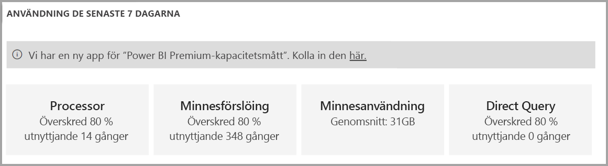

Panelvärden beräknas över ett tidsfönster på en timma för att ange hur många timmar som under de senaste sju dagarna motsvarade tröskelvärdet för mått. Det är viktigt att förstå att överskridning av ett tröskelvärde inte nödvändigtvis är en ödesdiger situation, men kan tyda på försämrad prestanda.

Genom att klicka på en sammanfattningspanel, är det möjligt att klicka igenom i en rapport för att visa måttet som ett linjediagram under de senaste sju dagarna. Informationen som presenteras i diagrammet är en sammanfattning av varje timmes resultat som kan hjälpa dig att fastställa en allmän förståelse för vad som förekom en viss timme.

Övervakningsfunktionerna i **Power BI-administratörsportalen** är grundläggande och utformade för att ge en snabb uppfattning om viktiga systemmått. För mer detaljerad övervakning, rekommenderar vi att du använder **Kapacitetsmåttappen för Power BI Premium**.

#### Kapacitetsmåttappen för Power BI Premium

**Kapacitetsmåttappen för Power BI Premium** är en Power BI-app som är tillgänglig för Kapacitetsadministratörer och installeras som andra Power BI-appar \[[15](#endnote-15)\]. Den innehåller en instrumentpanel och rapport.

När appen öppnas läses instrumentpanelen in för att presentera flera paneler som uttrycker en aggregerad vy över alla kapaciteter som användaren är kapacitetsadministratör för. Instrumentpanelens layout innehåller följande avsnitt:

- **Översikt**: Appversion, antalet kapaciteter och arbetsytor
- **Systemöversikt**: Minne och processormått
- **Översikt över datamängd**: Antal datauppsättningar, DQ/LC, uppdaterings- och frågemått
- **Dataflödessammanfattning**: Antal dataflöden och datauppsättningsmått
- **Översikt över sidnumrerade rapporter**: Uppdatera och visa mått
- **AI-sammanfattning**: Antal åtgärder och datauppsättningsmått

Den underliggande rapporten (från vilken instrumentpanelens paneler har fästs) kan nås genom att klicka på valfri panel på instrumentpanelen. Den ger en mer detaljerad översikt över vart och ett av instrumentpanelens avsnitt och stöder interaktiv filtrering. Filtrering kan uppnås genom att ange utsnitt efter datumintervall, kapacitet, arbetsyta och arbetsbelastning (rapport, datauppsättning, dataflöde) och genom att välja element i rapportens visuella objekt för att korsfiltrera rapportsidan. Korsfiltreringen är en kraftfull teknik för att begränsa till bestämda tidsperioder, kapaciteter, arbetsytor, datauppsättningar, etc. och kan vara mycket användbar när du utför rotorsaksanalys.

Rapporten består av följande sidor:

- **Datauppsättningar**: Visar detaljerade mått om datauppsättningens hälsotillstånd. Knappval visar olika perspektiv: Sammanfattning, Uppdateringar, Frågevaraktigheter, Frågeväntan och Datauppsättningar
- **Sidnumrerade rapporter**: Visar detaljerade mått om hälsotillståndet för sidnumrerade rapporter
- **Dataflöden**: Visar detaljerade mått om hälsotillståndet för dataflöden
- **AI**: Visar detaljerade mått om hälsotillståndet för AI-arbetsbelastningen
- **System**: Innehåller mätvärden för den totala kapaciteten, inklusive minne och CPU-användning
- **Visningsnamn och ID:n**: Visningsnamn, ID:n och ägare av kapaciteter, arbetsytor och arbetsbelastningar

Rapportsidorna innehåller olika perspektiv som är tillgängliga genom att klicka på knappar. Visuella rapportobjekt kan övervaka mått över tid för att jämföra dem med användandet av systemresurser.

Detta White Paper beskriver inte varje sida och perspektiv. I stället visas en lista med mått som är tillgängliga i rapporten tillsammans med deras syfte. Rapporten visar många sidor och visuella objekt baserade på följande mått, först efter resurs, såsom visas i följande tabeller.

##### Entiteter (för vilka användaren är en kapacitetsadministratör)

| Mått | Beskrivning |
| --- | --- |
| Kapacitet | Antal kapaciteter |
| Arbetsytor | Antal arbetsytor i dina kapaciteter som rapporterar mått över de senaste sju dagarna |
| Datauppsättningar | Antal datauppsättningar i alla arbetsytor i dina kapaciteter |
| Dataflöden | Antal dataflöden i alla arbetsytor i dina kapaciteter |
| Sidnumrerade rapporter | Antal sidnumrerade rapporter i alla arbetsytor i dina kapaciteter |
| |

##### Minne

| Mått | Beskrivning |
| --- | --- |
| Genomsnittligt minne | Den genomsnittliga minnesanvändningen under de senaste sju dagarna (i GB) |
| Genomsnittligt minne av arbetsbelastningar: datauppsättningar, dataflöden, sidnumrerade rapporter | Genomsnittlig minnesanvändning under de senaste sju dagarna (i GB) av arbetsbelastningar: datauppsättningar, dataflöde, sidnumrerade rapporter |
| Högst användning | Högsta minnesförbrukning (i GB) under de senaste sju dagarna, uppdelat på treminutersintervall i bucketar på en timma |
| |

##### Processor

| Mått | Beskrivning |
| --- | --- |
| Antal med hög användning | Antal gånger som CPU har överskridit 80 % av tröskelvärdena under de senaste sju dagarna, uppdelat på treminutersintervall i bucketar på en timma |
| |

##### DQ-/LC-anslutningar

| Mått | Beskrivning |
| --- | --- |
| Antal med hög användning | Antal gånger som DQ-/LC-anslutningar har överskridit 80 % av tröskelvärdena under de senaste sju dagarna, uppdelat på treminutersintervall i bucketar på en timma |
| |

Följande tabeller visar arbetsbelastningsrelaterade mått.

##### Uppdatering av datauppsättning

| Mått | Beskrivning |
| --- | --- |
| Uppdaterar | Antal uppdateringar under de senaste sju dagarna |
| Lyckad uppdatering | Antal lyckade uppdateringar under de senaste sju dagarna |
| Misslyckade uppdateringar | Antal misslyckade uppdateringar under de senaste sju dagarna |
| Genomsnittlig uppdateringsvaraktighet | Genomsnittlig uppdateringsvaraktighet i minuter under de senaste sju dagarna |
| Högsta uppdateringsvaraktighet | Varaktigheten för den långvarigaste uppdateringen i minuter |
| Genomsnittlig väntetid | Genomsnittlig väntetid (den genomsnittliga fördröjningen) mätt i minuter \[[16](#endnote-16)\] |
| Högsta väntetid | Högsta väntetid (den genomsnittliga fördröjningen) mätt i minuter |
| Uppdateringstillförlitlighet | Procentandelen uppdateringar som har slutförts under de senaste sju dagarna |
| |

##### Datauppsättningsfrågor

| Mått | Beskrivning |
| --- | --- |
| Frågor | Antal frågor som körts under de senaste sju dagarna |
| Lyckade frågor | Antal lyckade frågor under de senaste sju dagarna |
| Misslyckade frågor | Antal misslyckade frågor under de senaste sju dagarna |
| Genomsnittlig frågevaraktighet | Genomsnittlig frågevaraktighet (i ms) under de senaste sju dagarna kan används för att avgöra frågedistribution per timma tillsammans med minnesförbrukning, uppdelat i buckets på en timma |
| Högsta frågevaraktighet | Högsta frågevaraktighet (i ms) under de senaste sju dagarna |
| Antal frågeväntetider | Antal frågor som har haft några väntetider de senaste 7 dagarna |
| Genomsnittlig frågeväntetid | Genomsnittlig frågeväntetid (i ms) över de senaste sju dagarna kan används för att avgöra distribution för frågeväntetid per timma tillsammans med minnesförbrukning, uppdelat i buckets på en timma |
| Högsta frågeväntetid | Högsta frågeväntetid (i ms) under de senaste sju dagarna |
| |

##### Inläsningar av datauppsättning

| Mått | Beskrivning |
| --- | --- |
| Genomsnittlig datauppsättningsstorlek | Genomsnittlig storlek (i MB) av datauppsättningar i minnet \[[17](#endnote-17)\] |
| Aktiva datauppsättningar som lästs in i minnet | Antal datauppsättningar som lästs in i minnet per timma |
| Borttagna datauppsättningar | Antal datauppsättningar som tagits bort på grund av minnestryck |
| Borttagna datauppsättningar och minnesförbrukning | Antal datauppsättningar som tagits bort från minnet per timma |
| Aktivt minne | Aktivt minne visar den totala mängd minne som inte kan tas bort eftersom det används. Skillnaden mellan det aktiva minnet och den totala mängden minne är summan av minne som förbrukas av datauppsättningar som finns i minnet men inte har använts under de senaste 3 minuterna. |
| |

##### Dataflöden

| Mått | Beskrivning |
| --- | --- |
| Uppdaterar | Antal uppdateringar av dataflöden under de senaste sju dagarna |
| Genomsnittlig uppdateringsvaraktighet | Genomsnittlig varaktighet för dataflödesuppdatering i minuter under de senaste sju dagarna |
| Högsta uppdateringsvaraktighet | Högsta varaktighet för dataflödesuppdatering i minuter under de senaste sju dagarna |
| Genomsnittlig uppdateringsväntetid | Genomsnittlig dataflödesväntetid (den genomsnittliga fördröjningen, mätt i minuter) |
| Högsta uppdateringsväntetid | Högsta dataflödesväntetid (den genomsnittliga fördröjningen, mätt i minuter) |
| Uppdateringstillförlitlighet | Procentandelen dataflödesuppdateringar som har slutförts under de senaste sju dagarna |
| |

##### Sidnumrerade rapporter

| Mått | Beskrivning |
| --- | --- |
| Visningar | Antal rapportvyer |
| Radantal | Antal rader med data i rapporten |
| Genomsnittlig hämtning | Genomsnittlig varaktighet för datahämtning (i ms) under de senaste sju dagarna |
| Genomsnittlig bearbetning | Genomsnittlig bearbetningstid (i ms) under de senaste sju dagarna |
| Genomsnittlig rendering | Genomsnittlig renderingstid (i ms) under de senaste sju dagarna |
| Genomsnittlig varaktighet | Genomsnittlig total tid för att bearbeta alla faser av en rapportvy (i ms) under de senaste sju dagarna |
| |

##### AI

| Mått | Beskrivning |
| --- | --- |
|    Anrop    |    Antal anrop till AI-funktioner efter funktionstyp under de senaste sju dagarna    |
|    Genomsnittligt radantal    |    Genomsnittligt antal rader för varje anrop under de senaste sju dagarna    |
|    Genomsnittlig indatastorlek    |    Genomsnittlig storlek på indata i byte under de senaste sju dagarna    |
|    Genomsnittlig utdatastorlek    |    Genomsnittlig storlek på utdata i byte under de senaste sju dagarna    |
|    Genomsnittlig varaktighet    |    Genomsnittlig varaktighet på API-anrop (i ms) under de senaste sju dagarna    |
|    Genomsnittlig väntetid    |    Genomsnittlig väntetid (i ms) för AI-anrop under de senaste sju dagarna    |
|    Lyckade/misslyckade    |    Antal lyckade och misslyckade uppdateringar under de senaste sju dagarna    |
|         |         |

Appen kommer troligen genomgå frekventa versionsuppdateringar. Uppdaterad information finns i dokumentet [Övervaka Power BI Premium- och Power BI Embedded-kapaciteter](service-admin-premium-monitor-capacity.md).

#### Tolka mått

Mått bör övervakas för att upprätta en grundläggande förståelse för resursanvändning och arbetsbelastningsaktivitet. Om kapaciteten blir långsam, är det viktigt att förstå vilka mått som ska övervakas och vilka slutsatser du kan dra.

Vi rekommenderar att frågor bör slutföras inom en sekund för att leverera dynamiska upplevelser till rapportanvändare och möjliggöra högre frågedataflöde. Det är vanligtvis mindre viktigt när bakgrundsprocesser, inklusive uppdateringar, tar längre tid att slutföra.

I allmänhet kan långsamma rapporter vara en indikation på en överhettad kapacitet. När det inte gick att läsa in rapporter, är det här en indikation på en överhettad kapacitet. I båda fallen kan rotorsaken tillskrivas många faktorer, bland annat:

- **Misslyckade frågor** indikerar verkligen minnesbelastning och att en modell inte kunde läsas in i minnet. Power BI-tjänsten kommer att försöka läsa in en modell i 30 sekunder innan åtgärden misslyckas.

- **Långa frågeväntetider** kan ha flera olika orsaker:
  - Behovet av att Power BI-tjänsten först tar bort modellen/modellerna och sedan läser in modellen som ska frågas igen (att återkalla enbart borttagningen av den högre datauppsättningen är inte en indikation på kapacitetsstress, såvida det inte följs av långa frågeväntetider som indikerar minnesförslöing)
  - Modellinläsningstider (särskilt väntetiden för att läsa in en stor modellen i minnet)
  - Långvariga frågor
  - För många LC-\DQ-anslutningar (överstiger kapacitetsbegränsningar)
  - Processormättnad
  - Komplexa rapportlayouter med för många visuella objekt på en sida (kom ihåg att varje visuellt objekt är en fråga)
- **Långa frågevaraktigheter** kan tyda på att modellutformningarna inte är optimerade, särskilt när flera datauppsättningar är aktiva i en kapacitet och bara en datauppsättning ger långa frågevaraktigheter. Detta tyder på att kapaciteten är tillräckligt resurstilldelad och att datauppsättningen i fråga är icke-optimal eller bara långsam. Långvariga frågor kan vara problematiska eftersom de kan blockera åtkomst till resurser som krävs av andra processer.
- **Långa väntetider för uppdatering eller väntetider för AI-anrop** tyder på otillräckligt med minne på grund av många aktiva modeller som förbrukar minne eller att en problematisk uppdatering blockerar andra uppdateringar (överstiger parallella uppdateringsbegränsningar).

En mer detaljerad förklaring av hur du använder mått finns i nästkommande avsnitt [Optimera Premium-kapaciteter](#optimizing-premium-capacities).

## Optimera Premium-kapaciteter

När det uppstår prestandaproblem för Premium-kapaciteter, är ett vanligt första sätt att optimera eller finjustera redan distribuerade lösningar för att återställa godtagbara svarstider. Den övergripande logiken är att undvika att köpa ytterligare Premium-kapacitet om det inte kan justeras.

När det krävs ytterligare Premium-kapacitet, finns det två alternativ som kommer att diskuteras senare i det här avsnittet:

- Skala upp Premium-kapaciteten
- Lägg till en Premium-kapacitet

Slutligen avslutas detta avsnitt med att testa metoder och Premium-kapacitetsstorlek.

### Allmänna metodtips

När du försöker uppnå bästa användning och prestanda finns det några metodtips som kan anses som allmänna rekommendationer. Dessa omfattar:

- Använda app-arbetsytor i stället för personliga arbetsytor
- Dela upp verksamhetskritisk och BI med självbetjäning (SSBI) i olika kapaciteter

  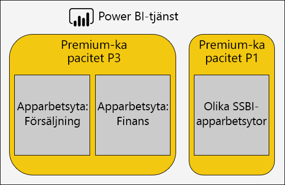

- Om du delar innehåll endast med Power BI Pro-användare, kanske det inte finns något behov av att lagra innehållet i en dedikerad kapacitet
- Använd dedikerade kapaciteter när du vill uppnå en specifik uppdateringstid eller när specifika funktioner är nödvändiga, till exempel stora datauppsättningar eller sidnumrerade rapporter

### Adressering av vanliga frågor

Optimera distributioner för Power BI Premium är ett komplext ämne som inbegriper en förståelse för arbetsbelastningskraven, tillgängliga resurser och effektiv användning.

Det här avsnittet behandlar sju vanliga supportfrågor, som beskriver eventuella problem och förklaringar samt information om hur du identifierar och löser dem.

#### Varför är kapaciteten långsam och vad kan jag göra?

Det finns många skäl som kan bidra till en långsam Premium-kapacitet. Den här frågan kräver ytterligare information om vad som menas med långsam. Läses rapporter in långsamt? Eller läses de inte in alls? Tar det lång tid att läsa in eller uppdatera visuella rapportobjekt när användare interagerar med rapporten? Tar uppdateringar längre tid än väntat eller tidigare upplevt?

Om du får en uppfattning om orsaken kan du sedan börja undersöka. Svar på följande sex frågor kommer hjälpa dig att lösa mer specifika problem.

#### Vilket innehåll använder upp min kapacitet?

Du kan använda **Kapacitetsmåttappen för Power BI Premium** för att filtrera efter kapacitet och granska prestandamått för arbetsyteinnehåll. Det är möjligt att granska prestandamått och resursanvändningen per timme för de senaste sju dagarna för allt innehåll som lagras i en Premium-kapacitet. Det här är ofta det första steget när du felsöker ett allmänt prestandaproblem för Premium-kapacitet.

Viktiga mått att övervaka är:

- Processorgenomsnitt och antal med hög användning
- Genomsnittlig minne och antal hög användning, och minnesanvändning för specifika datauppsättningar, dataflöden och sidnumrerade rapporter
- Aktiva datauppsättningar som lästs in i minnet
- Genomsnittliga och högsta frågevaraktigheter
- Genomsnittliga frågeväntetider
- Genomsnittliga uppdateringstider för datauppsättning och dataflöde
- Genomsnittliga tider för AI-anrop och väntetider

I kapacitetsmåttappen för Power BI Premium, visar aktivt minne den totala mängd minne som allokerats till en rapport som inte kan tas bort eftersom det använts under de senaste tre minuterna. En hög topp i väntetid för uppdatering kan kopplas till en stor och/eller aktiv datauppsättning.

Diagrammet ”De 5 främsta efter genomsnittlig varaktighet” visar fem främsta datauppsättningarna, sidnumrerade rapporter, dataflöden och AI-anrop som förbrukar kapacitetsresurser. Innehåll i de fem främsta listorna lämpar sig för undersökning och möjlig optimering.

#### Varför är rapporter långsamma?

I följande tabeller visas eventuella problem och hur du kan identifiera och hantera dem.

##### Inte tillräckligt med kapacitetsresurser

| Möjliga förklaringar | Så här identifierar du | Så här löser du |
| --- | --- | --- |
| Högt totalt aktivt minne (modellen kan inte tas bort eftersom den inte använts under de senaste tre minuterna)   Flera höga toppar i frågeväntetider   Flera höga toppar i uppdateringsväntetider | Övervaka minnesmått \[[18](#endnote-18)\], och antal borttagningar \[[19](#endnote-19)\] | Minska modellstorleken, eller konvertera till DirectQuery-läge – se ämnet [Optimera modeller](#optimizing-models) i det här avsnittet   Skala upp kapaciteten   Tilldela innehållet till en annan kapacitet |

##### Ineffektiva rapportutformningar

| Möjliga förklaringar | Så här identifierar du | Så här löser du |
| --- | --- | --- |
| Rapportsidor innehåller flera visuella objekt (interaktiv filtrering kan utlösa minst en fråga per visuellt objekt)   Visuella objekt hämtar mer data än vad som behövs | Granska rapportutformningar   Intervjua rapportanvändare för att förstå hur de interagerar med rapporter   Övervaka frågemått för datauppsättningen \[[20](#endnote-20)\] | Designa om rapporter med färre visuella objekt per sida |

##### Datauppsättningen långsam (särskilt när rapporter tidigare har presterat bra)

| Möjliga förklaringar | Så här identifierar du | Så här löser du |
| --- | --- | --- |
| Allt större volymer av importdata   Komplex eller ineffektiv beräkningslogik, inklusive RLS-roller   Modellen inte helt optimerad   (DQ/LC) Gateway-svarstid   Långsamma frågesvarstider från DQ-källa | Granska modellutformningar   Övervaka gateway-prestandaräknare | Se ämnet [Optimera modeller](#optimizing-models) i det här avsnittet |

##### Hög samtidig rapportanvändning

| Möjliga förklaringar | Så här identifierar du | Så här löser du |
| --- | --- | --- |
| Höga frågeväntetider   Processormättnad   DQ-/LC-anslutningsgräns har överskridits | Övervaka processoranvändning \[[21](#endnote-21)\], frågeväntetider och DQ-/LC-användning \[[22](#endnote-22)\] mått + frågevaraktigheter – om det växlar kan detta antyda samtidighetsproblem | Skala upp kapaciteten eller tilldela innehållet till en annan kapacitet   Designa om rapporter med färre visuella objekt per sida |

#### Varför läses rapporter inte in?

När det inte går att läsa in rapporter är detta ett värsta scenario och ett säkert tecken på att kapaciteten inte har tillräckligt med minne och är överhettad. Detta kan inträffa när alla inlästa modeller aktivt efterfrågas och därför inte kan tas bort och uppdateringsåtgärder har pausats eller fördröjts. Power BI-tjänsten kommer att försöka läsa in datauppsättningen i 30 sekunder och användaren meddelas smidigt om felet med ett förslag att försöka igen om en stund.

Det finns för närvarande inga mått att övervaka för fel vid rapportinläsning. Du kan identifiera risken för det här problemet genom att övervaka systemminnet, särskilt högsta användning och tidpunkt för högsta användning. Hög borttagning av datauppsättning och långa genomsnittliga väntetider för uppdateringar av datauppsättningar kan innebära att det här problemet sker.

Om det händer mycket sällan, kanske detta inte är ett problem med prioritet. Rapportanvändare informeras om att tjänsten är upptagen och att de kan försöka igen om en liten stund. Om det händer för ofta, kan problemet lösas genom att skala upp Premium-kapaciteten eller genom att tilldela innehållet till en annan kapacitet.

Kapacitetsadministratörer (och Power BI-tjänstadministratörer) kan övervaka måttet **Frågefel** för att avgöra när det här händer. De kan också starta om kapaciteten för att återställa alla åtgärder vid systemöverbelastning.

#### Varför startar inte uppdateringar enligt schemat?

Schemalagda uppdateringsstarttider är inte garanterade. Kom ihåg att Power BI-tjänsten alltid prioriterar interaktiva åtgärder över bakgrundsåtgärder. Uppdatering är en bakgrundsåtgärd som kan ske när två villkor är uppfyllda:

- Det finns tillräckligt med minne
- Antalet samtidiga uppdateringar som stöds för Premium-kapacitet överskrids inte

När villkoren inte uppfylls, köas uppdateringen tills villkoren är tillräckliga.

Kom ihåg att det krävs minst dubbelt av den aktuella datauppsättningens minnesstorlek för en fullständig uppdatering. Om det inte finns tillräckligt med minne, kan inte uppdateringen påbörjas förrän modellborttagning frigör minne – detta innebär fördröjningar tills en eller flera datauppsättningar blir inaktiva och kan tas bort.

Kom ihåg att det högsta tillåtna antalet samtidiga uppdateringar är inställt på 1,5 gånger serverdelens v-kärnor, avrundat uppåt.

En schemalagd uppdatering misslyckas när den inte kan påbörjas innan nästa schemalagda uppdatering ska påbörjas. En uppdatering på begäran som utlöses manuellt från användargränssnittet försöker köra upp till tre gånger innan åtgärden misslyckas.

Kapacitetsadministratörer (och Power BI-tjänstadministratörer) kan övervaka måttet **Genomsnittlig uppdateringsväntetid (minuter)** för att fastställa genomsnittlig fördröjning mellan den schemalagda tiden och start för åtgärden.

Även om det vanligtvis inte är en administrativ prioritet, se till att det finns tillräckligt med minne för att underlätta att datauppdateringar sker i tid. Detta kan innebära att isolera datauppsättningar till kapaciteter med kända tillräckliga resurser. Det är också möjligt för administratörer att prata med datauppsättningens ägare för att sprida ut eller minska schemalagda uppdateringstider för att minimera kollisioner. Observera att det inte är möjligt för en administratör att visa uppdateringskön eller hämta datauppsättningens scheman.

#### Varför är uppdateringarna långsamma?

Uppdateringar kan vara långsamma eller upplevas långsamma (som tidigare vanliga fråga tar upp).

När uppdateringen faktiskt är långsam, kan det vara av flera olika orsaker:

- Otillräcklig CPU (uppdateringar kan vara mycket CPU-intensiva)
- Otillräckligt med minne, vilket resulterar i att uppdateringen pausar (vilket kräver att uppdateringen början om när villkoren är tillräckliga för att upprepa)
- Icke-kapacitetsskäl, till exempel datakällans systemsvarstid, nätverksfördröjning, ogiltig behörighet eller gateway-genomflöde
- Datavolym – ett bra skäl att konfigurera inkrementell uppdatering, som beskrivs nedan

Kapacitetsadministratörer (och Power BI-tjänstadministratörer) kan övervaka måttet **Genomsnittlig uppdateringsvaraktighet (minuter)** för att fastställa benchmark för jämförelse över tid och måttet **Genomsnittlig uppdateringsväntetid (minuter)** för att fastställa genomsnittlig fördröjning mellan den schemalagda tiden och start för åtgärden.

Inkrementell uppdatering kan avsevärt minska varaktighet för uppdatering, särskilt för stora datamodellstabeller. Det finns fyra fördelar med inkrementell uppdatering:

- **Uppdaterar snabbare**: Endast en del av en tabell behöver läsas in, vilket minskar CPU- och minnesanvändning och parallellitet kan vara högre när du uppdaterar flera partitioner
- **Uppdateringar sker bara vid behov** : Inkrementella uppdateringsprinciper kan konfigureras till att läsa in bara när data har ändrats
- **Mer tillförlitliga uppdateringar**: Kortare körning av anslutningar till ej beständiga datakällsystem är mindre känsliga för frånkoppling
- **Modeller förblir trimmade** : Inkrementella uppdateringsprinciper kan konfigureras för att automatiskt ta bort historik utöver en glidande tidsperiod

Mer information finns i dokumentet [Inkrementell uppdatering i Power BI Premium](service-premium-incremental-refresh.md).

#### Varför slutförs inte datauppdateringar?

När datauppdateringen påbörjas men inte kan slutföras, kan det finnas flera olika orsaker:

- Otillräckligt minne, även om det endast finns en modell i Premium-kapaciteten, d.v.s. modellstorleken är mycket stort
- Icke-kapacitetsskäl, inklusive frånkoppling av datakällan, ogiltig behörighet eller gateway-fel

Kapacitetsadministratörer (och Power BI-tjänstadministratörer) kan övervaka måttet **Uppdateringsfel på grund av minnesbrist**.

#### Varför misslyckas AI-anrop?

AI-anrop kan misslyckas av flera orsaker. Det minsta minnet som krävs för att starta AI-arbetsbelastning är 5 GB, men det kanske inte är tillräckligt för vissa indatauppsättningar. Till exempel kräver automatiserade maskininlärningsmodeller minst två gånger, och ibland flera gånger, indatauppsättningens storlek. Ett AI-anrop avslutas också om det tar längre tid än två timmar att slutföra. För automatiserade maskininlärningsmodeller vars utbildningsanrop inte har fullföljts på två timmar, returneras den bästa modellen som hittas under dessa två timmar.  AI-anrop kan även avbrytas av interaktiva begäranden som har högre prioritet.

Administratörer bör övervaka AI-väntetider efter tecken på andra förfrågningar med högre prioritet. Administratörer kan också se till att det finns tillräckligt med minne för AI-arbetsbelastningar i förhållande till indatastorlekar. Det kan innebära att isolera AI-arbetsbelastningar till kapaciteter som man vet har tillräckligt med resurser. Det är också möjligt för administratörer att prata med dataflödets ägare för att sprida ut eller minska dataflödets uppdateringstider för att minimera kollisioner. Observera att det inte är möjligt för en administratör att se AI-anropskön.

### Optimera modeller

Optimal modelldesign är avgörande för att leverera en effektiv och skalbar lösning. Det är dock utanför omfattningen av detta White Paper att tillhandahålla en fullständig beskrivning. I stället innehåller det här avsnittet viktiga områden att överväga när du optimerar modeller.

#### Optimera Power BI-värdbaserade modeller

Optimering av modeller som finns i en Premium-kapacitet kan uppnås vid datakällorna och modellagren.

Överväg optimeringsmöjligheterna för en importmodell:

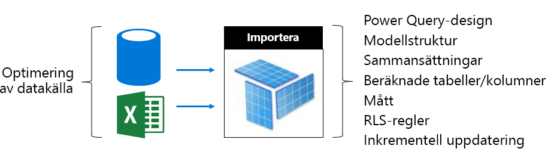

På datakällans nivå:

- Relationsdatakällor kan optimeras för att säkerställa den snabbaste möjliga uppdateringen av i förväg integrerande data, tillämpa rätt index, definiera tabellpartitioner som passar för inkrementella uppdateringsperioder och materialiseringsberäkningar (i stället för beräknade modelltabeller och kolumner) eller lägga till beräkningslogik till vyer
- Icke-relationella datakällor kan integreras i förväg med relationslagringsplatser
- Se till att gatewayer har tillräckligt med resurser, helst på dedikerade virtuella datorer, med tillräckligt med nätverksbandbredd och i närheten till datakällor

På modellnivå:

- Power Query-frågeutformningar kan minimera eller ta bort komplexa omvandlingar och särskilt de som slår ihop olika datakällor (informationslager uppnår detta under steget extrahering-transformering-inläsning). Dessutom kan de säkerställa att lämpliga sekretessnivåer för datakällor är inställda, detta kan göra att Power BI inte behöver läsa in fullständiga resultat för att skapa ett kombinerat resultat för frågor.
- Modellstrukturen identifierar data som ska läsas in och har direkt inverkan på modellstorleken. Den kan utformas till att undvika att onödiga data läses in genom att ta bort kolumner, ta bort rader (särskilt historiska data) eller genom att läsa in sammanfattningsdata (på bekostnad av inläsning av detaljerade data). Dramatisk storleksminskning kan uppnås genom att ta bort kolumner med hög kardinalitet (särskilt textkolumner) som inte lagrar eller komprimerar särskilt effektivt.
- Modellfrågeprestanda kan förbättras genom att konfigurera relationer med enkelriktning om det inte finns en bra anledning till att tillåta dubbelriktad filtrering. Du också använda funktionen CROSSFILTER istället för dubbelriktad filtrering.
- Aggregeringstabeller kan uppnå snabba frågesvar genom att läsa i förväg sammanfattade data, men det här ökar storleken på modellen och leder till längre uppdateringstider. I allmänhet ska aggregeringstabeller reserveras för mycket stora modeller eller sammansatta modellutformningar.
- Beräknade tabeller och kolumner ökar storleken på modellen och resulterar i längre uppdateringstider. I allmänhet kan en mindre lagringsstorlek och snabbare uppdateringstid ske när data är materialiserad eller beräknad i datakällan. Om detta inte är möjligt kan användning av Power Query-anpassade kolumner erbjuda förbättrad lagringskomprimering.
- Det kan finnas möjlighet att finjustera DAX-uttryck för mått och RLS-regler, kanske skriva om logik för att undvika dyra formler
- Inkrementell uppdatering kan avsevärt minska uppdateringstiden och spara minne och processor. Inkrementell uppdatering kan också konfigureras för att ta bort historiska data för att hålla modellstorlekar i trim.
- En modell kan göras om till två modeller när det finns olika och motstridiga frågemönster. Till exempel har vissa rapporter höga nivåer av aggregeringar över all historik och kan tolerera 24 timmars svarstid. Andra rapporter gäller för dagens data och behöver detaljerad åtkomst till enskilda transaktioner. Skapa hellre två modeller som är optimerade för alla behov i stället för att utforma en enda modell som ska räcka åt alla rapporter.

Överväg optimeringsmöjligheterna för en DirectQuery-modell. När modellen utfärdar frågebegäranden till den underliggande datakällan, är optimering av datakällan mycket viktigt för att leverera dynamiska modellfrågor.

 

På datakällans nivå:

- Datakällan kan optimeras för att säkerställa snabbaste möjliga frågor genom att integrera data i förväg (vilket inte är möjligt på modellnivån), tillämpa rätt index, definiera tabellpartitioner materialisera sammanfattade data (med indexerade vyer), och minimera mängden beräkning. Den bästa upplevelsen uppnås när direktfrågor bara behöver filtrera och utföra inre kopplingar mellan indexerade tabeller eller vyer.
- Se till att gatewayer har tillräckligt med resurser, helst på dedikerade virtuella datorer, med tillräckligt med nätverksbandbredd och i närheten till datakällan

På modellnivå:

- Power Query-frågedesigner ska helst inte tillämpa några omvandlingar – försök annars hålla omvandlingar till ett absolut minimum
- Modellfrågeprestanda kan förbättras genom att konfigurera relationer med enkelriktning om det inte finns en bra anledning till att tillåta dubbelriktad filtrering. Dessutom ska modellrelationer konfigureras till att anta referensintegritet användas (när så är fallet) vilket leder till att datakällfrågor använder inre kopplingar effektivare (i stället för yttre kopplingar).
- Undvik att skapa anpassade kolumner för Power Query-frågor eller modellberäknad kolumn – materialisera dessa i datakällan, när det är möjligt
- Det kan finnas möjlighet att finjustera DAX-uttryck för mått och RLS-regler, kanske skriva om logik för att undvika dyra formler

Överväg optimeringsmöjligheterna för en sammansatt modell. Kom ihåg att en sammansatt modell möjliggör en blandning av import- och DirectQuery-tabeller.

- I allmänhet gäller optimeringsämnen för import- och DirectQuery-modeller för sammansatta modelltabeller som använder dessa lagringslägen.
- Normalt ska du sträva efter att uppnå en belastningsutjämnade design genom att konfigurera tabeller av dimensionstyp (som representerar affärsentiteter) som dubbelt lagringsläge och tabeller av faktatyp (ofta stora tabeller som representerar operativa fakta) som DirectQuery-lagringsläge. Dubbelt lagringsläge innebär både import- och DirectQuery-lagringslägena, och detta gör att Power BI-tjänsten kan fastställa det mest effektiva lagringsläget att använda när du genererar en intern fråga för genomströmning.
- Se till att gatewayer har tillräckligt med resurser, helst på dedikerade virtuella datorer, med tillräckligt med nätverksbandbredd och närheten till datakällor
- Aggregeringstabeller konfigurerade som importlagringsläge kan leverera dramatiska förbättringar i frågeprestanda när de används för att sammanfatta tabeller av faktatyp för DirectQuery-lagringsläge. I det här fallet ökar aggregeringstabeller storleken på modellen och ökar uppdateringstiden, och det här är ofta en acceptabel kompromiss för snabbare frågor.

#### Optimera externt värdbaserade modeller

Många optimeringsmöjligheter som beskrivs i avsnittet [Optimera Power BI-värdbaserade modeller](#optimizing-power-bi-hosted-models) gäller även för modeller som utvecklats med Azure Analysis Services och SQL Server Analysis Services. Klara undantag är vissa funktioner som för närvarande inte stöds, inklusive sammansatta modeller och aggregeringstabeller.

Ytterligare ett övervägande för externt värdbaserade datauppsättningar är den databas som är värd i förhållande till Power BI-tjänsten. För Azure Analysis Services innebär det att skapa Azure-resursen i samma region som Power BI-klienten (hemregion). För SQL Server Analysis Services, för IaaS, innebär detta värdskap för den virtuella datorn i samma region, och för lokala datorer innebär det att säkerställa en effektiv gateway-installation.

Det kan vara av intresse att observera att Azure Analysis Services-databaser och SQL Server Analysis Services-tabelldatabaser kräver att deras modeller fullständigt läses in i minnet och att de förblir där hela tiden som stöd för frågor. Precis som för Power BI-tjänsten måste det finnas tillräckligt med minne för att uppdatera om modellen måste vara online under uppdateringen. Till skillnad från Power BI-tjänsten finns det inget koncept för att modeller automatiskt föråldras in och ut ur minnet enligt användning. Power BI Premium, erbjuder därför en mer effektiv metod för att maximera modellfrågor med lägre minnesanvändning.

### Kapacitetsplanering

Storleken på en Premium-kapacitet anger dess tillgängliga minne och processorresurser och begränsningar som har införts på kapaciteten. Antal Premium-kapaciteter är också något att överväga, eftersom man genom att skapa flera Premium-kapaciteter kan hjälpa till att isolera arbetsbelastningar från varandra. Observera att lagringen är 100 TB per kapacitetsnod och det är troligen mer än tillräckligt för alla arbetsbelastningar.

Att fastställa storleken på och antalet Premium-kapaciteter kan vara en utmaning, särskilt för den inledande kapaciteten som du skapar. Det första steget vid fastställande av kapacitetsstorlek är att förstå genomsnittlig arbetsbelastning som representerar förväntad daglig användning. Det är viktigt att förstå att inte alla arbetsbelastningar är lika. I ena änden av spektrumet kan t.ex. 100 samtidiga användare med åtkomst till en enda rapportsida som innehåller ett enda visuellt objekt enkelt uppnås. Men i den andra änden av spektrumet kommer 100 samtidiga användare med åtkomst till 100 olika rapporter, var och en med 100 visuella objekt på rapportsidan, att ha mycket olika krav på resurskapacitet.

Kapacitetsadministratörer behöver därför inte tänka på många faktorer specifika för miljö, innehåll och förväntad användning. Det övergripande målet är att maximera kapacitetsanvändning samtidigt som konsekventa frågetider, godkända väntetider och borttagningsintervall levereras. Faktorer att överväga kan innefatta:

- **Modellstorlek och dataegenskaper** : Importmodeller måste vara helt inlästa i minnet för att fråga eller uppdatera. LC-/DQ-datauppsättningar kan kräva betydande processortid och eventuellt betydande minne för att utvärdera komplexa åtgärder eller RLS-regler. Minne- och processorstorlek och LC-/DQ-frågedataflöde är begränsat av kapacitetsstorleken.
- **Samtidiga aktiva modeller** : Samtidiga frågor för olika importmodeller kommer att leverera bästa svarstider och prestanda när de finns kvar i minnet. Det bör finnas tillräckligt med minne för att vara värd för alla mycket frågade modeller, med ytterligare minne för att möjliggöra deras uppdateringar.
- **Uppdatering av importmodell** : Uppdateringstyp (fullständig eller inkrementell), varaktighet och komplexitet i Power Query-frågor och beräknad logik för tabell/kolumn kan påverka minnes- och särskilt processoranvändning. Samtidiga uppdateringar är begränsade av kapacitetsstorlek (1,5 x serverdelens v-kärnor, avrundas uppåt).
- **Samtidiga frågor** : Många samtidiga frågor kan resultera i rapporter som inte svarar när processor- eller LC-/DQ-anslutningar överskrider kapacitetsgränsen. Detta gäller särskilt för rapportsidor som innehåller många visuella objekt.
- **Dataflöden, sidnumrerade rapporter och AI-funktioner** : Kapaciteten kan konfigureras till att stödja dataflöden, sidnumrerade rapporter och AI-funktioner, och var och en kräver en konfigurerbar högsta procentandel av kapacitetsminne. Minne allokeras dynamiskt till dataflöden, men det är statiskt allokerat till sidnumrerade rapporter och AI-arbetsbelastning.

Förutom de här faktorerna kan kapacitetsadministratörer överväga att skapa flera kapaciteter. Flera kapaciteter möjliggör isolering av arbetsbelastningar och kan konfigureras för att säkerställa att prioritetsarbetsbelastningar har garanterade resurser. Till exempel kan två kapaciteter skapas för att avgränsa affärskritiska arbetsbelastningar från självbetjänade BI (SSBI) arbetsbelastningar. Affärskritisk kapacitet kan användas för att isolera stora företagsmodeller vilket ger dem garanterade resurser med redigeringsåtkomst beviljad endast till IT-avdelningen. SSBI-kapaciteten kan användas som värd för ett växande antal mindre modeller med åtkomst beviljad till affärsanalytiker. SSBI-kapaciteten kan ibland uppleva väntetider för frågor eller uppdateringar som är acceptabla.

Framöver kan kapacitetsadministratörer balansera arbetsytor i kapaciteter genom att flytta innehåll mellan arbetsytor eller arbetsytor mellan kapaciteter, och genom att skala upp eller ner kapaciteter. I allmänhet för värdskap för större modeller skalar du upp och för högre samtidighet skalar du ut.

Kom ihåg att köpa en licens som ger klienten v-kärnor. Köp av en **P3**-prenumeration kan användas för att skapa en eller upp till fyra Premium-kapaciteter, d.v.s. 1 x P3 eller 2 x P2 eller 4 x P1. Dessutom före uppskalning av en P2-kapacitet till en P3-kapacitet kan hänsyn tas till uppdelningen av v-kärnor för att skapa två P1-kapaciteter.

### Testa metoder

När en kapacitetsstorlek avgörs kan testning utföras genom att skapa en kontrollerad miljö. Ett praktiskt och ekonomiskt alternativ är att skapa en Azure-kapacitet (A SKU:er), notera att en P1-kapacitet har samma storlek som en A4-kapacitet, och P2- och P3-kapaciteter har samma storlek som A5- och A6-kapaciteten respektive. Azure-funktionerna kan skapas snabbt och debiteras per timme. Så när testningen är klar, kan de enkelt tas bort om du vill sluta ha kostnader.

Testinnehållet kan läggas till arbetsytor som skapats på Azure-kapacitet och sedan kan en enskild användare köra rapporter för att generera en realistisk och representativ arbetsbelastning för frågor. Om det finns importmodeller, ska en uppdatering för varje modell också utföras. Övervakningsverktyg kan sedan användas för att granska alla mått för att förstå resursanvändning.

Det är viktigt att testerna är upprepningsbara: Testerna ska köras flera gånger och de ska leverera ungefär samma resultat varje gång. Ett medeltal av de här resultaten kan användas för att extrapolera och beräkna en arbetsbelastning under sanna produktionsvillkor.

För att generera ett belastningstest, överväg att utveckla ett belastningstestprogram för att simulera en realistisk arbetsbelastning. Information om hur du gör detta ligger utanför omfånget för detta White Paper. Ytterligare information, inklusive ett kodexempel, finns i webbseminariet [Belastningstest av Power BI-program med Visual Studio](https://blogs.msdn.microsoft.com/charles_sterling/2018/04/04/webinar-load-testing-power-bi-applications-with-visual-studio-load-test/).

## Utforska verkliga scenarier

I det här avsnittet presenteras flera verkliga scenarier för att beskriva vanliga problem eller utmaningar, hur du identifierar dem och hur du kan lösa dem:

- [Hålla datauppsättningar uppdaterade](#keeping-datasets-up-to-date)
- [Identifiera datauppsättningar som svarar långsamt](#identifying-slow-responding-datasets)
- [Identifiera orsaker till att datauppsättningar sporadiskt svarar långsamt](#identifying-causes-for-sporadically-slow-responding-datasets)
- [Avgöra om det finns tillräckligt med minne](#determining-whether-there-is-enough-memory)
- [Avgöra om det finns tillräckligt med processor](#determining-whether-there-is-enough-cpu)

Stegen, tillsammans med diagrammen och tabellerna är från **Kapacitetsmåttappen för Power BI Premium** som en Power BI-administratör kommer att ha åtkomst till.

### Hålla datauppsättningar uppdaterade

I det här scenariot utlöstes en undersökning när användare klagat över att rapportdata ibland verkade vara gamla eller ”inaktiva”.

I appen interagerar administratören med det visuella objektet för **Uppdateringar**, och sorterar datauppsättningar via statistiken för **Maximal väntetid** i fallande ordning. Detta hjälper dem att visa de datauppsättningar som har de längsta väntetiderna, grupperade efter namn på arbetsyta.

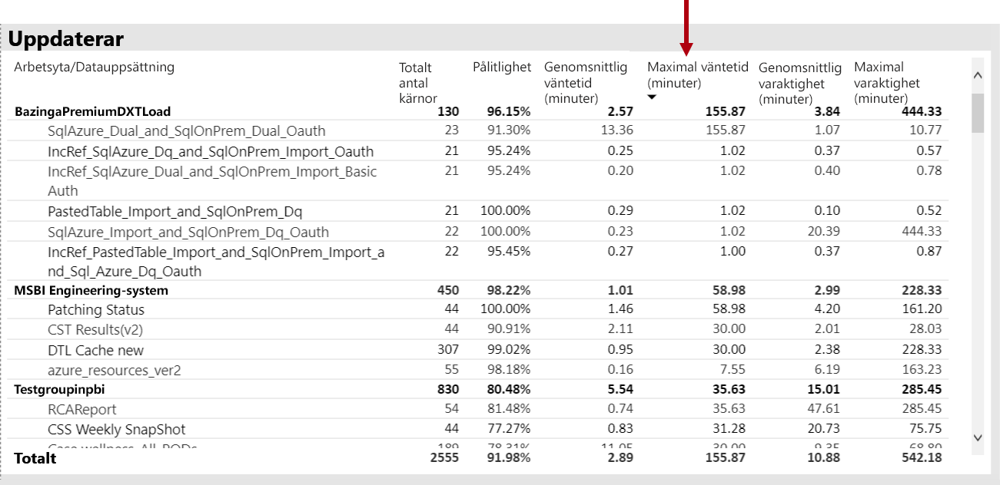

Förutom i det visuella objektet **Genomsnittliga uppdateringsväntetider per timma** kan de se att uppdateringsväntetiderna konsekvent är som högst runt kl 16 varje dag.

Det finns flera förklaringar till dessa resultat:

- För många uppdateringsförsök kan ske på samma gång, vilka överskrider de begränsningar som kapacitetsnoden utgör (sex samtidiga uppdateringar på en P1 med standardminnesallokering)

- Datauppsättningar som ska uppdateras kan vara för stora för att passa tillgängligt minne (vilket kräver minst 2 x minne för fullständig uppdatering)
- Ineffektiv Power Query-logik kan resulterar i en topp av minnesanvändning under uppdateringen av datauppsättningen. På en upptagen kapacitet kan detta ibland nå den fysiska gränsen, vilket leder till att uppdateringen misslyckas och potentiellt påverkar andra rapportvyåtgärder på kapaciteten.
- Ofta efterfrågade datauppsättningar som måste vara kvar i minnet kan påverka andra datauppsättningars förmåga att uppdatera på grund av begränsat tillgängligt minne

För att undersöka detta, kan Power BI-administratören söka efter:

- Lågt tillgängligt minne vid tidpunkten för datauppdateringen, då tillgängligt minne är lägre än 2 ggr storleken på datauppsättningen som ska uppdateras
- Datauppsättningar som inte uppdaterades och inte var i minnet för en uppdatering, men som startats för att visa interaktiv trafik under tunga uppdateringstider. För att se vilka datauppsättningar som lästes in i minnet vid något givet tillfälle, kan en Power BI-administratör titta på området datauppsättningar i fliken **Datauppsättningar** och korsfiltrera till en given tid genom att klicka på någon av staplarna i **Inlästa datauppsättningar per timme**. En lokal topp (visas på bilden nedan) anger en timme när flera datauppsättningar lästes in i minnet, vilket kan försena starten på schemalagda uppdateringar
- Ökad borttagning av datauppsättningar som äger rum när datauppdateringar är schemalagda att starta, anger att det var hög minnesbelastning på grund av att för många olika interaktiva rapporter behandlades före tidpunkten för uppdateringen. Det visuella objektet **Antal borttagna datauppsättningar och minnesförbrukning per timme** kan innehålla toppar i borttagningar.

Följande bild visar en lokal topp i inlästa datauppsättningar, vilket tyder på interaktiva frågor fördröjde starten av uppdateringarna. Att välja en tidsperiod i det visuella objektet **Inlästa datauppsättningar per timme** kommer att korsfiltrera det visuella objektet **Datauppsättningens storlek**.

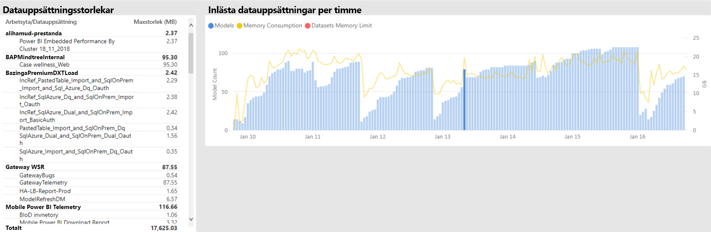

Power BI-administratören kan försöka att lösa problemet genom att utföra åtgärder för att säkerställa att det finns tillräckligt med minne för datauppdateringarna genom att börja med att:

- Kontakta datauppsättningens ägare och be dem att minska och sprida ut schemalagda datauppdateringar
- Minska datamängdens frågebelastning genom att ta bort onödiga instrumentpaneler eller paneler på instrumentpaneler, särskilt de som framtvingar säkerhet på radnivå
- Snabbare uppdateringar genom att optimera Power Query-logik, modellberäknade kolumner eller tabeller, minska datauppsättningens storlek eller konfigurera större datauppsättningar för att utföra inkrementell datauppdatering

### Identifiera datauppsättningar som svarar långsamt

I det här scenariot utlöstes en undersökning när användare klagat att vissa rapporter tog lång tid att öppna, och ibland hängde sig.

I appen kan Power BI-administratören använda det visuella objektet **Frågevaraktigheter** för att fastställa de sämst presterande datauppsättningarna genom att sortera datauppsättningar efter fallande **Genomsnittlig varaktighet**. Det här visuella objektet visar också antal frågor för datauppsättningen, så du kan se hur ofta datauppsättningarna efterfrågas.

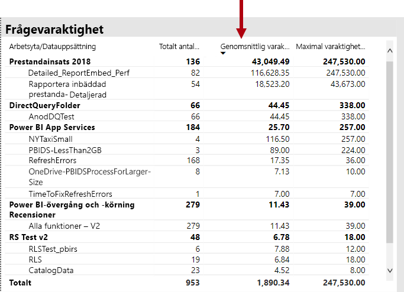

Power BI-administratören kan referera till det visuella objektet **Frågevaraktighetsfördelning**, som visar en övergripande fördelning av bucketgrupperad frågeprestanda (< = 30 ms, 0–100 ms, etc.) för den filtrerade tidsperioden. I allmänhet anses frågor som tar en sekund eller mindre som dynamiska av de flesta användare. Frågor som tar längre tid tenderar att skapa en uppfattning av dålig prestanda.

Det visuella objektet **Frågevaraktighetsfördelning per timme** låter Power BI-administratören identifiera entimmesperioder när kapacitetsprestanda kan ha uppfattats som dålig. Ju större fältsegment som representerar frågevaraktigheter över en sekund, desto större risk att användare kommer att uppfatta sämre prestanda.

Det visuella objektet är interaktivt och när ett segment av fältet är markerat, korsfiltrerats motsvarande visuell tabell för **Frågevaraktigheter** på rapportsidan för att visa de datauppsättningar som den representerar. Den här korsfiltreringen tillåter Power BI-administratörer att enkelt identifiera vilka datauppsättningar som svarar långsamt.

Följande bild visar ett visuellt objekt filtrerat efter **Frågevaraktighetsfördelning per timme**, som fokuserar på sämst presterande datauppsättningar i buckets om en timma. 

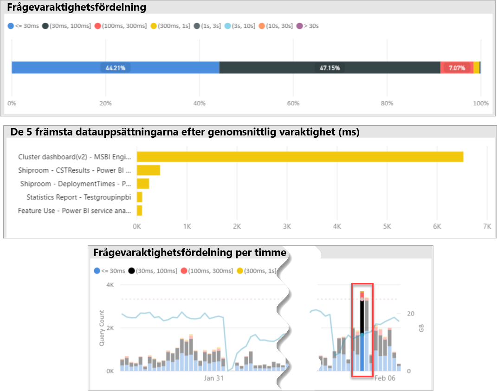

När den sämre presterande datauppsättningen i ett specifikt spann om 1 timma identifieras, kan Power BI-administratören undersöka om den sämre prestandan beror på en överbelastade kapacitet, eller på en dåligt utformad datauppsättning eller rapport. För att uppnå detta kan de refererar till det visuella objektet **Frågeväntetider** och sortera datauppsättningar efter fallande genomsnittlig frågeväntetid. Om en stor del av frågorna väntar, är troligen höga krav på datauppsättningen orsaken till att många frågor väntar. Om den genomsnittliga frågeväntetiden är betydande (> 100 ms), kan det vara värt att granska datauppsättningen och rapporten för att se om optimeringar kan göras. Exempelvis färre visuella objekt på vissa rapportsidor eller en optimering av DAX-uttryck.

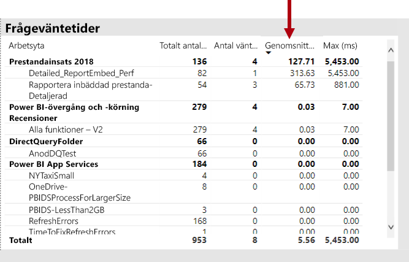

Det finns flera anledningar till att frågeväntetid byggs upp i datauppsättningar:

- En icke-optimal modelldesign, måttuttryck eller t.o.m. rapportdesign – är alla omständigheter som kan bidra till tidskrävande frågor som förbrukar hög CPU. Detta gör att nya frågor får vänta tills CPU-trådar bli tillgängliga och kan skapa en konvojeffekt (tänkt trafikstockning), som ofta ses under toppar vid kontorstider. Sidan **Frågan väntar** blir den viktigaste resursen för att avgöra om datauppsättningar har höga genomsnittliga frågeväntetider.
- Ett stort antal samtidiga kapacitetsanvändare (hundratals) använder samma rapport eller datauppsättning. Även välutformade datauppsättningar kan prestera dåligt så att en samtidighetströskel överskrids. Detta anges vanligtvis av en enda datauppsättning som visar ett avsevärt högre värde för frågeantalet än andra datauppsättningar visar (d.v.s. 300K frågor för en datauppsättning jämfört med < 30K frågor för alla andra datauppsättningar). Vid en viss tidpunkt kommer frågeväntan för den här datauppsättningen att börja minska, och detta kan ses i det visuella objektet **Frågevaraktigheter**.
- Många olika datauppsättningar som efterfrågas samtidigt orsakar minnesförslöing eftersom datauppsättningar ofta pendlar mellan att ha minne eller inte. Detta leder till att användare upplever långsam prestanda när datauppsättningen läses in i minnet. För att bekräfta detta, kan Power BI-administratören referera till det visuella objektet **Antal borttagna datauppsättningar och minnesförbrukning per timme**, vilket kan antyda att ett stort antal datauppsättningar som lästs in i minnet tas bort flera gånger.

### Identifiera orsaker till att datauppsättningar sporadiskt svarar långsamt

I det här scenariot utlöstes en undersökning när användare beskrev att visuella objekt för rapporten ibland kändes långsamma i att svara eller inte svarade alls, men ibland var de tillräckligt dynamiska.

I appen användes avsnittet **Frågevaraktigheter** för att hitta den orsakande datauppsättningen på följande sätt:

- I det visuella objektet **Frågevaraktigheter** filtrerade administratören datauppsättning för datauppsättning (med start på de översta datauppsättningarna som efterfrågats) och undersökte de korsfiltrerade staplarna i det visuella objektet **Frågevaraktighetsfördelning per timme**.
- När ett enda entimmesfält visade betydande förändringar i förhållandet mellan alla frågevaraktighetsgrupper jämfört med andra entimmesstaplar för datauppsättningen (d.v.s. förhållanden mellan färgerna ändras drastiskt), innebär det att den här datauppsättningen visade en sporadisk förändring i prestanda.
- Entimmesstaplarna visar en oregelbunden del av ineffektiva frågor, och angav ett tidsspann där datauppsättningen påverkades av en störande angränsande effekt, orsakad av andra datauppsättningars aktiviteter.

Bilden nedan visar en timme den 30 januari där det har inträffat en betydande minskning av prestanda för en datauppsättning, vilket anges av storleken på ”(3,10s]” för bucketen för körningsvaraktighet. Genom att klicka på detta entimmesfält visas alla datauppsättningar som lästs in i minnet under denna tid och visar således de datauppsättningar som orsakat den störande angränsande effekten.

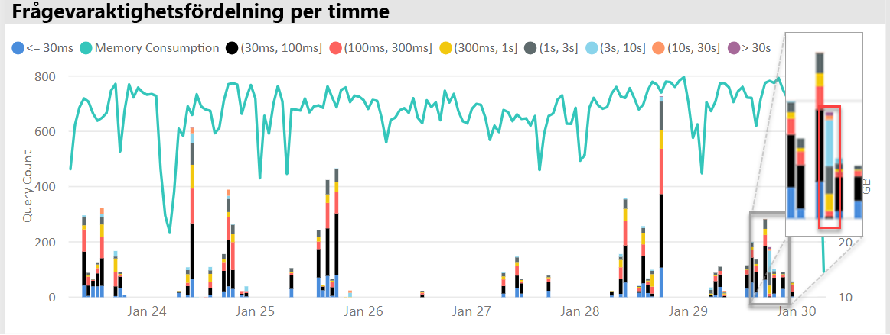

När ett problematiskt tidsspann identifieras (d.v.s. under den 30 januari på bilden ovan) kan Power BI-administratören ta bort alla filter för datauppsättningen och sedan filtrera enbart enligt detta tidsspann för att avgöra vilka datauppsättningar som frågades aktivt under den här tiden. Den datauppsättning som orsakade den störande angränsande effekten är vanligtvis den mest efterfrågade datauppsättningen eller den med längst genomsnittlig frågevaraktighet.

En lösning på problemet kan vara att distribuera orsakande datauppsättningar över olika arbetsytor på olika Premium-kapaciteter eller i delad kapacitet om datauppsättningens storlek, konsumtionskrav och datauppdateringsmönster stöds.

Omvänt kan också gälla. Power BI-administratören kan identifiera när en datauppsättnings frågeprestanda drastiskt förbättras och leta reda på vad som försvann. Om viss information saknas vid denna tidpunkt, kan detta hjälpa till att peka på vad som orsakar problemet.

### Avgöra om det finns tillräckligt med minne

För att avgöra om det finns tillräckligt mycket minne för kapaciteten för att slutföra sina arbetsbelastningar, kan Power BI-administratörer referera till det visuella objektet **Procent förbrukat minne** i fliken **Datauppsättningar** i appen. **Allt** minne (totalt) representerar det minne som förbrukas av datauppsättningar som är inlästa i minnet, oavsett om de aktivt efterfrågas eller bearbetas. **Aktivt** minne representerar det minne som förbrukats av datauppsättningar som bearbetas aktivt.

I en felfri kapacitet ser det visuella objektet ut så här och visar ett gap mellan Allt (totalt) och Aktivt minne:

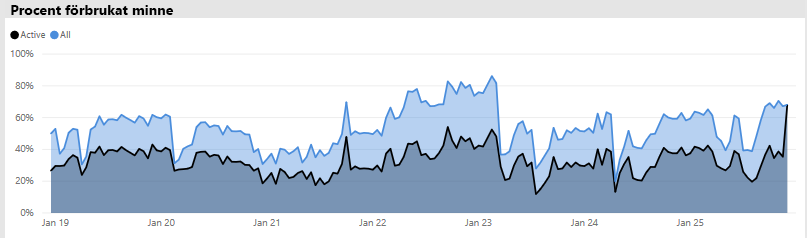

I en kapacitet som upplever minnesbelastning visar samma visuella objekt tydligt aktivt minne och total minneskonvergering, vilket innebär att det inte går att läsa in ytterligare datauppsättningar i minnet vid den här tidpunkten. I det här fallet kan Power BI-administratören klicka på **Kapacitetsomstart** (i **Avancerade alternativ** i området för kapacitetsinställningar i administratörsportalen). Omstart av kapaciteten leder till att alla datauppsättningar rensas från minnet så att de kan läsas in i minnet igen såsom krävs (av frågor eller datauppdatering).

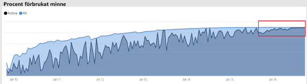

### Avgöra om det finns tillräckligt med processor

I allmänhet ska en kapacitets genomsnittliga CPU-användning vara mindre än 80 %. Överskrids detta värde innebär det att kapaciteten närmar sig processormättnad.

Effekterna av processormättnad uttrycks av åtgärder som tar längre tid än de ska på grund av att kapaciteten utför många CPU-kontextbyten då den försöker bearbeta alla åtgärder. I en Premium-kapacitet med ett stort antal samtidiga frågor anges detta av stora frågeväntetider. En följd av höga frågeväntetider är långsammare svarstider än vanligt. Power BI-administratören kan enkelt identifiera när processorn är mättad genom att visa det visuella objektet **Väntetidsfördelningar per timme**. Periodiska toppar av frågeväntetider indikerar potentiell processormättnad.

Ett liknande mönster kan ibland identifieras i bakgrundsåtgärder om de bidrar till processormättnad. En Power BI-administratör kan söka efter en regelbunden topp i uppdateringstider för en specifik datauppsättning, vilket kan tyda på processormättnad vid tidpunkten (troligen på grund av andra pågående uppdateringar av datauppsättningen och/eller interaktiva frågor). I det här fallet avslöjar vyn **System** i appen inte nödvändigtvis att processorn är på 100 %. Vyn **System** visas enligt medelvärde per timme, men processorn kan bli mättad i flera minuter av tunga åtgärder som dyker upp som toppar i väntetider.

Det finns flera olika nyanser för att se effekten av processormättnad. Antalet frågor som väntar är viktigt, frågeväntetid sker alltid i viss omfattning utan att orsaka uppenbar prestandaförsämring. Vissa datauppsättningar (med längre genomsnittlig frågetid, vilket indikerar komplexitet eller storlek) är mer benägna att orsaka effekterna av processormättnad än andra. För att enkelt identifiera dessa datauppsättningar, kan Power BI-administratören söka efter ändringar i färgsammansättning av staplarna i det visuella objektet **Väntetidsfördelningar per timma**. Efter att ha upptäckt ett avvikande fält, kan de leta efter de datauppsättningar som hade frågeväntetid under denna tid och också titta på genomsnittlig frågeväntetid jämfört med genomsnittlig frågevaraktighet. När de här två måtten är av samma storlek och frågearbetsbelastningen för datauppsättningen är icke-trivial, är det troligt att datauppsättningen påverkas av otillräcklig processor.

Detta kan vara särskilt tydligt när en datauppsättning som används i korta ökningar med höga frågefrekvenser av flera användare (d.v.s. i en utbildningssession), resulterar i processormättnad under varje ökning. I det här fallet kan betydande frågeväntetider för den här datauppsättningen uppstå och påverka andra datauppsättningar i kapacitet (störande angränsande effekt).

I vissa fall kan Power BI-administratörer begära att datauppsättningens ägare skapar en mindre föränderlig frågearbetsbelastning genom att skapa en instrumentpanel (som frågar med jämna mellanrum vid alla uppdateringar av datauppsättning efter cachelagrade paneler) i stället för en rapport. Detta kan förhindra toppar när instrumentpanelen läses in. Den här lösningen kanske inte alltid är möjlig för alla verksamhetskrav, men den kan vara ett effektivt sätt att undvika processormättnad, utan att göra ändringar på datauppsättningen.

## Slutsats

Power BI Premium ger mer konsekvent prestanda, support för stora datavolymer och flexibiliteten hos en enhetlig självbetjänings- och BI-företagsplattform för alla i din organisation. Detta tekniska nivå 300-white paper har skrivits specifikt för Power BI-administratörer och innehållsförfattare och utgivare. Syftet är att hjälpa dem att förstå potentialen i Power BI Premium och förklara hur man utformar, distribuera, övervakar och felsöker skalbara lösningar.

För att distribuera och hantera Power BI Premium-kapaciteter, krävs det att administratörer och utvecklare av modellen har en mycket god förståelse för hur kapaciteter fungerar, så de kan hanteras och övervakas, och hur modeller kan optimeras, för att kunna besvara problem med prestanda och flaskhalsar på rätt sätt om de dyker upp.

## Slutkommentarer

\[1\] Det här tekniska dokumentet behandlar Power BI Premium som endast stöds av Power BI-molntjänsten. Power BI-rapportservern behandlas inte, förutom i det att förklara att licensen som krävs för att installera Power BI-rapportserver ingår i vissa Power BI Premium SKU:er.

\[2\] Power BI som en molntjänst när den används för att bädda in innehåll för programanvändare är PaaS-tjänst (Platform-as-a-Service). Den här typen av inbäddning kan ske med två olika produkter, en av dem är Power BI Premium.

\[3\] Push, strömning och hybrida datauppsättningar lagras inte i Premium-kapaciteter och beaktas därför inte vid distribuering, hantering och övervakning av Premium-kapaciteter.

\[4\] Excel-arbetsböcker som en Power BI-innehållstyp lagras inte i Premium-kapaciteter och beaktas därför inte vid distribuering, hantering och övervakning av Premium-kapaciteter.

\[5\] Visuella objekt kan konfigureras för att ignorera utsnitt. Mer information finns i dokumentet [Visualiseringsinteraktioner i en Power BI-rapport](service-reports-visual-interactions.md).

\[6\] Skillnaden i storlek kan fastställas genom att jämföra filstorlek för Power BI Desktop med Aktivitetshanterarens minnesanvändning för filen.

\[7\] Support för Microsoft-datakällor inkluderar SQL Server, Azure Data Bricks, Azure HDInsight Spark (Beta), Azure SQL Database och Azure SQL Data Warehouse. Information om ytterligare källor finns i dokumentet [Datakällor som stöds av Direct Query i Power BI](desktop-directquery-data-sources.md).

\[8\] Power BI Premium stöder överföring av en Power BI Desktop-fil (PBIX) som är upp till 10 GB i storlek. Väl överförd kan en datauppsättning växa upp till 12 GB i storlek till följd av uppdateringar. Maximal överföringsstorlek varierar beroende på SKU. Mer information finns i dokumentet [Power BI Premium-stöd för stora datauppsättningar](service-premium-large-datasets.md).

\[9\] SKU:er med färre än fyra kärnor körs inte på dedikerad infrastruktur. Detta inkluderar EM1, EM2, A1 och A2 SKU:er.

\[10\] Även om det är sällsynt, kan modeller tas bort från minnet på grund av serviceåtgärder.

\[11\] Dessa tillfällen kan ändras när som helst.

\[12\] Detta kallas multi-geo, och är för närvarande i förhandsversion. Anledningen till en multi-geo-distribution är vanligtvis för efterlevnad för företag eller myndigheter, snarare än för prestanda och skalning. Inläsning av rapporter och instrumentpaneler involverar fortfarande förfrågningar om metadata från hemregionen. Mer information finns i dokumentet [Multi-Geo-stöd för Power BI Premium (förhandsversion)](service-admin-premium-multi-geo.md).

\[13\] Det är möjligt att användare kan orsaka prestandaproblem genom att överbelasta Power BI-tjänsten med jobb, skriva för komplicerade frågor, skapa cirkelreferenser och så vidare.

\[14\] Alternativet att tilldela hela organisationens arbetsytor rekommenderas inte och en mer riktad metod är att föredra. Det är i allmänhet inte bästa praxis att använda personliga arbetsytor för produktionsinnehåll.

\[15\] Det är möjligt att övervaka A SKU:er i appen eller i Azure-portalen, men inte i Power BI-administratörsportalen. För att övervaka A SKU:er, kommer uppdatering av rapporten att misslyckas om appen inte har lagts till i läsarrollen för resursen. Ytterligare information finns i dokumentet [Övervaka Power BI Premium- och Power BI Embedded-kapaciteter](service-admin-premium-monitor-capacity.md).

\[16\] Uppdateringar kan vänta när det inte finns tillräckligt med processor eller minne för att starta.

\[17\] Storleken på datauppsättningen i minnet kan vara större än storleken på disken med upp till 20 %.

\[18\] Genomsnittlig minnesanvändning (GB) och högsta minnesförbrukning (GB)

\[19\] Borttagna datauppsättningar

\[20\] Datauppsättningsfrågor, Total minskning av frågevaraktighet (ms), Andel väntande datauppsättningar och Datauppsättningens genomsnittliga väntetid (ms)

\[21\] Hög användning av CPU och CPU-tid för högsta användning (senaste sju dagarna)

\[22\] Hög användning av DQ/LC och DQ/LC-tid för högsta användning (senaste sju dagarna)