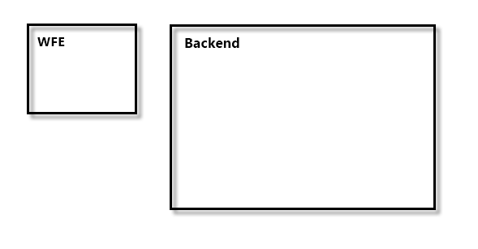
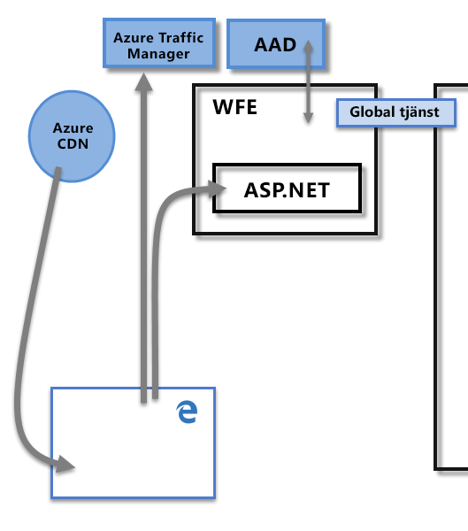
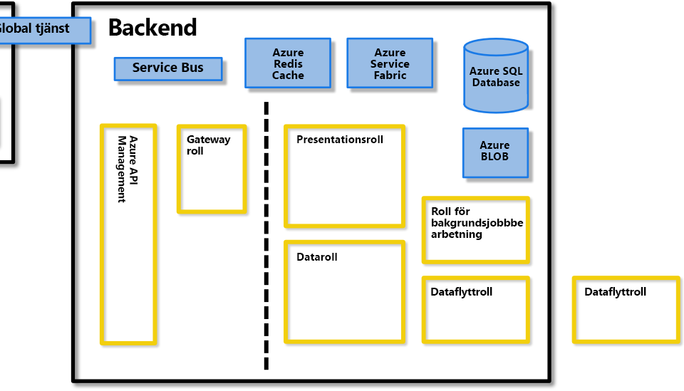
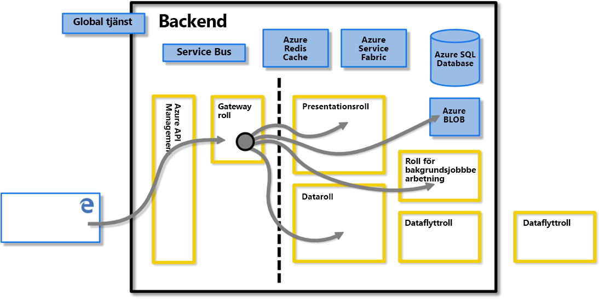
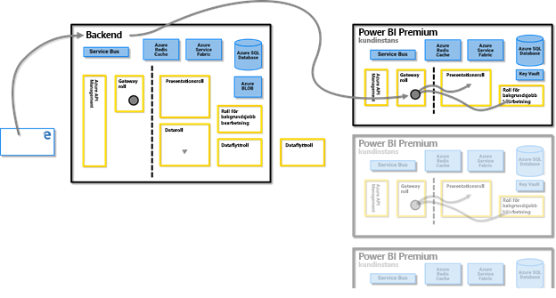
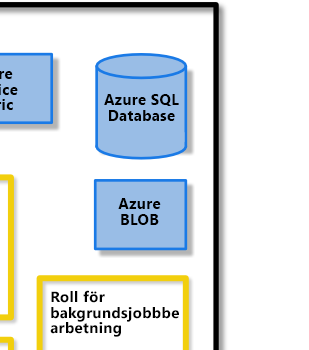
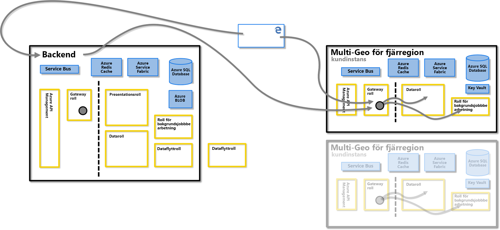
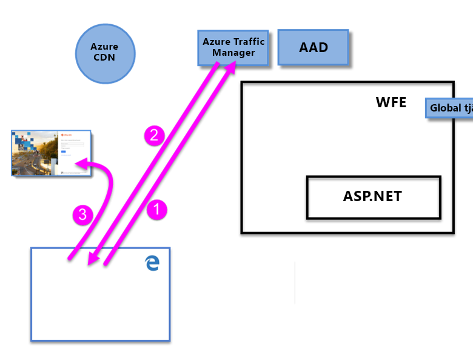
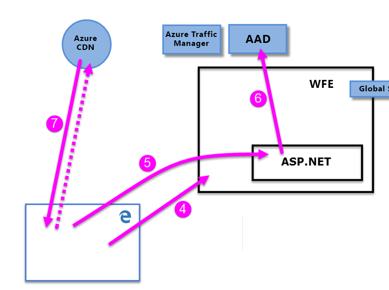
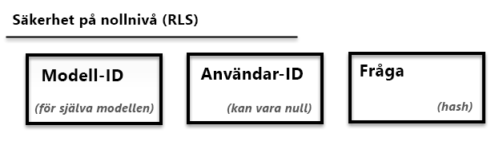

# White paper om Power BI-säkerhet

**Sammanfattning:** Power BI är en onlinebaserad programvarutjänst (*SaaS*, programvara som en tjänst) från Microsoft som gör att du snabbt och enkelt kan instrumentpaneler, rapporter, datamängder och visualiseringar för Business Intelligence som självservice. Med Power BI kan du ansluta till många olika datakällor, kombinera och forma data från dessa anslutningar och sedan skapa rapporter och instrumentpaneler som kan delas med andra.

**Författare:** David Iseminger

**Tekniska granskare:** Pedram Rezaei, Cristian Petculescu, Siva Harinath, Tod Manning, Haydn Richardson, Adam Wilson, Ben Childs, Robert Bruckner, Sergei Gundorov och Kasper de Jonge

**Gäller för:** Power BI SaaS, Power BI Desktop, Power BI Embedded och Power BI Premium

> [!NOTE]
> Du kan spara eller skriva ut detta white paper genom att välja **Skriv ut** i webbläsaren och sedan välja **Spara som PDF**.

## Introduktion

**Power BI** är en onlinebaserad programvarutjänst (_SaaS_, programvara som en tjänst) från Microsoft som gör att du snabbt och enkelt kan instrumentpaneler, rapporter, datamängder och visualiseringar för Business Intelligence som självservice. Med Power BI kan du ansluta till många olika datakällor, kombinera och forma data från dessa anslutningar och sedan skapa rapporter och instrumentpaneler som kan delas med andra.

Power BI-tjänsten regleras av [villkoren för Microsoft Online Services](http://www.microsoftvolumelicensing.com/DocumentSearch.aspx?Mode=3&amp;DocumentTypeId=31) och [Microsofts sekretesspolicy för företag](http://www.microsoft.com/privacystatement/OnlineServices/Default.aspx). Information om platsen för databearbetning finns i villkoren för platsen för databehandling i villkoren för Microsoft Online Services. När det gäller information om efterlevnad är [Microsoft Trust Center](https://www.microsoft.com/trustcenter) den primära resursen för Power BI. Power BI-teamet arbetar ständigt med att ge sina kunder de senaste innovationerna och ökad produktivitet. Power BI är för närvarande på nivå D i [efterlevnadsramverket för Office 365](http://go.microsoft.com/fwlink/p/?LinkID=618494).

Den här artikeln beskriver Power BI-säkerhet genom att ge en förklaring av Power BI-arkitekturen samt hur användare autentiserar till Power BI och dataanslutningar upprättas. Sedan beskrivs hur Power BI lagrar och flyttar data genom tjänsten. I det sista avsnittet behandlas säkerhetsrelaterade frågor med svar för varje fråga.

## Power BI-arkitektur

**Power BI**-tjänsten bygger på **Azure**, vilket är Microsofts [plattform för molnbaserad databehandling](http://azure.microsoft.com/overview/what-is-azure/). Power BI distribueras för närvarande i många datacenter runtom i världen – det finns många aktiva distributioner som är tillgängliga för kunder i de regioner som hanteras av dessa datacenter. Det finns även lika många passiva distributioner som reserv för varje aktiv distribution.

Varje Power BI-distribution består av två kluster – ett frontwebb (**WFE**) och ett **serverdel**. De här två klustren visas i följande bild och utgör en referens för resten av den här artikeln. 

Power BI använder Azure Active Directory (**AAD**) för kontoautentisering och hantering. Power BI använder dessutom **Azure Traffic Manager** (ATM) till att dirigera användartrafik till det närmaste datacentret, vilket bestäms av DNS-posten för den klient som försöker att ansluta, för autentiseringsprocessen samt för att ladda ned statiskt innehåll och filer. Power BI använder geografiskt närmaste frontwebb (WFE) för att distribuera det statiska innehåll som krävs samt filer till användare, med undantag för anpassade visuella objekt som levereras via **Azure Content Delivery Network (CDN)**.

### WFE-klustret

**WFE**-klustret hanterar den första anslutningen och autentiseringsprocessen för Power BI, samt använder AAD för att autentisera klienter och tillhandahåller tokens för efterföljande klientanslutningar till Power BI-tjänsten.

När användare försöker ansluta till Power BI-tjänsten kan klientens DNS-tjänst kommunicera med **Azure Traffic Manager** för att hitta det närmaste datacentret med en Power BI-distribution. Mer information om den här processen finns i avsnittet om [trafikroutningsmetod med prestanda för Azure Traffic Manager](https://azure.microsoft.com/documentation/articles/traffic-manager-routing-methods/#performance-traffic-routing-method).

WFE-klustret närmast användaren hanterar inloggnings- och autentiseringssekvensen (som beskrivs senare i den här artikeln) och ger användaren en AAD-token när autentiseringen lyckas. ASP.NET-komponenten i WFE-klustret parsar begäran för att avgöra vilken organisation användaren tillhör och frågar sedan Power BI **Global Service**. Global Service är en enskild Azure-tabell som delas mellan alla WFE-kluster och serverdelskluster värden över som mappar användare och kundorganisationer till det datacenter som hanterar deras Power BI-klientorganisation. WFE anger till webbläsaren vilket serverdelskluster som innehåller organisationens klientorganisation. När en användare har autentiserats sker efterföljande klientinteraktioner direkt med serverdelsklustret utan att gå via WFE för de begärandena.

### Serverdelsklustret för Power BI

**Serverdelsklustret** avser hur autentiserade klienter interagerar med Power BI-tjänsten. **Serverdelsklustret** hanterar visualiseringar, instrumentpaneler för användare, datauppsättningar, rapporter, datalagring, dataanslutningar, datauppdatering och andra delar av interaktionen med Power BI-tjänsten.

**Gatewayrollen** fungerar som en gateway mellan användarförfrågningar och Power BI-tjänsten. Användarna interagerar inte direkt med några andra roller utöver gatewayrollen.

**Viktigt!** Observera att det _endast_ är rollerna Azure API Management (**APIM**) och Gateway (**GW**) som kan nås via offentligt Internet. De tillhandahåller funktioner för autentisering, auktorisering, DDoS-skydd, begränsning, belastningsutjämning, routning m.m.

Den streckade linjen i bilden för **serverdelsklustret** ovan visar gränsen mellan de enda två roller som är tillgängliga för användarna (till vänster om den streckade linjen) och de roller som endast kan nås av systemet. När en autentiserad användare ansluter till Power BI-tjänsten accepteras och hanteras anslutningen och alla begäranden från klienten av **gatewayrollen** och **Azure API Management**, som sedan interagerar med resten av Power BI-tjänsten för användarens räkning. Om till exempel en klient försöker visa en instrumentpanel accepterar **gatewayrollen** förfrågan och skickar sedan separat en begäran till **presentationsrollen** om att hämta de data som behövs för att webbläsaren ska kunna återge instrumentpanelen.

### Power BI Premium

**Power BI Premium** erbjuder en dedikerad och etablerad arbetsyta som partitionerad tjänst till prenumeranter som behöver särskilda resurser för sina Power BI-aktiviteter. När en kund registrerar sig för en Power BI Premium-prenumeration skapas Premium-kapacitet via **Azure Resource Manager**. Distributionen av den prenumerationen tilldelar en uppsättning virtuella datorer enligt prenumerationsnivån i det datacenter där Power BI-klientorganisationen finns (med undantag för Multi-Geo-miljöer, som beskrivs senare i dokumentet). Detta initieras som en **Azure Service Fabric**-distribution.

När Premium-klustret har skapats sker all kommunikation med det via Power BI-serverdelsklustret, där en anslutning till de virtuella datorerna i klientens dedikerade **Power BI Premium**-prenumeration upprättas.

### Datalagringsarkitektur

Power BI använder två primära databaser för att lagra och hantera data: data som laddas upp från användarna skickas vanligtvis till **Azure Blob**-lagring, och alla metadata samt artefakter för själva systemet lagras bakom en brandvägg i **Azure SQL Database**.

Om till exempel en användare importerar en Excel-arbetsbok i Power BI-tjänsten skapas en Analysis Services-tabelldatabas i minnet, och data lagras i minnet i upp till en timme (eller tills minnesbelastning inträffar i systemet). Data skickas även till **Azure Blob**-lagring.

Metadata om en användares Power BI-prenumeration, till exempel instrumentpaneler, rapporter, senaste datakällor, arbetsytor, organisationsinformation, information om klientorganisation samt andra metadata om systemet lagras och uppdateras i **Azure SQL Database**. All information som lagras i Azure SQL Database krypteras fullständigt med hjälp av [Azure SQL-tekniken Transparent datakryptering](https://msdn.microsoft.com/library/dn948096.aspx) (TDE). Alla data som lagras i Azure Blob-lagring krypteras också. Mer information om processen för inläsning, lagring och flytt av data beskrivs i avsnittet **Lagring och flytt av data**.

## Skapa klientorganisation

En klientorganisation är en dedikerad instans av Azure AD-tjänsten som en organisation får och äger när den registrerar sig för en Microsoft-molntjänst såsom Azure, Microsoft Intune, Power BI eller Office 365. Varje Azure AD-klient är unik och avgränsad från andra Azure AD-klienter.

En klientorganisation innehåller användarna i ett företag samt information om dem – lösenord, användarprofildata, behörigheter och så vidare. Den innehåller även grupper, program och annan information som hör till en organisation och dess säkerhet. Mer information finns i [Vad är en Azure AD-klientorganisation](https://msdn.microsoft.com/library/azure/jj573650.aspx#BKMK_WhatIsAnAzureADTenant).

En Power BI-klientorganisation skapas i det datacentret bedöms vara närmast landet (eller regionen), och tillståndsinformation ges för klientorganisationen i Azure Active Directory, som tillhandahölls när Office 365 eller Power BI-tjänsten ursprungligen etablerades. Power BI-klientorganisationen flyttas inte från det datacentret i dag.

### Flera geografiska områden (Multi-Geo)

Vissa organisationer behöver Power BI-närvaro i flera geografiska områden eller regioner baserat på affärsbehoven. Exempelvis har ett företag kanske sin Power BI-klientorganisation i USA men bedriver även affärsverksamhet i andra geografiska områden, till exempel Australien, och behöver behålla Power BI-tjänster och data i den avlägsna regionen.  Från och med hösten 2018 kan organisationer med klientorganisationen i ett geografiskt område även komma åt Power BI-resurser i ett annat geografisk område med hjälp av korrekt etablering. Den här funktionen kallas **Multi-Geo** hänvisas till i resten av det här dokumentet.

Det finns tekniska konsekvenser att tänka på vid verksamhet i olika geografiska områden. Dessa klargörs i dokumentet. Följande bör beaktas:

- En cachelagrad fråga som lagras i en avlägsen region är kvar i den regionen i vila, men andra data som överförs kan skifta fram och tillbaka mellan olika geografiska områden.
- Rapporter i PBIX-filer eller XLSX-filer i en avlägsen region som publiceras till Power BI gör ibland att en kopia eller skuggkopia lagras i Power BI:s Azure Blob-lagring. När det sker krypteras data med hjälp av Azure Storage Service Encryption (SSE).
- När data flyttas från en region till en annan i en Multi-Geo-miljö utförs skräpinsamling i den region som data flyttades från inom 7 till 10 dagar, varefter kopian av de data som flyttades från ursprungsregionen förstörs.

Följande bild illustrerar hur Power BI-tjänster som tillhandahålls i den avlägsna regionen i en Multi-Geo-miljö dirigeras genom **Power BI-serverdelsklustret**, när en anslutning till klientens fjärranslutna virtuella dator för Power BI-prenumerationen upprättas.

### Datacenter och nationella inställningar

Power BI erbjuds i vissa regioner baserat på var Power BI-kluster distribueras i regionala datacenter. Microsoft planerar att expandera sin Power BI-infrastruktur till ytterligare datacenter.

Följande länkar ger ytterligare information om Azure-datacenter.

- [Azure-regioner](http://azure.microsoft.com/regions/) – information om Azures globala närvaro och platser
- [Azure-tjänster efter region](http://azure.microsoft.com/regions/#services) – en fullständig lista över Azure-tjänster (både infrastrukturtjänster och plattformstjänster) som är tillgängliga från Microsoft i varje region.

För närvarande är Power BI-tjänsten tillgänglig i vissa områden som underhålls av datacenter enligt beskrivningen i [Microsoft Trust Center] ((https://www.microsoft.com/TrustCenter/CloudServices/business-application-platform/data-location). Via länken nedan visas en översikt över Power BI-datacenter. Du kan hovra över en region för att se de datacenter som finns där:

* [Power BI-datacenter](https://www.microsoft.com/TrustCenter/CloudServices/business-application-platform/data-location)

Microsoft tillhandahåller även datacenter för självständiga stater. Mer information om tillgänglighet för Power BI-tjänsten för nationella moln finns i [Power BI för nationella moln](https://powerbi.microsoft.com/clouds/).

Mer information om var data lagras och hur de används finns i [Microsoft Trust Center](https://www.microsoft.com/TrustCenter/Transparency/default.aspx#_You_know_where). Åtaganden om platsen för vilande kunddata anges i **databehandlingsvillkoren** i [villkoren för Microsoft Online Services](http://www.microsoftvolumelicensing.com/DocumentSearch.aspx?Mode=3&amp;DocumentTypeId=31).

## Användarautentisering

Användarautentisering till Power BI-tjänsten består av en serie begäranden, svar och omdirigeringar mellan användarens webbläsare och den Power BI-tjänst eller de Azure-tjänster som används av Power BI. Den sekvensen beskriver processen för autentisering av användare i Power BI. Mer information om alternativ för en organisations modeller för användarautentisering (inloggningsmodeller) finns i avsnittet om att [välja en inloggningsmodell för Office 365](https://blogs.office.com/2014/05/13/choosing-a-sign-in-model-for-office-365/).

### Autentiseringssekvens

Sekvensen för användarautentisering för Power BI-tjänsten sker enligt beskrivningen i följande steg, som illustreras i följande bilder.

1. En användare upprättar en anslutning till Power BI-tjänsten via en webbläsare, antingen genom att skriva Power BI-adressen i adressfältet (till exempel https://app.powerbi.com)) eller genom att välja _Logga in_ från landningssidan för Power BI (https://powerbi.microsoft.com). Anslutningen upprättas med hjälp av TLS 1.2 och HTTPS, och all efterföljande kommunikation mellan webbläsaren och Power BI-tjänsten använder HTTPS. Begäran skickas till **Azure Traffic Manager**.

2. **Azure Traffic Manager** kontrollerar användarens DNS-post för att fastställa det närmaste datacentret där Power BI-tjänst distribueras, och svarar till DNS med IP-adressen för det WFE-kluster som användaren ska skickas till.

3. WFE omdirigerar sedan användaren till inloggningssidan för Microsoft Online Services.

    

1. När användaren har autentiserats omdirigerar inloggningssidan användaren till det tidigare fastställda närmaste **WFE-klustret** för Power BI-tjänsten.

2. Webbläsaren skickar en cookie som hämtades från inloggningen till Microsoft Online Services, som inspekteras av **ASP.NET-tjänsten** i **WFE-klustret**.

3. WFE-klustret kontaktar **Azure Active Directory-tjänsten** (**AAD**) för att autentisera användarens prenumeration på Power BI-tjänsten och för att hämta en AAD-säkerhetstoken. När AAD returnerar autentiseringen för användaren och returnerar en AAD-säkerhetstoken kontaktar WFE-klustret **Power BI**** Global Service**, som upprätthåller en lista över klientorganisationer och platserna för deras Power BI-serverdelar samt fastställer vilket Power BI-kluster som innehåller användarens klientorganisation. WFE-klustret omdirigerar sedan användaren till det Power BI-kluster där dess klientorganisation finns och returnerar en samling objekt till användarens webbläsare:

      - **AAD-säkerhetstoken**
      - **Sessionsinformation**
      - Webbadressen för det **serverdelskluster** som användaren kan kommunicera och interagera med

1. Användarens webbläsare kontaktar sedan angivet Azure CDN, eller WFE för vissa av filerna, för att ladda ned samlingen av angivna delade filer som behövs för att aktivera webbläsarens interaktion med Power BI-tjänsten. Webbläsaren inkluderar sedan AAD-token, sessionsinformation, platsen för det associerade serverdelsklustret samt den samling av filer som har laddats ned från Azure CDN och WFE-klustret under hela webbläsarsessionen för Power BI-tjänsten.

När de objekten är klara kontaktar webbläsaren det angivna serverdelsklustret, och användarens interaktion med Power BI-tjänsten inleds. Därefter sker alla anrop till Power BI-tjänsten med det angivna serverdelsklustret, och alla anrop inkluderar användarens AAD-token. AAD-token har en tidsgräns på en timme. WFE uppdaterar regelbundet token om en användares session förblir öppen i syfte att upprätthålla åtkomsten.

## Lagring och flytt av data

I Power BI-tjänsten är data antingen _vilande_ (data är tillgängliga för en Power BI-användare som åtgärder för närvarande inte vidtas för) eller _pågående_ (till exempel: frågor som körs, dataanslutningar och modeller som åtgärder vidtas för, data och/eller modeller som laddas upp till Power BI-tjänsten samt andra åtgärder som användare eller Power BI-tjänsten kan vidta på data som aktivt används eller uppdateras). Data som är pågående kallas _data som bearbetas_. Vilande data i Power BI krypteras. Data som överförs, vilket innebär data som skickas eller tas emot av Power BI-tjänsten, krypteras också.

Power BI-tjänsten hanterar även data på olika sätt beroende på om data läses med en **DirectQuery** eller via import. Det finns därmed två kategorier av användardata för Power BI: data som läses av DirectQuery och data som inte läses av DirectQuery.

En **DirectQuery** är en fråga för vilken en Power BI-användares fråga har översatts från Microsofts DAX-språk (Data Analysis Expressions) – det språk som används av Power BI och andra Microsoft-produkter för att skapa frågor – i datakällans interna dataspråket (till exempel T-SQL eller andra inbyggda databasspråk). Data som är associerade med en DirectQuery lagras endast med referens, vilket innebär att källdata inte lagras i Power BI när DirectQuery inte är aktiv (förutom visualiseringsdata som används för att visa instrumentpaneler och rapporter, enligt beskrivningen i avsnittet _Data som bearbetas (dataflytt)_ nedan). I stället lagras referenser till DirectQuery-data, vilket tillåter åtkomst till dessa data när DirectQuery körs. En DirectQuery innehåller all nödvändig information för att köra frågan, däribland anslutningssträngen och de autentiseringsuppgifter som används för åtkomst till datakällorna. Detta gör att DirectQuery kan ansluta till de inkluderade datakällorna för automatisk uppdatering. Med en DirectQuery ingår information om den underliggande datamodellen i DirectQuery.

En fråga för en importdatauppsättning består av en uppsättning DAX-frågor som _inte_ översätts direkt till det inbyggda språket för underliggande datakällor. Importfrågor inkluderar inte autentiseringsuppgifter för underliggande data, och underliggande data läses in i Power BI-tjänsten såvida de inte är lokala data som nås via en [Power BI Gateway](service-gateway-onprem.md), i vilket fall frågan endast lagrar referenser till lokala data.

I följande tabell beskrivs Power BI-data baserat på vilken typ av fråga som används. En **X** indikerar förekomst av Power BI-data när du använder den associerade frågetypen.

|  |Importera  |DirectQuery  |Live Connect  |
|---------|---------|---------|---------|
|Schema     |     X    |    X     |         |
|Raddata     |    X     |         |         |
|Cachelagring av data för visuella objekt     |    X     |     X    |    X     |

Skillnaden mellan en DirectQuery och andra frågor avgör hur Power BI-tjänsten hanterar vilande data och huruvida själva frågan krypteras. I följande avsnitt beskrivs vilande data och som flyttas samt kryptering, plats och process för hantering av data.

### Vilande data

När data är vilande lagrar Power BI-tjänsten datamängder, rapporter och instrumentpanelsrutor på det sätt som beskrivs i följande underavsnitt. Som tidigare nämnts krypteras vilande data i Power BI. ETL står för Extrahera, Transformera och Läsa in i följande avsnitt.

#### Krypteringsnycklar

- Krypteringsnycklarna för Azure Blob-nycklar lagras, krypteras, i Azure Key Vault.
- Krypteringsnycklarna för Azure SQL Database TDE-tekniken hanteras av själva Azure SQL.
- Krypteringsnyckeln för tjänsten för dataflytt och den lokala datagatewayen lagras:
  - I den lokala datagatewayen i kundens infrastruktur – för lokala datakällor
  - I rollen Dataflytt – för molnbaserade datakällor

Den innehållskrypteringsnyckel (CEK) som används för att kryptera Windows Azure Blob Storage är en slumpmässigt genererad 256-bitars nyckel. Den algoritm som CEK använder för att kryptera innehållet är AES\_CBC\_256.

Den nyckelkrypteringsnyckel (KEK) som används för att kryptera CEK är en fördefinierad 256-bitars nyckel. Den algoritm som används av KEK för att kryptera CEK är A256KW.

Gatewaykrypteringsnycklar baserat på återställningsnyckeln lämnar aldrig en lokal infrastruktur. Power BI kan inte komma de krypterade lokala värdena för autentiseringsuppgifter och kan inte spärra de autentiseringsuppgifterna. Webbklienter krypterar autentiseringsuppgifterna med en offentlig nyckel som associeras med den specifika gateway som de kommunicerar med.

För molnbaserade datakällor krypterar rollen Dataflytt krypteringsnycklarna med hjälp av [Always Encrypted](https://msdn.microsoft.com/library/mt163865.aspx)-metoder. Du kan läsa mer om [Always Encrypted-databasfunktionen](https://msdn.microsoft.com/library/mt163865.aspx).

#### Datauppsättningar

1. Metadata (tabeller, kolumner, mått, beräkningar, anslutningssträngar osv.)

    a. För lokala Analysis Services lagras ingenting i tjänsten förutom en referens till den databas som lagras krypterad i Azure SQL.

    b. Alla andra metadata för ETL, DirectQuery och push-data krypteras och lagras i Azure Blob-lagring.

1. Autentiseringsuppgifter för att de ursprungliga datakällorna
  
      a. Lokala Analysis Services – det behövs inga autentiseringsuppgifter, och därför lagras inga autentiseringsuppgifter.

      b. DirectQuery – detta beror på huruvida modellen skapas direkt i tjänsten, i vilket fall den lagras i anslutningssträngen och krypteras i Azure Blob, eller om modellen importeras från Power BI Desktop, i vilket fall autentiseringsuppgifterna lagras krypterade i Azure SQL Database för Dataflytt. Krypteringsnyckeln lagras på den dator som kör gatewayen i kundens infrastruktur.

      c. Publicerade data – ej tillämpligt

      d. ETL

      - För **Salesforce** eller **OneDrive** – uppdateringstoken lagras krypterade i Azure SQL Database för Power BI-tjänsten.
      - I annat fall:
        - Om datamängden anges för uppdatering lagras autentiseringsuppgifterna krypterade i Azure SQL Database för Dataflytt. Krypteringsnyckeln lagras på den dator som kör gatewayen i kundens infrastruktur.
        - Om datamängden inte anges för uppdatering finns det inga autentiseringsuppgifter lagrade för datakällorna

1. Data

    a. Lokala Analysis Services och DirectQuery – inget lagras i Power BI-tjänsten.

    b. ETL – krypteras i Azure Blob-lagring, men alla data som för närvarande finns i Azure Blob-lagring för Power BI-tjänsten använder [Azure Storage Service Encryption (SSE)](https://docs.microsoft.com/azure/storage/common/storage-service-encryption), även kallat kryptering på serversidan. Multi-Geo använder också SSE.

    c. Push-data v1 – lagras krypterat i Azure Blob-lagring, men alla data som för närvarande finns i Azure Blob-lagring i Power BI-tjänsten använder [Azure Storage Service Encryption (SSE)](https://docs.microsoft.com/azure/storage/common/storage-service-encryption), även kallat kryptering på serversidan. Multi-Geo använder också SSE. Push-data v1 utgick från och 2016. 

    d. Push-data v2 – lagras krypterat i Azure SQL.

Power BI använder metoden för kryptering på klientsidan med hjälp av CBC-läget (Cipher Block Chaining) med AES (Advanced Encryption Standard) för att kryptera sin Azure Blob-lagring. Du kan [lära dig mer om kryptering på klientsidan](https://azure.microsoft.com/documentation/articles/storage-client-side-encryption/).

Power BI tillhandahåller övervakning av dataintegritet på följande sätt:

* För vilande data i Azure SQL använder Power BI dbcc, TDE och konstant kontrollsumma för sida som en del av de inbyggda erbjudandena för SQL.

* För vilande data i Azure Blob-lagring använder Power BI kryptering på klientsidan och HTTPS för att överföra data till lagring, vilket omfattar integritetskontroller under datahämtningen. Du kan [lära dig mig om säkerhet för Azure Blob-lagring](https://azure.microsoft.com/documentation/articles/storage-security-guide/).

#### Rapporter

1. Metadata (rapportdefinition)

   a. Rapporter kan antingen vara Excel för Office 365-rapporter eller Power BI-rapporter. Följande gäller för metadata baserat rapporttypen:
        
    &ensp; &ensp; a. Excel-rapportens metadata lagras krypterade i SQL Azure. Metadata lagras också i Office 365.

    &ensp; &ensp; b. Power BI-rapporter lagras krypterade i Azure SQL-databas.

2. Statiska data

   Statiska data omfattar artefakter såsom bakgrundsbilder och anpassade visuella objekt.

    &ensp; &ensp; a. För rapporter som skapats med Excel för Office 365 lagras ingenting.

    &ensp; &ensp; b. För Power BI-rapporter lagras och krypteras statiska data i Azure Blob-lagring.

3. Cacheminnen

    &ensp; &ensp; a. För rapporter som skapats med Excel för Office 365 cachelagras ingenting.

    &ensp; &ensp; b. För Power BI-rapporter cachelagras data för de visuella objekt som visas krypterade i Azure SQL Database.
 

4. Ursprungliga Power BI Desktop-filer (.pbix) eller Excel-filer (.xlsx) publiceras till Power BI

    Ibland lagras en kopia eller en skuggkopia av .xlsx- eller pbix-filer Azure Blob-lagring för Power BI. När detta sker krypteras data. Alla sådana rapporter som lagras i Power BI-tjänsten, i Azure Blob-lagring, använder [Azure Storage Service Encryption (SSE)](https://docs.microsoft.com/azure/storage/common/storage-service-encryption), även kallat kryptering på serversidan. Multi-Geo använder också SSE.

#### Instrumentpaneler och instrumentpanelsrutor

1. Cacheminnen – de data som behövs för visuella objekt på instrumentpanelen cachelagras och lagras vanligtvis krypterade i Azure SQL Database. Andra paneler såsom fästa visuella objekt från Excel eller SQL Server Reporting Services (SSRS) lagras i Azure Blob som bilder och krypteras också.

2. Statiska data – som omfattar artefakter såsom bakgrundsbilder och anpassade visuella objekt som lagras krypterade i Azure Blob-lagring.

Oavsett vilken krypteringsmetod som används hanterar Microsoft nyckelkrypteringen för kundernas räkning, antingen i ett hemligt arkiv eller i Azure Key Vault.

### Data som lagras kortvarigt på beständiga enheter

Icke-beräkningsbara enheter är enheter som har minne som finns kvar utan konstant effekt. Nedan beskrivs de data som lagras kortvarigt på beständiga enheter. 

#### Datauppsättningar

1. Metadata (tabeller, kolumner, mått, beräkningar, anslutningssträngar osv.)

2. Vissa schemarelaterade artefakter kan lagras på disken för beräkningsnoderna under en begränsad tidsperiod. Vissa artefakter kan även lagras okrypterade i Azure REDIS Cache under en begränsad tidsperiod.

3. Autentiseringsuppgifter för att de ursprungliga datakällorna

    a. Lokala Analysis Services – ingenting lagras

    b. DirectQuery – detta beror på huruvida modellen skapas direkt i tjänsten, i vilket fall den lagras i anslutningssträngen i krypterat format med krypteringsnyckeln lagrad i oformaterad text på samma ställa (tillsammans med den krypterade informationen), eller om modellen importeras från Power BI Desktop, i vilket fall autentiseringsuppgifterna inte lagras på beständiga enheter.

    > [!NOTE]
    > Funktionen för modellskapande på tjänstsidan utgick från och med 2017.

    c. Publicerade data – inget (ej tillämpligt)

    d. ETL – inget (ingenting lagras på beräkningsnoden eller på något annat sätt än vad som beskrivs i avsnittet **Vilande data** ovan)
4. Data

    Vissa dataartefakter kan lagras på disken för beräkningsnoderna under en begränsad tidsperiod.

### Data som bearbetas

Data bearbetas när de aktivt används eller läses av en användare. Till exempel bearbetas data när en användare läser en datamängd, reviderar eller ändrar en instrumentpanel eller rapport, när en uppdatering sker eller när andra aktiviteter för dataåtkomst sker. När någon av dessa händelser inträffar och placerar data i bearbetning skapar **datarollen** i Power BI-tjänsten en AS-databas (Analysis Services) i minnet, och datamängden läses in i AS-databasen i minnet. Oavsett om datamängden baseras på en DirectQuery är data som läses in i AS-databasen okrypterade för att tillåta åtkomst av **datarollen**. datamängden lagras även i minnet för ytterligare åtkomst tills Power BI-tjänsten inte längre behöver den. För kunder med en Power BI Premium-prenumeration skapar Power BI en AS-databas (Analysis Services) i minnet i kundens separat etablerade samling med virtuella Power BI-datorer.

När åtgärder vidtas på data, vilket innefattar initial inläsning av data till Power BI, kan Power BI-tjänsten cachelagra visualiseringsdata i en krypterad **Azure SQL Database** oavsett huruvida datamängden baseras på en DirectQuery.

För att övervaka dataintegriteten för data som bearbetas använder Power BI HTTPS, TCP/IP och TLS för att se till att data krypteras och behåller integriteten under transporten.

## Användarautentisering till datakällor

Med varje datakälla en användare upprättar en anslutning baserat på deras inloggning och ger åtkomst till data med dessa autentiseringsuppgifter. Användare kan sedan skapa frågor, instrumentpaneler och rapporter baserat på underliggande data.

När en användare delar frågor, instrumentpaneler, rapporter eller visualiseringar beror åtkomst till dessa data och visualiseringar på huruvida de underliggande datakällorna stöder säkerhet på rollnivå (RLS).

Om en underliggande datakälla stöder **Power BI:s**** säkerhet på rollnivå (RLS)** tillämpar Power BI-tjänsten den säkerheten på rollnivå, och användare som inte har tillräckliga autentiseringsuppgifter för att komma åt underliggande data (vilket kan vara en fråga som används i en instrumentpanel, en rapport eller något annat dataartefakt) ser inte data som användarna inte har tillräckliga behörigheter för. Om en användares åtkomst till underliggande data skiljer sig från den användare som skapade instrumentpanelen eller rapporten visar visualiseringar och andra artefakter endast data baserat på den åtkomstnivå som användaren har till dessa data.

Om en datakälla **inte** tillämpar RLS så tillämpas autentiseringsuppgifterna för Power BI-inloggning på den underliggande datakällan, eller om andra autentiseringsuppgifter tillhandahålls under anslutningen tillämpas de tillhandahållna autentiseringsuppgifterna. När en användare läser in data i Power BI-tjänsten från icke-RLS-datakällor lagras data i Power BI enligt beskrivningen i avsnittet **Lagring och flytt av data** i det här dokumentet. För icke-RLS-datakällor gäller att när data delas med andra användare (till exempel via en instrumentpanel eller rapport) eller en uppdatering av data sker så används de ursprungliga autentiseringsuppgifterna för att komma åt eller visa data.

Som ett snabbt exempel på skillnaderna mellan RLS- och icke-RLS-datakällor kan du tänka dig att Lars skapar en rapport och en instrumentpanel och sedan delar dem med Sara och Jonas. Om de datakällor som används i rapporten och instrumentpanelen kommer från datakällor som **inte** stöder RLS kan både Sara och Jonas se de data som Lars tog med i instrumentpanelen (som laddades upp till Power BI-tjänsten), och både Sara och Jonas kan sedan interagera med dessa data. Om Lars däremot skapar en rapport och en instrumentpanel från datakällor som stöder RLS och sedan delar dem med Sara och Jonas sker följande när Sara försöker visa instrumentpanelen:

1. Eftersom instrumentpanelen kommer från en RLS-datakälla visar instrumentpanelens visualiseringar kort meddelandet &quot;loading&quot; (läser in) medan Power BI-tjänsten kör frågor mot datakällan för att hämta den aktuella datamängd som anges i den anslutningssträng som är associerad med instrumentpanelens underliggande fråga.

2. Data används och hämtas baserat på Saras autentiseringsuppgifter och roll, och endast data som Sara har tillräcklig behörighet läses in i instrumentpanelen och rapporten.

3. Visualiseringarna på instrumentpanelen och i rapporten visas baserat på Saras rollnivå.

Om Jonas skulle öppna den delade instrumentpanelen eller rapporten skulle samma sekvens ske baserat på hans rollnivå.

## Power BI och ExpressRoute

Med Power BI och ExpressRoute kan du skapa en privat nätverksanslutning från din organisation till Power BI (eller med hjälp av din Internetleverantörs samordningsanläggning), vilket kringgår Internet och ger bättre skydd för dina känsliga Power BI-data och -anslutningar.

ExpressRoute är en Azure-tjänst som du kan använda för att skapa privata anslutningar mellan Azure-datacenter (där Power BI finns) och din lokala infrastruktur, eller skapa privata anslutningar mellan Azure-datacenter och din samordningsmiljö. Mer information finns i artikeln [Power BI och ExpressRoute](service-admin-power-bi-expressroute.md).

## Power BI Mobile

Power BI Mobile är en samling appar för de tre primära mobila plattformarna: Android, iOS och Windows Mobile. Säkerhetsöverväganden för Power BI-mobilappar delas in i två kategorier:

* Enhetskommunikation
* Programmen och data på enheten

För **enhetskommunikation** kommunicerar alla Power BI Mobile-program med Power BI-tjänsten och använder samma anslutnings- och autentiseringssekvenser som används av webbläsare, vilket beskrivs närmare tidigare i detta white paper. Power BI-mobilappar för iOS och Android öppnar en webbläsarsession i själva programmet, och Windows-mobilappen öppnar en asynkron meddelandekö för att upprätta anslutningskanalen med Power BI.

I följande tabell visas stöd för certifikatbaserad autentisering (CBA) för Power BI Mobile baserat på plattform för mobila enheter:

| **Stöd för CBA** | **iOS** | **Android** | **Windows** |
| --- | --- | --- | --- |
| **Power BI** (logga in på tjänsten) | stöds | stöds | Stöds ej |
| **SSRS ADFS** (anslut till SSRS-servern) | Stöds ej | Stöds | Stöds ej |

Power BI Mobile-appar kommunicerar aktivt med Power BI-tjänsten. Telemetri används för att samla in användningsstatistik för mobilappar och liknande data, som överförs till tjänster för övervakning av användning och aktivitet. Det skickas ingen personlig information med telemetridata.

Power BI-**programmet på enheten** lagrar data på enheten som möjliggör användning av appen:

* Azure Active Directory och uppdateringstoken lagras med en säker mekanism på enheten enligt branschstandardmässiga säkerhetsåtgärder.

* Data cachelagras i lagring på enheten, som inte krypteras direkt av själva programmet

* Inställningar lagras också på enheten okrypterade, men det lagras inga faktiska användardata.

Datacachen från Power BI Mobile finns kvar på enheten i två veckor eller tills appen tas bort, användaren loggar ut från Power BI Mobile eller användaren misslyckas med att logga in (till exempel en händelse för tokenupphörande eller lösenordsändring). Datacachen omfattar instrumentpaneler och rapporter som tidigare öppnats från Power BI Mobile-appen.

Power BI Mobile-program läser inte av mappar på enheten. 

Alla tre plattformar som Power BI Mobile är tillgängligt för stöder Microsoft Intune, en programvarutjänst som tillhandahåller hantering av mobilenheter och program. Med Intune aktiverat och konfigurerat krypteras data på den mobila enheten, och själva Power BI-programmet kan inte installeras på ett SD-kort. Du kan [lära dig mer om Microsoft Intune](http://www.microsoft.com/cloud-platform/microsoft-intune).

## Frågor och svar om säkerhet för Power BI

Följande frågor är vanliga frågor och svar om säkerhet för Power BI. Dessa är ordnade baserat på den tidpunkt då de lades till i detta white paper så att du snabbt kan hitta nya frågor och svar när det uppdateras. De nyaste frågorna läggs till i slutet av den här listan.

**Hur ansluter användare till och får åtkomst till datakällor när de använder Power BI?**

* **Power BI-autentiseringsuppgifter och autentiseringsuppgifter för domän:** Användare loggar in till på Power BI med en e-postadress. När en användare försöker ansluta till en dataresurs skickar Power BI e-postadressen för inloggning på Power BI som autentiseringsuppgifter. För domänanslutna resurser (antingen lokala eller molnbaserade) matchas e-postadressen för inloggning med ett _User Principal Name_ ([UPN](https://msdn.microsoft.com/library/windows/desktop/aa380525(v=vs.85).aspx)) av katalogtjänsten för att fastställa om det finns tillräckligt med referenser för att tillåta åtkomst. För organisationer som använder arbetsbaserade e-postadresser för att logga in på Power BI (samma e-postadress som de använder för att logga in på arbetsresurser, till exempel _david@contoso.com_) kan mappningen ske sömlöst. För organisationer som inte använde arbetsbaserade e-postadresser (till exempel _david@contoso.onmicrosoft.com_) måste katalogmappning upprättas för att tillåta åtkomst till lokala resurser med inloggningsuppgifter för Power BI.

* **SQL Server Analysis Services och Power BI:** För organisationer som använder lokala SQL Server Analysis Services erbjuder Power BI den lokala datagatewayen för Power BI (som är en **gateway** enligt referenserna i föregående avsnitt).  Den lokala datagatewayen för Power BI kan tillämpa säkerhet på rollnivå (RLS) på datakällor. Mer information om RLS finns i **Användarautentisering till datakällor** tidigare i dokumentet. Du kan även läsa en djupgående artikel om [Power BI Gateway](service-gateway-manage.md).

  Dessutom kan organisationer använda Kerberos för **enkel inloggning** (SSO) och smidigt ansluta från Power BI till lokala datakällor såsom SQL Server, SAP HANA och Teradata. Mer information och specifika konfigurationskrav finns i avsnittet om att [**använda Kerberos för enkel inloggning från Power BI till lokala datakällor**](https://docs.microsoft.com/power-bi/service-gateway-kerberos-for-sso-pbi-to-on-premises-data).

* **Icke-domänanslutningar**: För anslutningar som inte är domänkopplade och inte stöder säkerhet på rollnivå (RLS) måste användaren ange autentiseringsuppgifter under anslutningssekvensen, som Power BI sedan skickar till datakällan för att upprätta anslutningen. Om behörigheterna är tillräckliga läses data in från datakällan till Power BI-tjänsten.

**Hur överförs data till Power BI?**

* Alla data som begärs och överförs av Power BI krypteras under överföring med HTTPS för att ansluta från datakällan till Power BI-tjänsten. En säker anslutning upprättas med dataprovidern, och det är först när den anslutningen har upprättats som data överförs i nätverket.

**Hur cachelagrar Power BI data för rapporter, instrumentpaneler eller modeller, och sker det på ett säkert sätt?**

* När en datakälla används följer Power BI-tjänsten den process som beskrivs i avsnittet **Lagring och flytt av data** tidigare i det här dokumentet.

**Cachelagrar klienter webbplatsdata lokalt?**

* När webbläsarklienter använder Power BI anger Power BI-webbservrarna direktivet _Cache-Control_ till _no-store_. Direktivet _no-store_ instruerar webbläsare att inte cachelagra den webbplats som visas av användaren och att inte lagra webbplatsen i klientens cachemapp.

**Hur fungerar rollbaserad säkerhet, delning av rapporter eller instrumentpaneler och dataanslutningar vad gäller dataåtkomst, visning av instrumentpaneler, åtkomst till rapporter eller uppdatering?**

* För datakällor som **inte aktiverats för säkerhet på rollnivå (RLS)** gäller att om en instrumentpanel, rapport eller datamodell delas med andra användare via Power BI så är data tillgängliga för användare som de delas med för visning och interaktion. Power BI *autentiserar inte användare på nytt* mot den ursprungliga datakällan. När data har laddats upp till Power BI ansvarar den användare som autentiserade mot källdata för att hantera vilka andra användare och grupper som kan visa data.

  När anslutningar görs till en datakälla som stöder **RLS**, till exempel en Analysis Services-datakälla, cachelagras endast instrumentpanelsdata i Power BI. Varje gång en rapport eller datamängd visas eller läses i Power BI och använder data från den RLS-kompatibla datakällan läser Power BI-tjänsten datakällan för att hämta data baserat på användarens autentiseringsuppgifter. Om det finns tillräckligt med behörigheter läses data in i rapporten eller modellen för den användaren. Om autentiseringen misslyckas ser användaren ett fel.

  Mer information finns i avsnittet **Användarautentisering till datakällor** tidigare i dokumentet.

**Våra användare ansluter till samma datakällor hela tiden, varav vissa kräver autentiseringsuppgifter som skiljer sig från deras domänautentiseringsuppgifter. Hur undviker de att behöva ange autentiseringsuppgifterna varje gång de gör en dataanslutning?**

* Power BI erbjuder [Power BI Personal Gateway](https://support.powerbi.com/knowledgebase/articles/649846), en funktion som gör att användarna kan skapa autentiseringsuppgifter för flera olika datakällor och sedan automatiskt använda dessa autentiseringsuppgifter vid åtkomst till alla dessa datakällor. Mer information finns i [Power BI Personal Gateway](https://support.powerbi.com/knowledgebase/articles/649846).

**Hur fungerar Power BI-grupper?**

* Med Power BI-grupper kan användare snabbt och enkelt samarbeta om skapandet av instrumentpaneler, rapporter och datamodeller i etablerade team. Om du till exempel har en Power BI-grupp som omfattar alla i ditt närmaste team kan du enkelt samarbeta med alla i teamet genom att välja gruppen från Power BI. Power BI-grupper är likvärdiga med universella grupper för Office 365 (som du kan [läsa om](https://support.office.com/Article/Find-help-about-Groups-in-Office-365-7a9b321f-b76a-4d53-b98b-a2b0b7946de1), [skapa](https://support.office.com/Article/View-create-and-delete-Groups-in-the-Office-365-admin-center-a6360120-2fc4-46af-b105-6a04dc5461c7) och [hantera](https://support.office.com/Article/Manage-Group-membership-in-the-Office-365-admin-center-e186d224-a324-4afa-8300-0e4fc0c3000a)) och använder samma autentiseringsmekanismer som i Azure Active Directory för att skydda data. Du kan [skapa grupper i Power BI](https://support.powerbi.com/knowledgebase/articles/654250) eller skapa en universell grupp i administrationscentret för Microsoft 365 – båda ger samma resultat för skapande av grupper i Power BI.

  Observera att data som delas med Power BI-grupper följer samma säkerhetsåtgärder som andra delade data i Power BI. För **icke-RLS-datakällor** autentiserar Power BI **inte** användare på nytt mot den ursprungliga datakällan. När data har laddats upp till Power BI ansvarar den användare som autentiserade mot källdata för att hantera vilka andra användare och grupper som kan visa data. Mer information finns i avsnittet **Användarautentisering till datakällor** tidigare i dokumentet.

  Det finns mer information om [grupper i Power BI](https://support.powerbi.com/knowledgebase/articles/654247).

**Vilka portar används av den lokala datagatewayen och den personliga gatewayen? Finns det några domännamn som måste vara tillåtas för anslutningsändamål?**

* Ett ingående svar på den här frågan finns via följande länk: [Power BI Gateway](service-gateway-manage.md)

**Hur används återställningsnycklar och var lagras de vid arbete med den lokala datagatewayen? Hur går säker hantering av autentiseringsuppgifter till?**

* Under installation och konfiguration av gateway skriver administratören in en **återställningsnyckel** för gatewayen. **Återställningsnyckeln** används för att generera två uppsättningar med betydligt kraftfullare nycklar:

  - En asymmetrisk **RSA-nyckel**
  - En asymmetrisk **AES-nyckel**

  De genererade nycklarna (**RSA** och **AES**) lagras i en fil som finns på den lokala datorn. Den filen krypteras också. Filens innehåll kan endast dekrypteras av den specifika Windows-datorn och endast av det specifika gatewaytjänstkontot.

  När en användare anger autentiseringsuppgifterna för datakällan i Power BI-tjänstens användargränssnitt krypteras autentiseringsuppgifterna med den offentliga nyckeln i webbläsaren. Gatewayen återkrypterar (redan krypterade) autentiseringsuppgifter med en symmetrisk AES-nyckel innan data lagras i Power BI. Med den här processen har Power BI-tjänsten aldrig åtkomst till okrypterade data.

**Vilka kommunikationsprotokoll används av den lokala datagatewayen, och hur skyddas de?**

* Gatewayen stöder följande två kommunikationsprotokoll:

  - **AMQP 1.0 – TCP + TLS**: Det här protokollet kräver att portarna 443, 5671–5672 och 9350–9354 öppnas för utgående kommunikation. Det här protokollet föredras eftersom det medför lägre omkostnader för kommunikation.

  - **HTTPS – WebSockets över HTTPS + TLS**: Det här protokollet använder endast port 443. WebSocket initieras av ett enda HTTP CONNECT-meddelande. När kanalen har upprättats sker är kommunikationen i stort sett via TCP + TLS. Du kan tvinga gatewayen att använda det här protokollet genom att ändra en inställning som beskrivs i [artikeln Lokal gateway](service-gateway-manage.md).

**Vad har Azure CDN för funktion i Power BI?**

* Som tidigare nämnts använder Power BI **Azure Content Delivery Network (CDN)** till att distribuera det statiska innehåll och de filer som behövs till användarna baserat på nationella inställningar. Närmare bestämt använder Power BI-tjänsten flera **CDN** för att effektivt distribuera statiskt innehåll och filer som behövs till användarna via offentligt Internet. Dessa statiska filer innefattar produktnedladdningar (till exempel **Power BI Desktop**, den **lokala datagatewayen** eller Power BI-appar från olika oberoende tjänstleverantörer), webbläsarkonfigurationsfiler som används för att initiera och upprätta efterföljande anslutningar med Power BI-tjänsten samt den första säkra inloggningssidan till Power BI.

  Baserat på information som uppges under den första anslutningen till Power BI-tjänsten kontaktar användarens webbläsare angivet Azure **CDN** (eller **WFE** för vissa av filerna) för att ladda ned samlingen av angivna delade filer som behövs för att aktivera webbläsarens interaktion med Power BI-tjänsten. Webbläsaren inkluderar sedan AAD-token, sessionsinformation, platsen för det associerade **serverdelsklustret** samt den samling av filer som har laddats ned från Azure **CDN** och **WFE**-klustret under hela webbläsarsessionen för Power BI-tjänsten.

**Bad gäller anpassade visuella objekt, utför Microsoft alla säkerhets- eller sekretessutvärderingar av koden för anpassade visuella objekt före publicering va objekt till galleriet?**

* Nej. Det är kundens ansvar att granska och avgöra huruvida koden för anpassade visuella objekt ska användas. All kod för anpassade visuella objekt används i en sandbox-miljö. Eventuell avvikande kod i ett anpassat objekt påverkar därför inte resten av Power BI-tjänst negativt.

**Finns det andra visuella Power BI-objekt som skickar information utanför kundens nätverk?**

* Ja. Bing Maps och visuella ESRI-objekt överför data ut ur Power BI-tjänsten för visuella objekt som använder dessa tjänster. Mer information och detaljerade beskrivningar av utgående trafik från Power BI-klientorganisationen finns i [**Power BI och ExpressRoute**](service-admin-power-bi-expressroute.md).

**Vad gäller mallappar, utför Microsoft alla säkerhets- eller sekretessutvärderingar av mallappen före publicering av objekt i galleriet?**
* Nej. Appens utgivare ansvarar för innehållet och kundens ansvar för att granska och kontrollera om det går att lita på skaparen av mallappen. 

**Finns det andra mallappar som kan skicka information utanför kundens nätverk?**
* Ja. Det är kundens ansvar att granska utgivarens sekretesspolicy och bestämma om mallappen ska installeras på klienten. Utgivaren är dessutom ansvarig för att meddela om appens beteende och kapaciteter.

**Vad gäller för datasuveränitet? Kan vi etablera klientorganisationer i datacenter som finns i specifika geografiska områden för att säkerställa att data inte lämnar landets gränser?**

* En del kunder i vissa geografiska områden har ett alternativ för att skapa en klientorganisation i ett nationellt moln där lagring och bearbetning av data sker separat från alla andra datacenter. Nationella moln har en något annorlunda typ av säkerhet, eftersom en separat dataförvaltning använder Power BI-tjänsten för nationella moln för Microsofts räkning.

  Alternativt kan kunder konfigurera en klientorganisation i en specifik region. Dock har sådana klientorganisationer inte en separat dataförvaltning från Microsoft. Priser för nationella moln skiljer sig från den allmänt tillgängliga kommersiella Power BI-tjänsten. Mer information om tillgänglighet för Power BI-tjänsten för nationella moln finns i [Power BI för nationella moln](https://powerbi.microsoft.com/clouds/).

**Hur behandlar Microsoft anslutningar för kunder som har Power BI Premium-prenumerationer? Är anslutningarna annorlunda jämfört med dem som upprättas för icke-Premium Power BI-tjänsten?**

* De anslutningar som upprättas för kunder med Power BI Premium-prenumerationer implementerar en [Azure Business-to-Business-auktoriseringsprocess (B2B)](https://docs.microsoft.com/azure/active-directory/active-directory-b2b-what-is-azure-ad-b2b) med hjälp av Azure Active Directory (AD) för att möjliggöra åtkomstkontroll och auktorisering. Power BI hanterar anslutningar från Power BI Premium-prenumeranter till Power BI Premium-resurser på samma sätt som för andra Azure AD-användare.

## Slutsats

Power BI-tjänstens arkitektur baseras på två kluster – ett för webbklientdelen (WFE) och ett för serverdelen. WFE-klustret är ansvarigt för den första anslutningen och autentiseringen till Power BI-tjänsten. Efter att den har autentiseras hanterar serverdelen alla efterföljande användarinteraktioner. Power BI använder Azure Active Directory (AAD) till att lagra och hantera användaridentiteter samt hanterar lagringen av data och metadata med hjälp av Azure Blob respektive Azure SQL Database.

Datalagring och databehandling i Power BI skiljer sig åt beroende på huruvida läses med hjälp av en DirectQuery, och även beroende på huruvida datakällor finns i molnet eller lokalt. Power BI kan även tillämpa säkerhet på rollnivå (RLS) och interagera med gatewayer som ger åtkomst till lokala data.

## Feedback och förslag

Vi uppskattar din feedback. Vi tar gärna emot dina förslag om förbättringar, tillägg eller förklaringar till detta white paper eller annat innehåll som rör Power BI. Skicka dina förslag till [pbidocfeedback@microsoft.com](mailto:pbidocfeedback@microsoft.com).

## Ytterligare resurser

Mer information om Power BI finns i följande resurser.

- [Grupper i Power BI](https://support.powerbi.com/knowledgebase/articles/654247)
- [Komma igång med Power BI Desktop](https://support.powerbi.com/knowledgebase/articles/471664)
- [Power BI Gateway](service-gateway-manage.md)
- [Power BI REST API – Översikt](https://msdn.microsoft.com/library/dn877544.aspx)
- [Power BI API-referens](https://msdn.microsoft.com/library/mt147898.aspx)
- [On-premises data gateway (Lokal datagateway)](service-gateway-manage.md)
- [Power BI och ExpressRoute](service-admin-power-bi-expressroute.md)
- [Nationella moln i Power BI](https://powerbi.microsoft.com/clouds/)
- [Power BI Premium](https://aka.ms/pbipremiumwhitepaper)
- [Använda Kerberos för enkel inloggning från Power BI till lokala datakällor](service-gateway-sso-overview.md)
